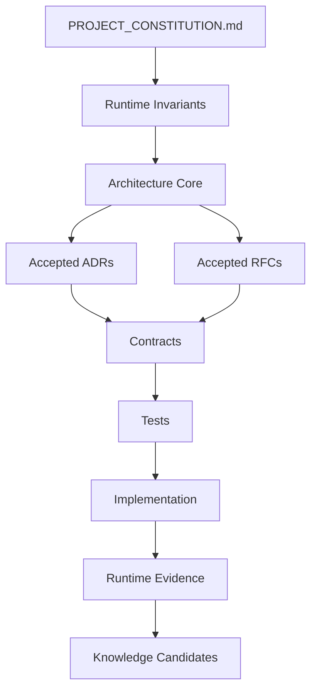
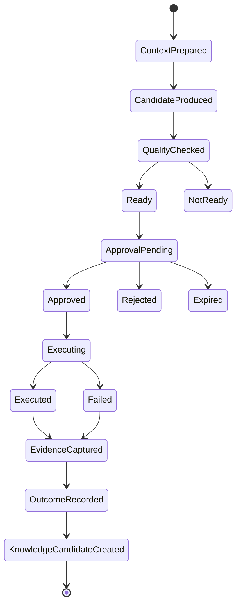
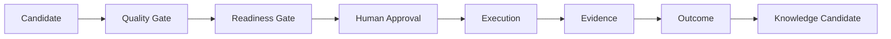
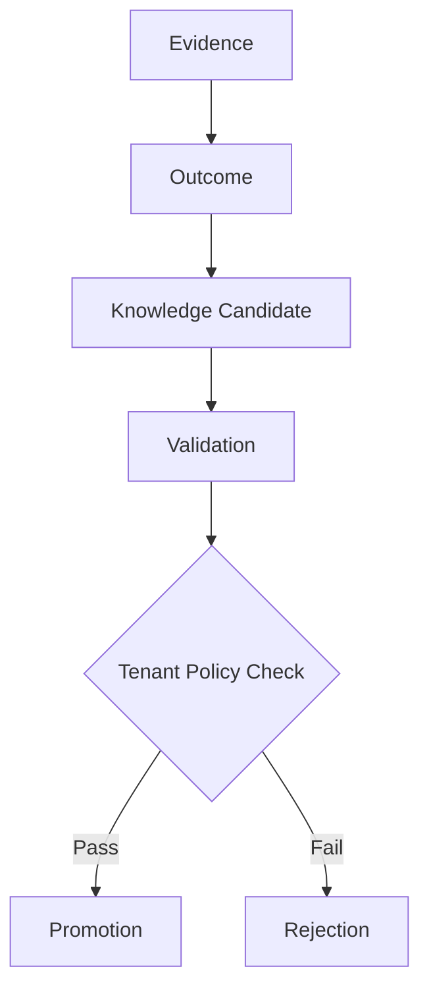
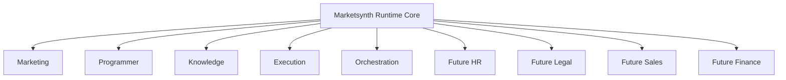

# PROJECT_CONSTITUTION.md

**Project:** Marketsynth  
**Former Working Name:** BotFazer  
**Document Type:** Normative Constitution  
**Authority Level:** Highest  
**Status:** FROZEN  
**Version:** 1.0.0  
**Effective Scope:** Product architecture, runtime architecture, AI-assisted development, governance, implementation, migration, future domain expansion  
**Primary Consumers:** Human architects, Cursor, ChatGPT, Claude Code, Codex, future AI development agents, engineering contributors  
**Repository Role:** Highest-authority document inside `marketsynth-ai-context`  
**Language:** English  
**Normative Style:** MUST / MUST NOT / SHOULD / MAY / SHALL  

---

# Preamble

Marketsynth is an AI-assisted operational platform for governed marketing operations, automation, runtime execution, evidence capture, outcome interpretation, and knowledge promotion. It is designed to grow beyond marketing into future specialist domains without a global rewrite.

Marketsynth is not a chatbot. Marketsynth is not a prompt chain. Marketsynth is not a loose collection of automation scenarios. Marketsynth is not a wrapper around a single model provider or framework.

Marketsynth is a governed runtime system. It separates reasoning from execution, readiness from approval, evidence from interpretation, tenant-local knowledge from global knowledge, and implementation from architecture.

This Constitution defines the highest-order rules of the Marketsynth project. Every document, contract, runtime transition, coding task, AI-generated change, domain extension, integration, and migration decision MUST conform to this Constitution.

If any project artifact conflicts with this Constitution, this Constitution prevails.

---

# Table of Contents

1. Constitutional Authority  
2. Normative Language  
3. Project Identity  
4. Mission and Non-Goals  
5. Architectural Philosophy  
6. Source of Truth  
7. Document Status and Governance  
8. Tenant Model  
9. Runtime Model  
10. Context Model  
11. Decision Model  
12. Approval Model  
13. Execution Model  
14. Evidence Model  
15. Outcome Model  
16. Knowledge Model  
17. Memory Model  
18. Domain Model  
19. Agent Governance  
20. Orchestrator / COO Runtime  
21. Supervisor Runtime  
22. Security and Secrets  
23. Provider and Integration Boundaries  
24. Contracts  
25. Engineering Principles  
26. Testing and Quality  
27. Observability and Auditability  
28. AI Development Rules  
29. Legacy BotFazer v3 Migration  
30. Future Domain Expansion  
31. Prohibited Practices  
32. Amendment Process  
33. Constitutional Invariant Index  
34. Glossary  
35. Constitutional Audit Report  

---
# Chapter 1 — Constitutional Authority

## Article 1.1 — Highest Authority

This Constitution is the highest authority of the Marketsynth project. No code, prompt, roadmap, local implementation, generated artifact, AI instruction, or historical chat may override it.

## Article 1.2 — Binding Scope

This Constitution applies to architecture, runtime behavior, AI agents, contracts, implementation, documentation, migration, integrations, testing, and future domain extension.

## Article 1.3 — Conflict Resolution

If conflict exists, the authority order is: Constitution → Runtime Invariants → Architecture Core → Accepted ADR → Accepted RFC → Contracts → Tests → Implementation → Chat History.

## Article 1.4 — No Silent Mutation

No person, AI agent, automation, script, or tool MAY silently change the meaning of this Constitution. Any meaning-changing modification MUST follow the amendment process.

## Article 1.5 — Implementation Subordination

Implementation MUST conform to approved architecture. Existing code is not authoritative merely because it exists.

## Article 1.6 — AI Binding

Cursor and all AI coding agents MUST treat this document as mandatory context before generating or modifying implementation.

## Article 1.7 — Constitutional Violation

A violation of tenant isolation, approval boundaries, Source of Truth hierarchy, or runtime invariants is a constitutional violation and MUST be treated as a blocking issue.

# Chapter 2 — Normative Language

## Article 2.1 — MUST

`MUST` means the requirement is mandatory and non-optional.

## Article 2.2 — MUST NOT

`MUST NOT` means the action is prohibited.

## Article 2.3 — SHOULD

`SHOULD` means the rule is recommended and expected unless a documented reason exists.

## Article 2.4 — MAY

`MAY` means the action is permitted but not required.

## Article 2.5 — SHALL

`SHALL` is equivalent to `MUST` and is used only where formal emphasis is useful.

## Article 2.6 — Required Interpretation

AI agents MUST interpret normative language literally and conservatively. If uncertain, they MUST ask for clarification or propose an ADR/RFC rather than guessing.

## Article 2.7 — No Prompt Override

Prompt instructions MAY narrow a task, but MUST NOT override constitutional language.

# Chapter 3 — Project Identity

## Article 3.1 — Official Name

The official product and platform name is Marketsynth.

## Article 3.2 — Legacy Name

BotFazer is a legacy working name. It MAY appear in historical references, migration notes, and legacy code identifiers, but MUST NOT define future product identity.

## Article 3.3 — Product Nature

Marketsynth is an AI-assisted governed operational platform combining reasoning, planning, approval, execution, evidence, outcome analysis, and knowledge promotion.

## Article 3.4 — Non-Identity

Marketsynth MUST NOT be reduced to a chatbot, prompt library, content generator, Make/n8n clone, linear workflow, or model-provider wrapper.

## Article 3.5 — AI-First Human-Governed

Marketsynth is AI-first in reasoning and preparation, but human-governed in real execution authority.

## Article 3.6 — Commercial Direction

Marketsynth SHOULD serve creators, marketers, automation builders, bot developers, SaaS operators, and future domain teams requiring governed AI operations.

## Article 3.7 — Durability

The identity of Marketsynth MUST survive changes in codebase, stack, model provider, UI, hosting, database, and orchestration technology.

# Chapter 4 — Mission and Non-Goals

## Article 4.1 — Mission

Marketsynth exists to convert business intent into governed, auditable, AI-assisted operational workflows.

## Article 4.2 — Initial Mission

The initial product focus is marketing operations: campaign planning, content packaging, channel preparation, publication readiness, approval, execution, and learning from outcomes.

## Article 4.3 — Expanded Mission

The architecture MUST support future domains such as HR, Legal, Sales, Finance, Research, Analytics, and Operations without global rewrite.

## Article 4.4 — Operational Value

Marketsynth MUST reduce repeated routine work, increase consistency, preserve human control, and convert operational experience into validated knowledge.

## Article 4.5 — Non-Goal: Autonomous Irreversible Control

Marketsynth MUST NOT become an uncontrolled autonomous actor capable of irreversible external effects without explicit approval.

## Article 4.6 — Non-Goal: Prompt Chaos

Marketsynth MUST NOT rely on hidden prompt conventions as architectural truth.

## Article 4.7 — Non-Goal: Vendor Lock-In

Marketsynth MUST NOT be constitutionally dependent on any specific LLM vendor, automation provider, database, or framework.

# Chapter 5 — Architectural Philosophy

## Article 5.1 — Architecture First

Architecture precedes implementation. Code adapts to architecture unless architectural audit proves the architecture invalid.

## Article 5.2 — Technology Agnostic

Constitutional semantics MUST NOT depend on FastAPI, PostgreSQL, Redis, LangGraph, LiteLLM, n8n, Make, OpenAI, Anthropic, or any other specific tool.

## Article 5.3 — Runtime over Prompt Chain

Marketsynth MUST be implemented as a governed runtime, not as an uncontrolled chain of prompts.

## Article 5.4 — Contracts over Assumptions

Significant interactions MUST be expressed through explicit contracts, schemas, state transitions, or documented interfaces.

## Article 5.5 — Traceability over Convenience

Traceability takes priority over convenience. If a shortcut breaks auditability, the shortcut is prohibited.

## Article 5.6 — Explicit State

Core lifecycle state MUST be explicit. Hidden state MAY exist only when it cannot affect correctness, approval, tenant isolation, or auditability.

## Article 5.7 — Separation of Concerns

Reasoning, readiness, approval, execution, evidence, outcome, and knowledge promotion MUST remain separable concerns.

## Article 5.8 — Evolution without Rewrite

New domains, models, providers, tools, and storage technologies MUST be addable without rewriting the constitutional model.

# Chapter 6 — Source of Truth

## Article 6.1 — Official Repository

The `marketsynth-ai-context` repository is the official AI-facing governance repository.

## Article 6.2 — Chat History

Chat history is historical input only. It is not Source of Truth unless promoted into an approved repository document.

## Article 6.3 — Legacy Code

Legacy BotFazer v3 code is implementation history. It MUST NOT override Marketsynth architecture.

## Article 6.4 — Authority Order

Authority order is Constitution → Runtime Invariants → Architecture Core → Accepted ADRs/RFCs → Contracts → Tests → Implementation.

## Article 6.5 — Document Promotion

A document becomes authoritative only after it is written into the repository, assigned status, scoped, and checked for constitutional compatibility.

## Article 6.6 — Code Conflict

If implementation conflicts with frozen architecture, the implementation MUST be treated as legacy, defective, or requiring explicit ADR review.

## Article 6.7 — Source of Truth Diagram

# Chapter 7 — Document Status and Governance

## Article 7.1 — Required Status

Every governance document SHOULD declare status: DRAFT, REVIEW, ACTIVE, FROZEN, SUPERSEDED, DEPRECATED, or ARCHIVED.

## Article 7.2 — DRAFT

DRAFT documents are not implementation authority unless explicitly scoped for experimentation.

## Article 7.3 — REVIEW

REVIEW documents are under evaluation and MUST NOT silently override ACTIVE or FROZEN documents.

## Article 7.4 — ACTIVE

ACTIVE documents are current authority within their scope and MAY evolve while preserving constitutional compatibility.

## Article 7.5 — FROZEN

FROZEN documents are foundational. Meaning-changing edits require ADR, audit, and explicit approval.

## Article 7.6 — SUPERSEDED

SUPERSEDED documents are historical and MUST NOT guide current implementation.

## Article 7.7 — DEPRECATED

DEPRECATED documents are retained for history only.

## Article 7.8 — ARCHIVED

ARCHIVED documents are stored for traceability and MUST NOT be used as active guidance.

## Article 7.9 — Decision Registry

Major decisions MUST be reflected in the Decision Registry or corresponding ADR/RFC.

## Article 7.10 — Weekly Audit

During active architecture development, weekly document audits SHOULD verify contradictions, drift, stale statuses, and missing cross-references.

# Chapter 8 — Tenant Model

## Article 8.1 — Tenant Definition

A Tenant is an isolated ownership, workspace, customer, or organizational boundary.

## Article 8.2 — Isolation

Tenant isolation is constitutional and non-negotiable.

## Article 8.3 — Scoped Objects

Projects, tasks, agents, memory, approvals, execution jobs, evidence, outcomes, knowledge candidates, credentials, costs, and audit events MUST be tenant-scoped where tenant data is involved.

## Article 8.4 — No Cross-Tenant Knowledge Candidate

Knowledge Candidate MUST never cross tenant boundary.

## Article 8.5 — No Cross-Tenant Memory

Memory MUST NOT be retrieved, inferred, merged, or reused across tenants without explicit constitutional policy.

## Article 8.6 — Ownership Check

Every read, write, execution, retrieval, promotion, or approval operation involving tenant data MUST enforce ownership.

## Article 8.7 — Violation Handling

Tenant boundary violations MUST trigger blocking behavior, audit event, supervisor finding, and remediation.

## Article 8.8 — Anonymized Promotion

Tenant-local observations MAY become global product knowledge only after anonymization, validation, policy check, explicit promotion, and audit.

# Chapter 9 — Runtime Model

## Article 9.1 — Runtime Definition

Runtime is the governed lifecycle where context, decisions, approvals, executions, evidence, outcomes, and knowledge candidates are created and transitioned.

## Article 9.2 — Canonical Lineage

The canonical lineage is Context → Decision → Approval → Execution → Evidence → Outcome → Knowledge Candidate.

## Article 9.3 — Lineage Completeness

Runtime objects SHOULD preserve enough lineage to reconstruct why, how, by whom, and under what authority an action occurred.

## Article 9.4 — State Transition Discipline

Runtime transitions MUST be explicit and invalid transitions MUST be rejected.

## Article 9.5 — No Silent Repair

The system MUST NOT silently repair illegal runtime transitions in ways that hide defects.

## Article 9.6 — Runtime Diagram

## Article 9.7 — Runtime over Code Path

Runtime is an architectural lifecycle, not just a call stack.

# Chapter 10 — Context Model

## Article 10.1 — Context Definition

Context is the scoped set of information used for reasoning, routing, preparation, or execution planning.

## Article 10.2 — Allowed Sources

Allowed context sources include user request, project state, runtime memory, approved knowledge, active contracts, active architecture, and policy constraints.

## Article 10.3 — Forbidden Sources

Secrets, unrelated tenant data, deprecated architecture, superseded contracts, and raw provider dumps MUST NOT silently enter context.

## Article 10.4 — Context Priority

Context priority is Constitution → Runtime Invariants → Active Architecture → Contracts → Runtime State → User Request.

## Article 10.5 — Determinism

Context construction SHOULD be deterministic where feasible.

## Article 10.6 — Context Snapshot

Important runtime operations SHOULD preserve a context snapshot or sufficient context reference.

## Article 10.7 — Context Minimization

AI agents SHOULD load the minimum necessary context for the task to reduce noise and hallucinated authority.

## Article 10.8 — Context Boundary

Context MUST respect tenant and security boundaries.

# Chapter 11 — Decision Model

## Article 11.1 — Decision Definition

A Decision is a selected route, plan, assignment, recommendation, or proposed action.

## Article 11.2 — Decision Is Not Approval

A machine-generated decision does not equal Human Approval.

## Article 11.3 — Decision Trace

Important decisions SHOULD record actor, context reference, rationale, constraints, and timestamp.

## Article 11.4 — Decision Authority

AI MAY recommend and route, but MUST NOT claim final business truth unless a domain-specific human-approved policy grants such authority.

## Article 11.5 — Decision Review

High-impact decisions SHOULD be reviewable by human owner or supervisor runtime.

## Article 11.6 — No Hidden Decision

The system SHOULD NOT hide material decisions inside prompts without structured trace.

## Article 11.7 — Terminology

Where COO/Orchestrator is concerned, use route/schedule/assign/escalate rather than decide when business truth is not being determined.

# Chapter 12 — Approval Model

## Article 12.1 — Human Approval Definition

Human Approval is explicit human authorization for a scoped real execution.

## Article 12.2 — Readiness Separation

Readiness is not approval. Quality passing is not approval. AI confidence is not approval.

## Article 12.3 — Mandatory Approval

Real execution MUST require valid Human Approval unless explicitly classified as safe internal simulation.

## Article 12.4 — Approval Scope

Approval MUST be scoped to tenant, project where applicable, artifact, action, target, actor, and expiration where applicable.

## Article 12.5 — Approval States

Canonical approval states are pending, approved, rejected, and expired.

## Article 12.6 — Owner Unavailable

If required owner is unavailable, runtime MUST wait, escalate, expire, or follow explicit delegation policy. It MUST NOT invent approval.

## Article 12.7 — Approval Evidence

Approval decisions MUST be auditable.

## Article 12.8 — Approval Reuse

Approval reuse MUST be prohibited unless explicitly scoped and recorded.

## Article 12.9 — Approval Bypass

Approval bypass is a constitutional violation.

# Chapter 13 — Execution Model

## Article 13.1 — Real Execution Definition

Real Execution is any action that mutates external state, user-visible state, production data, account state, budget, publication, credential, or irreversible process.

## Article 13.2 — Preconditions

Real execution requires valid tenant ownership, valid artifact, readiness, valid approval, active provider/target, idempotency controls where applicable, and evidence capture.

## Article 13.3 — External Effects

Publishing, sending messages, mutating provider APIs, changing production data, modifying accounts, spending budget, or changing credentials are external effects.

## Article 13.4 — Idempotency

Execution SHOULD be idempotent when duplicate attempts can create duplicate effects.

## Article 13.5 — Replay

Replay MUST be explicit, validated, scoped, and auditable.

## Article 13.6 — No Sleep Default

Sleep-based waiting MUST NOT be default production architecture. Prefer queues, callbacks, polling managers, or provider-native status mechanisms.

## Article 13.7 — Failure Evidence

Failed execution SHOULD still produce safe evidence.

## Article 13.8 — Execution Diagram

# Chapter 14 — Evidence Model

## Article 14.1 — Evidence Definition

Evidence is an auditable record that an event, execution, transition, or decision occurred.

## Article 14.2 — Evidence Contents

Evidence SHOULD include tenant, project, actor, timestamp, action, status, provider summary where applicable, external identifier where safe, and correlation IDs.

## Article 14.3 — Secret Exclusion

Evidence MUST NOT contain raw secrets, credentials, tokens, full provider dumps, or unrelated tenant data.

## Article 14.4 — Immutability

Evidence SHOULD be immutable or append-only where feasible.

## Article 14.5 — Failure Evidence

Failures SHOULD produce evidence with safe error summaries.

## Article 14.6 — Evidence Linkage

Evidence SHOULD link to approval, execution, outcome, and knowledge candidate where applicable.

## Article 14.7 — Evidence Authority

Evidence proves occurrence; it does not by itself prove business interpretation.

# Chapter 15 — Outcome Model

## Article 15.1 — Outcome Definition

Outcome is the interpreted result of evidence or execution.

## Article 15.2 — Outcome Is Not Evidence

Outcome MUST be derived from evidence but MUST NOT replace evidence.

## Article 15.3 — Outcome Scope

Outcome MUST remain tenant-scoped where based on tenant data.

## Article 15.4 — Outcome Measurement

Where possible, outcome SHOULD include measurable business or operational result.

## Article 15.5 — Outcome Uncertainty

Outcome MAY include confidence, uncertainty, or limitations.

## Article 15.6 — Outcome Linkage

Outcome SHOULD link to evidence and execution.

## Article 15.7 — Outcome to Knowledge

Only validated outcomes SHOULD feed Knowledge Candidate creation.

# Chapter 16 — Knowledge Model

## Article 16.1 — Knowledge Discipline

Knowledge MUST be derived, scoped, validated, and promoted.

## Article 16.2 — Knowledge Candidate

Knowledge Candidate is proposed knowledge and is not automatically authoritative.

## Article 16.3 — Boundary

Knowledge Candidate MUST never cross tenant boundary.

## Article 16.4 — Promotion Requirements

Promotion requires evidence, outcome linkage, validation, scope decision, tenant policy check, and audit record.

## Article 16.5 — Global Knowledge

Global knowledge MUST NOT contain tenant-private information.

## Article 16.6 — Rejection

Invalid candidates SHOULD be rejected with reason.

## Article 16.7 — Lineage

Promoted knowledge SHOULD preserve lineage to evidence and outcome.

## Article 16.8 — Knowledge Flow

# Chapter 17 — Memory Model

## Article 17.1 — Memory Purpose

Memory preserves operational continuity without becoming an uncontrolled knowledge dump.

## Article 17.2 — Memory Types

Memory types include session memory, project memory, tenant memory, and promoted system knowledge.

## Article 17.3 — Session Memory

Session Memory supports current interaction and MUST NOT automatically become persistent knowledge.

## Article 17.4 — Project Memory

Project Memory is project-scoped and tenant-scoped.

## Article 17.5 — Tenant Memory

Tenant Memory is reusable within tenant boundary only.

## Article 17.6 — Global Memory

Global knowledge memory requires explicit promotion and MUST be tenant-safe.

## Article 17.7 — Versioning

Persistent memory SHOULD be versioned.

## Article 17.8 — Deletion and Correction

Memory SHOULD support correction, invalidation, and deletion according to policy.

## Article 17.9 — No Silent Persistence

AI agents MUST NOT silently persist user data into durable memory without appropriate policy.

# Chapter 18 — Domain Model

## Article 18.1 — Domain Definition

A Domain is a bounded area of capability, language, contracts, ownership, and runtime behavior.

## Article 18.2 — Initial Domains

Initial domains are Marketing, Programmer, Automation, Knowledge, Execution, and Orchestration.

## Article 18.3 — Future Domains

Future domains MAY include HR, Legal, Sales, Finance, Research, Analytics, and Operations.

## Article 18.4 — Domain Addition

New domains MUST be added through domain definition, capability registry, contracts, routing rules, permission model, tests, and documentation.

## Article 18.5 — No Global Rewrite

Adding a domain MUST NOT require global rewrite.

## Article 18.6 — Domain Boundaries

Domains MUST NOT directly mutate another domain's internal state.

## Article 18.7 — Cross-Domain Interaction

Cross-domain interaction MUST occur through contracts, events, or orchestrated workflows.

## Article 18.8 — Marketing Domain

Marketing may produce briefs, campaigns, content plans, publication packages, channel copy, visual prompts, approval requests, and performance interpretations.

## Article 18.9 — Programmer Domain

Programmer may produce technical analysis, implementation plans, task drafts, review support, and code suggestions, but has no autonomous write authority by default.

# Chapter 19 — Agent Governance

## Article 19.1 — Agent Definition

An Agent is an AI-operated or AI-assisted runtime participant with explicit capabilities, permissions, inputs, outputs, and audit trail.

## Article 19.2 — Permission Boundaries

Agents MUST operate within explicit permissions.

## Article 19.3 — Capability Declaration

Each agent SHOULD declare capabilities, inputs, outputs, limitations, and tool access.

## Article 19.4 — Tool Allowlist

Tool access MUST be allowlisted.

## Article 19.5 — No Unbounded Autonomy

Agents MUST NOT have unrestricted authority over execution, memory, credentials, or codebase mutation.

## Article 19.6 — Programmer Restriction

Programmer Agent MUST NOT modify codebase unless explicit implementation authority exists.

## Article 19.7 — Agent Memory

Agent memory MUST obey tenant and memory policy.

## Article 19.8 — Agent Audit

Material agent actions SHOULD be auditable.

## Article 19.9 — Agent Delegation

Delegation MUST be bounded by domain, depth, policy, and permissions.

# Chapter 20 — Orchestrator / COO Runtime

## Article 20.1 — Purpose

Orchestrator/COO Runtime coordinates work across domains.

## Article 20.2 — Allowed Authority

It may route, schedule, assign, coordinate, escalate, and track.

## Article 20.3 — Forbidden Authority

It MUST NOT define business truth, invent approval, bypass domain contracts, or mutate external systems directly.

## Article 20.4 — Terminology

Use route/schedule/assign/escalate rather than decide where business truth is not determined.

## Article 20.5 — Escalation

Escalation MUST preserve ownership and approval boundaries.

## Article 20.6 — Owner Unavailable

If an owner is unavailable, Orchestrator MUST follow Owner Unavailable Policy.

## Article 20.7 — Coordination

Coordination MUST occur through explicit contracts and runtime state.

## Article 20.8 — Audit

Material routing and escalation actions SHOULD be auditable.

# Chapter 21 — Supervisor Runtime

## Article 21.1 — Purpose

Supervisor Runtime monitors, reviews, detects violations, produces findings, and escalates risk.

## Article 21.2 — No Direct Business Execution

Supervisor MUST NOT execute business actions directly.

## Article 21.3 — Finding Severity

Findings SHOULD be classified by severity such as info, warning, major, critical.

## Article 21.4 — Critical Findings

Critical findings MUST block unsafe execution.

## Article 21.5 — Invariant Monitoring

Supervisor SHOULD monitor runtime invariants, tenant boundaries, approval boundaries, and execution safety.

## Article 21.6 — Audit Role

Supervisor SHOULD produce auditable findings.

## Article 21.7 — No Approval Invention

Supervisor MAY recommend escalation but MUST NOT invent approval.

## Article 21.8 — Human Review

Critical supervisor findings SHOULD be reviewable by a human owner.

# Chapter 22 — Security and Secrets

## Article 22.1 — Secret Boundary

Secrets MUST NOT be stored in agent configs, prompts, logs, LLM payloads, user-visible errors, or documentation.

## Article 22.2 — Credential Storage

Credentials MUST be accessed through secure runtime configuration or secret storage.

## Article 22.3 — Safe Logging

Logs MUST contain safe metadata only.

## Article 22.4 — Error Redaction

Errors MUST be sanitized before exposure.

## Article 22.5 — Provider Dumps

Raw provider dumps MUST NOT be persisted or exposed unless sanitized and explicitly required.

## Article 22.6 — Tenant Security

Tenant security failures are critical.

## Article 22.7 — Least Privilege

Services, agents, integrations, and tools SHOULD operate with least privilege.

## Article 22.8 — Security Review

Changes affecting secrets, credentials, approval, tenant isolation, or external execution SHOULD receive security review.

# Chapter 23 — Provider and Integration Boundaries

## Article 23.1 — Adapter Boundary

External providers MUST be isolated behind adapters.

## Article 23.2 — Provider Independence

Domain services MUST NOT depend on provider-specific implementation details.

## Article 23.3 — Timeouts

Provider calls SHOULD have explicit timeouts.

## Article 23.4 — Retries

Retries MUST be policy-driven and safe.

## Article 23.5 — Error Normalization

Provider errors SHOULD be normalized into domain-safe errors.

## Article 23.6 — Idempotency

Mutating provider integrations SHOULD support idempotency where possible.

## Article 23.7 — Safe Metadata

Provider telemetry MUST avoid credential leakage.

## Article 23.8 — Replaceability

Replacing a provider MUST NOT require constitutional change.

# Chapter 24 — Contracts

## Article 24.1 — Contract Definition

A Contract is a typed or formal agreement defining interaction semantics.

## Article 24.2 — Contract Authority

Implementation MUST conform to contracts.

## Article 24.3 — Contract Contents

Core contracts SHOULD define identity, tenant/owner scope, status enum, input payload, output payload, metadata, timestamps, errors, and allowed transitions.

## Article 24.4 — Lifecycle States

Contract lifecycles SHOULD use explicit finite states.

## Article 24.5 — Breaking Changes

Breaking contract changes require accepted ADR/RFC and migration plan.

## Article 24.6 — DTO Semantics

AI agents MUST NOT silently change DTO meaning.

## Article 24.7 — Ownership Fields

Tenant-owned contracts MUST carry enough ownership context to enforce isolation.

## Article 24.8 — Error Contracts

Public errors MUST be safe and provider-independent.

# Chapter 25 — Engineering Principles

## Article 25.1 — Layering

Preferred implementation shape is API Router → Service → Repository → Provider Adapter → Infrastructure.

## Article 25.2 — Routers

Routers handle transport, authentication boundary, request parsing, and response mapping. Routers MUST NOT contain business policy.

## Article 25.3 — Services

Services own business rules, state transitions, ownership checks, and orchestration.

## Article 25.4 — Repositories

Repositories own persistence and MUST NOT contain business policy.

## Article 25.5 — Adapters

Adapters isolate providers and infrastructure.

## Article 25.6 — Typed Models

Core objects SHOULD use typed models and explicit enums.

## Article 25.7 — Small Changes

Implementation changes SHOULD be small, reviewable, and test-covered.

## Article 25.8 — No Hidden Global State

Hidden global state affecting correctness, tenant isolation, approval, execution, or auditability is prohibited.

## Article 25.9 — Architecture Compliance

Every material implementation SHOULD be traceable to architecture, contract, or ADR/RFC.

# Chapter 26 — Testing and Quality

## Article 26.1 — Invariant Tests

Constitutional and runtime invariants MUST be protected by tests.

## Article 26.2 — Contract Tests

Contracts SHOULD have tests for compatibility and invalid transitions.

## Article 26.3 — Tenant Tests

Tenant isolation MUST be tested for any tenant-scoped feature.

## Article 26.4 — Approval Tests

Approval boundaries MUST be tested for execution features.

## Article 26.5 — Error Tests

Error handling SHOULD be tested for safe redaction and provider normalization.

## Article 26.6 — Regression Tests

Every fixed defect SHOULD receive a regression test.

## Article 26.7 — CI Gates

CI SHOULD run lint, unit tests, integration tests, contract checks, and invariant checks where applicable.

## Article 26.8 — Release Blocking

Critical invariant failures MUST block release.

# Chapter 27 — Observability and Auditability

## Article 27.1 — Observability

The system SHOULD collect metrics, logs, traces, and audit events.

## Article 27.2 — Correlation

Runtime actions SHOULD carry correlation identifiers.

## Article 27.3 — Audit Events

Important state transitions MUST generate audit events.

## Article 27.4 — Safe Logs

Observability MUST NOT leak secrets or unrelated tenant data.

## Article 27.5 — Traceability Chain

The system SHOULD support tracing from architecture to decision to contract to code to test to runtime evidence.

## Article 27.6 — Supervisor Integration

Critical observability signals SHOULD be available to Supervisor Runtime.

## Article 27.7 — Cost Observability

LLM and provider usage SHOULD be tracked for cost governance.

## Article 27.8 — Operational Health

Operational health SHOULD expose pending execution, failed jobs, queue age, and provider failure patterns.

# Chapter 28 — AI Development Rules

## Article 28.1 — Mandatory Context

AI coding agents MUST read relevant constitutional, architectural, runtime, and contract documents before implementation.

## Article 28.2 — No Inferred Authority

AI MUST NOT infer authority from previous chat, legacy code, or convenience.

## Article 28.3 — Ask or Propose

If architecture is missing or contradictory, AI MUST ask for clarification or propose ADR/RFC.

## Article 28.4 — Preserve Invariants

AI MUST NOT generate code that violates Runtime Invariants.

## Article 28.5 — Legacy Treatment

AI MUST treat BotFazer v3 code as legacy unless aligned with Marketsynth architecture.

## Article 28.6 — No Silent Contract Mutation

AI MUST NOT silently change DTOs, statuses, ownership fields, or lifecycle semantics.

## Article 28.7 — Tests Required

AI-generated implementation SHOULD include relevant tests.

## Article 28.8 — Safe Output

AI MUST NOT output secrets or instructions that bypass approval, tenant isolation, or security boundaries.

## Article 28.9 — Context Minimization

AI SHOULD load task-relevant context instead of all documents.

# Chapter 29 — Legacy BotFazer v3 Migration

## Article 29.1 — Legacy Classification

BotFazer v3 code is legacy implementation, not Source of Truth.

## Article 29.2 — Migration Direction

Migration direction is BotFazer v3 → Marketsynth architecture.

## Article 29.3 — Audit First

Before major coding resumes, an Architecture-to-Code audit SHOULD compare legacy implementation to Marketsynth architecture.

## Article 29.4 — Preserve Useful Code

Useful legacy components MAY be retained if they comply with architecture after audit.

## Article 29.5 — No Architecture Backslide

Marketsynth architecture MUST NOT be weakened merely to fit legacy code.

## Article 29.6 — Incremental Migration

Migration SHOULD be incremental, tested, and reversible where possible.

## Article 29.7 — Naming Migration

User-facing and official architecture naming MUST migrate from BotFazer to Marketsynth.

## Article 29.8 — Migration Records

Migration decisions SHOULD be captured in ADRs or migration logs.

# Chapter 30 — Future Domain Expansion

## Article 30.1 — Expansion Principle

Future domains MUST reuse constitutional runtime patterns.

## Article 30.2 — Supported Future Domains

HR, Legal, Sales, Finance, Research, Analytics, and Operations are anticipated extension domains.

## Article 30.3 — No Global Rewrite

Adding a domain MUST NOT require global rewrite.

## Article 30.4 — Capability Registry

Each domain SHOULD publish capabilities, inputs, outputs, permissions, and constraints.

## Article 30.5 — Contracts

Each domain MUST expose contracts for cross-domain interaction.

## Article 30.6 — Approval and Execution

Future domains MUST obey Human Approval and Execution Models.

## Article 30.7 — Tenant Isolation

Future domains MUST obey Tenant Model.

## Article 30.8 — Legal and HR Caution

High-stakes domains such as Legal and HR SHOULD include stricter human review and risk controls.

## Article 30.9 — Domain Diagram

# Chapter 31 — Prohibited Architectural Practices

## Article 31.1 — No Execution Without Approval

Real execution without valid Human Approval is prohibited.

## Article 31.2 — No Cross-Tenant Knowledge

Cross-tenant Knowledge Candidate movement is prohibited.

## Article 31.3 — No Cross-Tenant Memory

Cross-tenant memory retrieval or reuse is prohibited.

## Article 31.4 — No Business Logic in Routers

Business policy in API routers is prohibited.

## Article 31.5 — No Provider Logic in Domain Services

Provider-specific logic inside domain services is prohibited.

## Article 31.6 — No Secret Leakage

Secrets in logs, prompts, errors, payloads, or docs are prohibited.

## Article 31.7 — No Silent Architecture Mutation

Silent changes to architectural meaning are prohibited.

## Article 31.8 — No Silent Contract Mutation

Silent changes to DTO semantics are prohibited.

## Article 31.9 — No Unbounded Agent Tools

Unrestricted agent tool access is prohibited.

## Article 31.10 — No Global Rewrite for Domain Addition

Requiring global rewrite to add a domain is prohibited.

## Article 31.11 — No Legacy as Truth

Treating BotFazer v3 legacy code as constitutional truth is prohibited.

## Article 31.12 — No Chat as Truth

Treating chat history as Source of Truth is prohibited.

# Chapter 32 — Amendment Process

## Article 32.1 — Amendment Requirement

Meaning-changing edits to this Constitution require formal amendment.

## Article 32.2 — Amendment Contents

An amendment MUST include problem statement, affected articles, proposed change, compatibility analysis, risk analysis, migration impact, and audit result.

## Article 32.3 — Approval

Amendments require explicit human approval.

## Article 32.4 — Audit

Amendments MUST be audited before becoming active.

## Article 32.5 — Versioning

Major version changes alter meaning; minor changes add compatible rules; patch changes clarify without semantic change.

## Article 32.6 — Record

Amendments MUST be recorded in changelog or ADR.

## Article 32.7 — Emergency Change

Emergency changes MAY be drafted quickly but MUST still receive retrospective audit.

## Article 32.8 — No Implied Amendment

Implementation changes do not amend the Constitution.

# Chapter 33 — Constitutional Invariant Index

## CI-001 — Constitutional Supremacy

This Constitution is the highest authority.

## CI-002 — Architecture as Source of Truth

Implementation and chat do not define architecture.

## CI-003 — Technology Independence

Changing stack does not change constitutional semantics.

## CI-004 — Tenant Isolation

Tenant data, memory, evidence, and knowledge candidates remain isolated.

## CI-005 — Knowledge Candidate Boundary

Knowledge Candidate never crosses tenant boundary.

## CI-006 — Human Approval

Real execution requires explicit approval.

## CI-007 — Readiness Separation

Readiness is not approval.

## CI-008 — Runtime Lineage

Context → Decision → Approval → Execution → Evidence → Outcome → Knowledge Candidate is preserved where applicable.

## CI-009 — Orchestrator Limit

Orchestrator routes, schedules, assigns, escalates; it does not define business truth.

## CI-010 — Owner Unavailable

Unavailable owner does not imply approval.

## CI-011 — Programmer Agent Limit

Programmer Agent has no autonomous codebase write authority by default.

## CI-012 — Safe Secrets

Secrets must not leak into logs, prompts, errors, or docs.

## CI-013 — Provider Boundary

External providers are isolated behind adapters.

## CI-014 — Domain Extensibility

Future domains must be addable without global rewrite.

## CI-015 — No Silent Mutation

Frozen architecture and contracts cannot be silently changed.

# Chapter 34 — Glossary

## Marketsynth

Official product and platform name.

## BotFazer

Legacy working name and historical implementation lineage.

## Source of Truth

Approved governance repository and authoritative documents.

## Tenant

Isolated customer, workspace, organization, or ownership boundary.

## Runtime

Governed lifecycle environment for context, decisions, approvals, execution, evidence, outcomes, and knowledge.

## Context

Scoped information set used for reasoning or preparation.

## Decision

Route, plan, assignment, recommendation, or proposed action.

## Approval

Explicit human authorization for scoped execution.

## Readiness

Technical eligibility for approval; not permission.

## Execution

Attempt to carry out an approved action.

## Evidence

Auditable record that something occurred.

## Outcome

Interpretation of evidence or execution result.

## Knowledge Candidate

Proposed knowledge requiring validation and scope.

## Domain

Bounded capability and responsibility area.

## Agent

AI-assisted runtime participant with explicit capabilities and boundaries.

## Orchestrator

Runtime component that routes, schedules, assigns, coordinates, and escalates.

## Supervisor

Runtime component that monitors, reviews, finds violations, and escalates risk.

## Contract

Formal semantic agreement or schema for interaction.

## Invariant

Rule that must remain true across valid system states.

## ADR

Architecture Decision Record.

## RFC

Request for Comments, used for proposed changes.

## FROZEN

Status for foundational documents requiring formal amendment to change.

# Chapter 35 — Constitutional Audit Report

## Audit Status

**Result:** PASSED FOR FROZEN v1.0 publication, with expected future refinements delegated to lower-level architecture documents.

## Internal Contradiction Check

No direct contradiction was found between:
- Human Approval and Execution Model;
- Tenant Model and Knowledge Model;
- Source of Truth hierarchy and legacy migration;
- Orchestrator authority and domain responsibility;
- AI development rules and human governance.

## Tenant Isolation Coverage

Tenant isolation is covered in:
- Tenant Model;
- Knowledge Model;
- Memory Model;
- Execution Model;
- Security;
- AI Development Rules;
- Invariant Index.

Result: PASS.

## Approval / Execution Separation

The document repeatedly separates readiness, quality, AI confidence, and decision from Human Approval.

Result: PASS.

## Knowledge Boundary Completeness

Knowledge Candidate is explicitly scoped, non-authoritative by default, and prohibited from crossing tenant boundary.

Result: PASS.

## Technology Independence

The Constitution explicitly avoids binding itself to frameworks, databases, LLM vendors, orchestration libraries, automation tools, or hosting providers.

Result: PASS.

## Future Domain Extensibility

Future HR, Legal, Sales, Finance, Research, Analytics, and Operations domains are anticipated and constrained by the same runtime laws.

Result: PASS.

## Cursor / AI Coding Workflow Suitability

The document includes:
- explicit Source of Truth priority;
- AI development rules;
- contract rules;
- engineering layers;
- prohibited practices;
- legacy migration handling;
- context minimization guidance.

Result: PASS.

## Legacy BotFazer v3 Handling

BotFazer v3 is classified as legacy implementation. It may inform migration but cannot override Marketsynth architecture.

Result: PASS.

## Remaining Work for Other Documents

This Constitution intentionally does not define full implementation details for:
- `ARCHITECTURE_CORE.md`;
- `RUNTIME_INVARIANTS.md`;
- `DOMAIN_MODEL.md`;
- `RUNTIME_MODEL.md`;
- `CONTRACT_CATALOG.md`;
- `AI_IMPLEMENTATION_RULES.md`.

Those documents MUST derive from this Constitution.

## Final Audit Conclusion

`PROJECT_CONSTITUTION.md` v1.0.0 is suitable to become the highest-authority governance document of the Marketsynth project.

Status may be set to **FROZEN**.

---

# Appendix A — Required Reading Order for AI Agents

1. `PROJECT_CONSTITUTION.md`
2. `RUNTIME_INVARIANTS.md`
3. `ARCHITECTURE_CORE.md`
4. Relevant domain model
5. Relevant runtime model
6. Relevant contracts
7. Coding standards
8. Tests

# Appendix B — Publication Note

This file is intended to replace any shorter placeholder constitution in `marketsynth-ai-context`.

# Appendix C — Freeze Declaration

This document is declared:

**PROJECT_CONSTITUTION.md — Version 1.0.0 — Status: FROZEN**

Any semantic change requires formal amendment.
