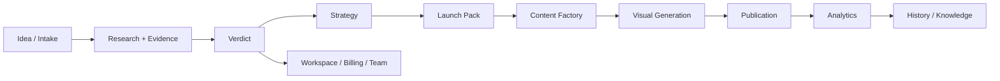

# Commercial User Journey Map

> **Source of Truth** for commercial user scenarios (*what* the user does).  
> Task: PRODUCT-01.4-COMMERCIAL-FOUNDATION-01 · Last updated: 2026-07-31

**Where screens live:** [INFORMATION_ARCHITECTURE.md](./INFORMATION_ARCHITECTURE.md)  
**How screens look:** [DESIGN.md](./DESIGN.md)

---

## 0. Mandatory workflow (four-step gate)

**No commercial screen may be changed until all four steps are done:**

```
1. Business Journey  →  2. Information Architecture  →  3. Design System  →  4. Implementation
```

| Step | Document | Question |
|------|----------|----------|
| **1. Business Journey** | **This document** | What does the user do? |
| **2. Information Architecture** | [INFORMATION_ARCHITECTURE.md](./INFORMATION_ARCHITECTURE.md) | Where does it live? |
| **3. Design System** | [DESIGN.md](./DESIGN.md) | Which components and tokens? |
| **4. Implementation** | Code + tests | Screen + behavior |

### 0.1 Four questions (all must be Yes)

| # | Question | Required |
|---|----------|----------|
| 1 | Screen exists in [INFORMATION_ARCHITECTURE.md](./INFORMATION_ARCHITECTURE.md)? | **Yes** |
| 2 | Screen matches a journey stage in this document? | **Yes** |
| 3 | Screen uses [DESIGN.md](./DESIGN.md) + `commercial/*`? | **Yes** |
| 4 | Valid after HR / Legal / Billing / Analytics attach? | **Yes** |

**Any No → UI change forbidden.** Update Journey Map and/or IA first, then DESIGN.md, then code.

**Forbidden:** polishing a screen without IA slot (causes global nav redesign when Launch / Analytics attach).

---

## 1. Product topology (summary)

Canonical structure: **[INFORMATION_ARCHITECTURE.md §1](./INFORMATION_ARCHITECTURE.md#1-product-topology-canonical)**.

```
Workspace → Projects → Project (Research, Strategy, Launch → Content / Visuals / Publication)
Workspace-level: Analytics, Knowledge, Settings (+ Billing, Team, HR, Legal, …)
```

Journey stages in §3 reference **IA screen IDs** (IA §7).

---

## 2. Macro journey (target product)

Full Marketsynth journey (not all stages active):



**Active slice (CWF.1):** A → B → C → E (partial) → H (Telegram, frozen until gate).  
**Architectural placeholders:** D, F, G, I, J, K — slots reserved in IA; do not implement without phase doc.

---

## 3. Journey catalog

Legend: **✅ active** · **⚠️ partial** · **📋 planned** · **⏸ frozen**

### J1 — Discover & start (Workspace)

| Stage | User goal | Entry | Screen / surface | States | Next action | Module slot |
|-------|-----------|-------|------------------|--------|-------------|-------------|
| J1.1 Landing | Understand value | `/` | Public landing | — | Start intake / Sign in | Marketing |
| J1.2 Home (no project) | Start new work | `/workspace` | Workspace Home | empty · intent | Intake or intent card | Research entry |
| J1.3 Intent select | Pick job type | `/workspace` | Intent cards + task input | — | Route to BIV / assistant | All modules |
| J1.4 Intake wizard | Describe idea | `/project-intake` | 7-step wizard | draft · review · confirm | Confirm → research | Research |
| J1.5 Projects index | Resume work | `/workspace/projects` | Projects list | empty · list | Open project context | History |

### J2 — Research & evidence (CWF.1 core) ✅

| Stage | User goal | Entry | Screen / surface | States | Next action | Module slot |
|-------|-----------|-------|------------------|--------|-------------|-------------|
| J2.1 Research queued | Know run started | Home + project | Progress / timeline | queued | Wait / poll | Research |
| J2.2 Research running | See live progress | Home + project | Research progress panel | running | Wait | Research |
| J2.3 Partial result | Use limited proof | Home + project | Partial research panel | partial | Refine inputs / accept limits | Research · Verdict |
| J2.4 Full evidence | Trust findings | Home + project | Findings + evidence cards | succeeded | Read verdict path | Research |
| J2.5 Research failed | Recover without panic | Home + project | Failure panel | failed · technical | Retry / support path | Research |

**Terminal questions (every state):** What happened? What is proven? What is missing? What next?

### J3 — Verdict & decision ✅ / ⚠️

| Stage | User goal | Entry | Screen / surface | States | Next action | Module slot |
|-------|-----------|-------|------------------|--------|-------------|-------------|
| J3.1 Full verdict | Decide GO/NO-GO | Home + project | Verdict / validation card | GO · CONDITIONAL · PILOT · HOLD · NO_GO | Launch Pack or pivot | Verdict |
| J3.2 Partial verdict | Decide with gaps | Home + project | Partial panel (J2.3) | partial_research | Remediation / pilot | Verdict |
| J3.3 Verdict history | Compare past | `/workspace/verdicts` | Index (dev/ops) | empty · list | Open project | History |

### J4 — Strategy & positioning 📋

| Stage | User goal | Entry | Screen / surface | States | Next action | Module slot |
|-------|-----------|-------|------------------|--------|-------------|-------------|
| J4.1 Strategy draft | Position offer | Project stage | Strategy panel (future) | draft | Approve | Strategy |
| J4.2 Audience / ICP | Know segment | Project stage | Audience card (future) | — | Edit / confirm | Strategy |

**IA slot:** post-verdict panel group on Home → later `/workspace/projects/{id}/strategy`.

### J5 — Launch Pack ⚠️

| Stage | User goal | Entry | Screen / surface | States | Next action | Module slot |
|-------|-----------|-------|------------------|--------|-------------|-------------|
| J5.1 Launch decision | Choose path after verdict | Home + project | Launch branch panel | branch | Request pack | Launch |
| J5.2 Offer review | Approve offer copy | Home + review | Offer review UI | draft · approved | Content | Launch |
| J5.3 Launch plan | See rollout steps | Project stage | Launch plan (future) | — | Execute content | Launch |

**IA slot:** Launch section in project sidebar (frozen) — do not duplicate on random routes.

### J6 — Content Factory 📋

| Stage | User goal | Entry | Screen / surface | States | Next action | Module slot |
|-------|-----------|-------|------------------|--------|-------------|-------------|
| J6.1 Content brief | Define assets | Project stage | Content brief (future) | — | Generate | Content Factory |
| J6.2 Asset review | Edit posts | `/workspace/review` | Review queue | empty · queue | Approve | Content Factory |
| J6.3 Assets library | Reuse content | `/workspace/assets` | Assets index | empty · list | Publish | Content Factory |

### J7 — Visual generation ⏸

| Stage | User goal | Entry | Screen / surface | States | Next action | Module slot |
|-------|-----------|-------|------------------|--------|-------------|-------------|
| J7.1 Visual brief | Request visuals | Project stage | Visual brief (future) | — | Generate | Visual Generation |
| J7.2 Visual review | Approve image | Review / assets | Asset card | pending · approved | Attach to post | Visual Generation |

**Frozen** until Controlled Pilot — IA slot only.

### J8 — Publication 📋

| Stage | User goal | Entry | Screen / surface | States | Next action | Module slot |
|-------|-----------|-------|------------------|--------|-------------|-------------|
| J8.1 Channel setup | Connect Telegram | `/workspace/channels` | Channels (future) | empty · connected | Publish | Publication |
| J8.2 Approval gate | Human approve send | Review panel | Approval panel | pending | Publish | Publication |
| J8.3 Published proof | See message_id | Home + project | Delivery evidence | published | Analytics | Publication |

### J9 — Analytics 📋

| Stage | User goal | Entry | Screen / surface | States | Next action | Module slot |
|-------|-----------|-------|------------------|--------|-------------|-------------|
| J9.1 Performance | See what worked | `/workspace/analytics` (future) | Analytics dashboard | empty · data | Optimize | Analytics |
| J9.2 Funnel | Track journey | Project stage | Funnel widget (future) | — | Strategy tweak | Analytics |

**IA slot:** Workspace nav group «Аналитика» — reserved, not implemented.

### J10 — History & knowledge ⚠️

| Stage | User goal | Entry | Screen / surface | States | Next action | Module slot |
|-------|-----------|-------|------------------|--------|-------------|-------------|
| J10.1 Project timeline | Audit what ran | `/workspace/projects` | Project cards + deep link | — | Open stage | History |
| J10.2 Knowledge | Reuse research | `/workspace/knowledge` | Knowledge index | empty | Search | Knowledge |

### J11 — Workspace admin 📋

| Stage | User goal | Entry | Screen / surface | States | Next action | Module slot |
|-------|-----------|-------|------------------|--------|-------------|-------------|
| J11.1 Settings | Profile / prefs | `/workspace/settings` | Settings | — | — | Settings |
| J11.2 Billing | Pay / plan | Settings → Billing (future) | Billing | — | Upgrade | Billing |
| J11.3 Team | Invite users | Settings → Team (future) | Team | — | Invite | Team |
| J11.4 HR / Legal | Compliance (future) | Settings subtree | HR / Legal | — | — | HR · Legal |

---

## 4. IA cross-reference

**Navigation, URLs, permissions, mobile, and reserved slots:** [INFORMATION_ARCHITECTURE.md](./INFORMATION_ARCHITECTURE.md) — single product map.

Do not duplicate IA tables here. When a journey stage needs a new route or nav slot, update IA first.

### 4.1 Project command center (journey view)

On `/workspace?project={id}`, panels stack in journey order:

1. Intake summary (if needed)
2. Research progress / result
3. Verdict
4. Launch Pack / Offer (when unlocked)
5. Launch → Content / Visuals / Publication (when unlocked)
6. Timeline footer (future)

Dedicated paths are deep links only — see IA §6.2.

---

## 5. Screen inventory (commercial surfaces)

| Screen | Journey | Shell width | Key components | Future-safe? |
|--------|---------|-------------|----------------|--------------|
| Public landing | J1.1 | marketing | hero, CTA | ✅ |
| Workspace Home | J1.2–J2 | `max-w-5xl` | intent, recent, stage panels | ✅ |
| Intake wizard | J1.4 | `max-w-6xl` | wizard shell, review | ⚠️ i18n |
| Projects list | J1.5 | `max-w-3xl` | `CommercialEmptyState`, cards | ✅ |
| Partial research | J2.3 | panel | `CommercialCard`, sections | ✅ |
| Full verdict | J3.1 | panel | verdict card | ⚠️ unify |
| Offer review | J5.2 | panel | approval pattern | ⚠️ |
| Review queue | J6.2 | list | `CommercialEmptyState` | 📋 |
| Settings | J11.1 | settings | forms | ✅ |

---

## 6. Screen-change checklist (copy into task / PR)

Four-step gate + four questions (§0). Additionally:

- [ ] Journey ID (J*.*) in §3
- [ ] IA screen ID in [INFORMATION_ARCHITECTURE.md §7](./INFORMATION_ARCHITECTURE.md#7-screen-registry-ia--journey--route)
- [ ] Terminal states: happened / proven / missing / next
- [ ] DESIGN.md tokens + `commercial/*` components
- [ ] No new orphan route (IA §1 anti-pattern)
- [ ] Empty / loading / error states defined
- [ ] Golden Path E2E unaffected or updated intentionally

---

## 7. Anti-patterns

- Redesigning Home layout before Launch / Analytics slots are defined
- Adding module pages without sidebar / project-stage reservation
- Bespoke empty states per page
- Parallel «legacy Alpha» UX for the same journey stage
- Developer-only routes exposed on commercial nav without gate

---

## 8. References

- **[INFORMATION_ARCHITECTURE.md](./INFORMATION_ARCHITECTURE.md)** — product structure (read before screen work)
- [DESIGN.md](./DESIGN.md) — visual system + component catalog
- [PRODUCT-FINISH-01-COMMERCIAL-GOLDEN-PATH.md](./product/PRODUCT-FINISH-01-COMMERCIAL-GOLDEN-PATH.md) — active golden path
- [MARKETSYNTH-PLATFORM-MAP.md](./product/MARKETSYNTH-PLATFORM-MAP.md) — full capability map
- [CWF-SKILL-INTEGRATION-GAPS.md](./product/CWF-SKILL-INTEGRATION-GAPS.md) — CWF delivery gaps
