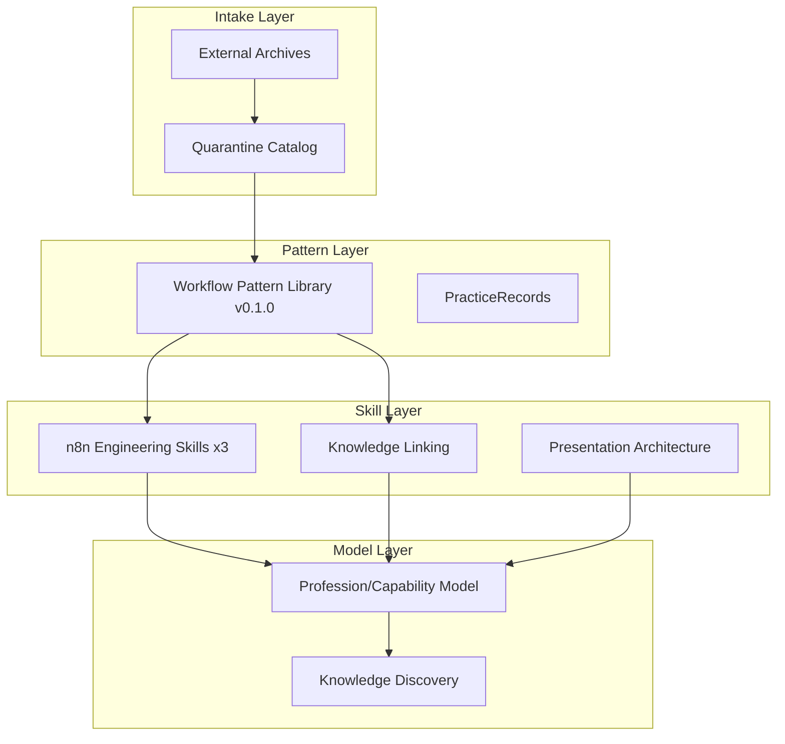

# KB-WPL Read-Only Knowledge System

**Program:** KB-WPL-01 (closed)  
**Status:** `frozen_read_only_knowledge_program`

## System contour

Marketsynth KB-WPL-01 is a governed, read-only knowledge foundation for marketing
and automation architecture. It does not execute workflows, activate Connectors,
or install external Skills.

## Design principles

1. **Read-only by default** — all bundles are frozen metadata; no runtime side effects.
2. **Explainable routing** — Discovery explains profession/capability/skill/pattern chains.
3. **Gaps remain visible** — missing runtime, Connector, Tool, or approval never hidden.
4. **Tenant-safe** — filtering before ranking and linking; no cross-tenant leakage.
5. **Deterministic** — hashes stable; no LLM ranking or vector search.

## Safe consumption

Future consumers may use this foundation for:

- Skill Discovery (read-only advisory)
- Architectural planning
- Internal knowledge lookup
- Future Knowledge Core persistence (KB-WPL-02)
- Future UI advisory surfaces

They must **not** treat frozen candidates as production-ready or executable.

## Legacy note

`app/knowledge/linking/` is legacy. New work uses `app/knowledge/knowledge_linking/`
for KB-WPL-01.5+ contracts.

## Verification

Integrated audit: `tests/test_kb_wpl_01_9_integrated_freeze_audit.py` (161+ tests)
