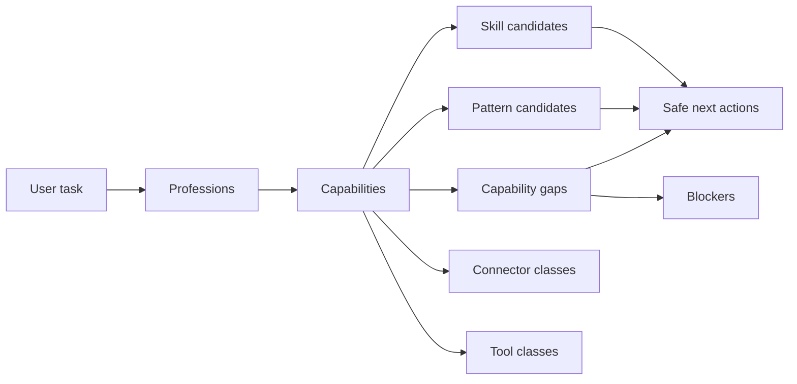

# Knowledge Discovery Model

**Phase:** KB-WPL-01.8  
**Status:** Read-only deterministic discovery layer

## Chain of explanation



Discovery output is **advisory**. `ProfessionalTaskRoute` explains the chain; it does not schedule
execution or activate runtime components.

## Contracts

### KnowledgeDiscoveryQuery

Required: `query_id`, `task_description`, `tenant_id`, `mode`, `execution_sensitivity`,
`result_limit`, `provenance`.

Optional filters: `preferred_profession_ids`, `required_capability_ids`, `excluded_capability_ids`,
`platform_constraints`, `provider_constraints`, `allowed_trust_statuses`, `minimum_maturity`,
`internal_audit_mode`, `include_quarantined`, `required_evidence_classes`, `approval_constraints`.

Rules:
- `include_quarantined=true` requires `internal_audit_mode=true`
- Billing/destructive sensitivity → deny-by-default recommendations
- Raw credentials and workflow JSON forbidden in input

### KnowledgeDiscoveryResult

Buckets: professions, capabilities, skill_candidates, pattern_candidates, connector_requirements,
tool_requirements, capability_gaps, blockers, approval_requirements, evidence_requirements,
professional_task_route, safe_next_actions, readiness_summary, missing_components.

Always: `runtime_authorized=false`, `human_review_required=true`, deterministic `result_hash`.

### DiscoveryCandidate

Shared candidate shape with `match_reasons`, `ranking_factors`, `total_rank`, `confidence`,
`limitations`, `blockers`, `recommended_action`, `runtime_authorized=false`.

## Gap-aware behavior

| State | Meaning |
|-------|---------|
| A — knowledge implemented | Skill + Pattern exist; runtime missing |
| B — partial | Skill exists; Connector missing |
| C — specified only | Capability exists; no Skill package |
| D — blocked | Missing approval/evidence/version/tenant restriction |
| E — deferred | Roadmap-only capability |

Patterns **support** but **do not replace** Skills. Gaps stay visible in results.

## Visibility

Filtering occurs **before** matching and ranking:

- Global platform-native Skills → all tenants
- Tenant-private Skills → owner tenant only
- Quarantined → internal audit mode only
- Rejected → hidden unless `include_rejected_references`
- Cross-tenant leakage forbidden

## Python API (read-only)

```python
from app.knowledge.discovery.queries import discover, route_task

result = discover(query, sources=load_default_sources())
route = route_task(query, sources=sources)
```

No HTTP routes, DB persistence, or MCP exposure in this phase.

## Binding rules

- Capability model (KB-WPL-01.7) is authoritative for routing semantics
- Skill Registry is authoritative for Skill identity
- WPL (KB-WPL-01.3C) is authoritative for Pattern identity
- Search relevance ≠ trust; capability fit ≠ runtime readiness
