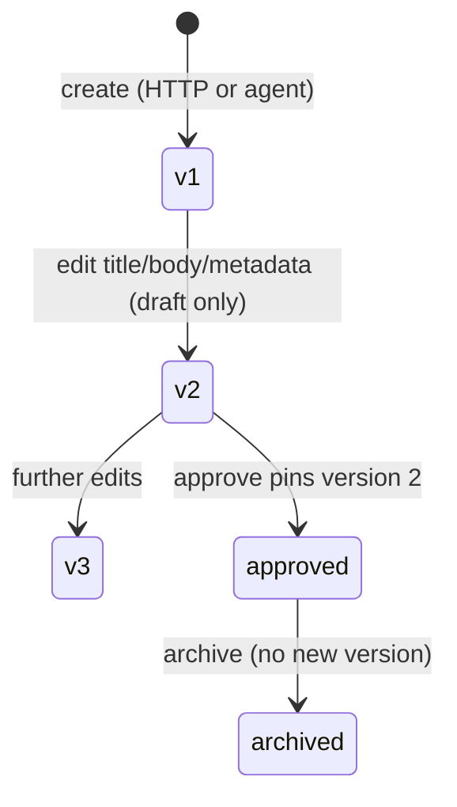

# Phase 4.0 — Marketing domain (briefs & content assets)

Phase 4 adds a **product domain layer** for a marketing agency: structured briefs and deliverable content assets. Phase 3 remains the execution engine (classic/LangGraph, handoff, outbox, replay) and is **not** wired to this domain yet.

## Why marketing brief?

A **marketing brief** is the single source of truth for a campaign or product line inside a project:

- What we sell (`product_description`, `offer`)
- Who we target (`target_audience`)
- What success looks like (`goals`)
- Guardrails (`constraints`)

Later, agents will read briefs via tools (e.g. `brief.get`) instead of ad-hoc prompt blobs.

## Why content asset?

A **content asset** is a concrete marketing artifact:

- Landing page copy, ad copy, emails, Telegram posts, articles, offers, audience profiles, funnel steps

Assets can link to:

- `brief_id` — which brief they implement
- `task_id` / `agent_run_id` — how they were produced (audit trail)

Statuses: `draft` → `approved` → `archived` (soft delete).

## API (project-scoped)

All routes require Bearer API key and **project ownership**.

### Marketing briefs

| Method | Path | Notes |
|--------|------|--------|
| POST | `/projects/{project_id}/marketing-briefs` | Create (`draft`) |
| GET | `/projects/{project_id}/marketing-briefs` | List; `?include_archived=true` |
| GET | `/projects/{project_id}/marketing-briefs/{brief_id}` | Get one |
| PATCH | `/projects/{project_id}/marketing-briefs/{brief_id}` | Update allowed fields |
| DELETE | `/projects/{project_id}/marketing-briefs/{brief_id}` | Archive (not hard delete) |

### Content assets

| Method | Path | Notes |
|--------|------|--------|
| POST | `/projects/{project_id}/content-assets` | Create |
| GET | `/projects/{project_id}/content-assets` | List; `?brief_id=` filter; `?include_archived=true` |
| GET | `/projects/{project_id}/content-assets/{asset_id}` | Get one |
| PATCH | `/projects/{project_id}/content-assets/{asset_id}` | Update body/status/links (content edits create versions) |
| POST | `/projects/{project_id}/content-assets/{asset_id}/create-revision` | New draft revision from approved source |
| GET | `/projects/{project_id}/content-assets/diff` | Diff two assets (`from_asset_id`, `to_asset_id`) |
| GET | `/projects/{project_id}/content-assets/{asset_id}/versions/diff` | Diff two versions (`from_version`, `to_version`) |
| GET | `/projects/{project_id}/content-assets/{asset_id}/revision-diff` | Diff revision draft vs source approved snapshot |
| POST | `/projects/{project_id}/content-assets/{asset_id}/rollback-to-version` | New draft from version snapshot (approved source only) |
| GET | `/projects/{project_id}/content-assets/{asset_id}/versions` | List version history |
| GET | `/projects/{project_id}/content-assets/{asset_id}/versions/{version_number}` | Get one version snapshot |
| DELETE | `/projects/{project_id}/content-assets/{asset_id}` | Archive |

## Contracts vs legacy `schemas/contracts.py`

Phase 4 domain models live in `app/marketing/contracts.py` (enums and Pydantic types). Legacy `MarketingBrief` / `ContentAsset` in `app/schemas/contracts.py` are **unchanged** placeholders from foundation — new code uses the marketing package.

## Phase 4.1 — Read-only marketing tools

Agents can read briefs and content assets through the standard tool layer (envelope, permissions, audit, context budget). **Write tools remain disabled** (`asset.create_draft`, updates, etc.) until a separate safety gate.

### Registered tools (read-only executors)

| Tool | Purpose |
|------|---------|
| `marketing_brief.get` | Single brief in current project |
| `marketing_brief.list` | Compact brief list (`limit` max 10) |
| `content_asset.get` | Single asset; body gated by `include_body` |
| `content_asset.list` | Compact asset list with optional filters |

Also in the read-only registry (stubs / other phases): `memory.search`, `project_context.get`, `task.get`, `task.list_recent`, `search_brief` (no-op).

**12 real read-only executors** total (including funnel read tools in 4.9) — plus optional write `content_asset.create_draft` when enabled.

### Safe payload rules

Model arguments **must not** include: `owner_id`, `project_id`, `agent_id`, `agent_run_id`, `run_id`, `task_id` (ownership comes from `ToolExecutionContext` only).

- **`marketing_brief.get`**: full brief fields; `constraints` only when `include_constraints=true` (default).
- **`marketing_brief.list`**: `id`, `title`, `offer_preview` (max 160 chars), `status`, timestamps; archived excluded unless `include_archived=true`.
- **`content_asset.get`**: metadata + `body_preview` (max 300) always; `body` only when `include_body=true`, sanitized and capped at **4 000** chars before envelope size limit.
- **`content_asset.list`**: compact rows with `body_preview` only (no full body).

Missing or cross-tenant IDs → `not_found` / `permission_denied` without existence leaks.

### Agent allowlists

| Agent type | Marketing tools |
|------------|-----------------|
| strategist, researcher, critic, orchestrator | all four |
| copywriter | all four |
| analyst | `marketing_brief.get`, `marketing_brief.list`, `content_asset.list` only |
| content_planner | same as copywriter |

Phase 4.1 is **read-only** so agents can ground on briefs/assets before any write path ships.

## Phase 4.2 — First agent write tool (`content_asset.create_draft`)

**Disabled by default.** Two flags must be true for exposure and execution:

```env
AGENT_WRITE_TOOLS_ENABLED=true
AGENT_WRITE_TOOL_CONTENT_ASSET_CREATE_DRAFT_ENABLED=true
AGENT_WRITE_TOOL_BODY_MAX_CHARS=12000
```

### Why only draft status

Agents may propose copy, not publish or approve. The tool always creates `status=draft`. Humans approve via dedicated HTTP endpoints (Phase 4.3). No `approve`, `update`, or `delete` agent tools.

### Safety gate

| Check | Behavior |
|-------|----------|
| Settings | Both write flags must be `true`; otherwise LLM does not see the tool |
| Agent type | Allowed: copywriter, content_planner, strategist, orchestrator. Denied: analyst, critic, researcher |
| Context | `owner_id`, `project_id`, `agent_id`, `agent_run_id` from `ToolExecutionContext` only |
| Links | `task_id`, `agent_run_id` on asset from context, not model args |
| Args forbidden | `status`, `owner_id`, `project_id`, `agent_id`, `agent_run_id`, `run_id`, `task_id` |
| Body | Rejected if longer than `AGENT_WRITE_TOOL_BODY_MAX_CHARS` (no silent truncate) |
| Brief | Optional `brief_id`; must belong to project; archived brief → `invalid_arguments` |
| Result | Compact `asset` + `body_preview` only — **no full body** in tool result |
| Audit | `execution_mode=write`; arguments preview has `body_length`, not body text |

### Limitations (4.2)

- No approve/archive/update/delete agent tools
- No external publishing
- No bulk or mass-write tools
- HTTP CRUD remains the path for human edits and approval

## Phase 4.3 — Human approval workflow

Lifecycle: **draft → approved → archived** (no reverse transitions).

| Endpoint | Transition |
|----------|------------|
| `POST .../content-assets/{id}/approve` | `draft` → `approved` |
| `POST .../content-assets/{id}/archive` | `draft` or `approved` → `archived` |
| `DELETE .../content-assets/{id}` | same as archive (409 if already archived) |

### Approval metadata

On approve, `metadata.approval` is set:

```json
{
  "approved_at": "ISO-8601",
  "approved_by_owner_id": "uuid",
  "source": "http_api"
}
```

Visible to the project owner via CRUD API; omitted from compact agent tool results.

### Status policy

`app/marketing/asset_policy.py` enforces transitions. `PATCH` with `status` uses the same rules (cannot jump `approved` → `draft`). HTTP create accepts **draft** only.

### Outbox events (optional, non-blocking)

| Event type | When |
|------------|------|
| `content_asset.approved` | After successful approve |
| `content_asset.archived` | After successful archive |

If outbox append fails, the status change is **not** rolled back (warning log only).

### Division of responsibility

| Actor | Can do |
|-------|--------|
| Agent (`content_asset.create_draft`) | Create **draft** only |
| Human (HTTP API) | Approve, archive, edit title/body/metadata |
| Agent | No approve, no archive, no publish |

## Phase 4.4 — Content asset versioning

Every content asset has an immutable **version history** in `content_asset_versions`. The asset row keeps the **current** snapshot (`title`, `body`, `metadata`) plus counters:

| Field | Meaning |
|-------|---------|
| `current_version_number` | Latest content revision (starts at 1) |
| `approved_version_number` | Which version was approved (`null` until approve) |

### Version lifecycle



- **Create** (HTTP or `content_asset.create_draft`) → version **1** with `created_by_source` = `http_api` or `agent_tool`.
- **Edit** `title`, `body`, or `metadata` on a **draft** asset → next version number; asset row updated to match.
- **Approve** → `approved_version_number = current_version_number`; **no** new version row.
- **Archive** → status only; **no** new version row.
- **Status-only** changes (e.g. approve, archive) do not create versions.

### Why approved content cannot be edited in place

Approved copy is the contractual deliverable. In-place edits would blur audit (“what was approved?”). Phase 4.4 **rejects** `PATCH` of `title` / `body` / `metadata` on `approved` assets (`409`). Use **create-revision** (Phase 4.5) for a new draft branch instead.

### Version API response

`GET .../versions` and `GET .../versions/{n}` return: `version_number`, `title`, `body`, `metadata`, `created_by_source`, `created_at` (no `created_by_agent_run_id` in public API).

### Agent read tools

`content_asset.get` / `content_asset.list` expose `current_version_number`, `approved_version_number`. Body / `body_preview` reflect the **current** version on the asset row.

### Migration

`alembic/versions/20260529_0012_content_asset_versions.py` — table `content_asset_versions`, columns on `content_assets`, backfill version 1 for existing rows (`created_by_source=system`).

## Phase 4.5 — Create revision from approved asset

Approved assets stay **immutable**. To change approved copy, humans create a **new draft asset** linked to the source — a **revision branch**, not rollback.

| Endpoint | Behavior |
|----------|----------|
| `POST .../content-assets/{id}/create-revision` | New `draft` asset from `approved_version_number` snapshot |

Optional body: `title`, `body`, `metadata` (merged over approved version metadata; `metadata.revision` always set).

### Revision vs version

| Concept | Scope | Meaning |
|---------|--------|---------|
| **Version** | Same asset row | History of edits while draft (`content_asset_versions`) |
| **Revision** | New asset row | Draft fork from an approved source (`source_asset_id`, `revision_number`) |

### Revision fields

| Field | Meaning |
|-------|---------|
| `source_asset_id` | Approved asset this revision was created from |
| `source_version_number` | Which version was approved on the source when revision was created |
| `revision_number` | 1, 2, 3… per source asset (increments per `create-revision`) |

New revision asset: `brief_id` copied; `task_id` / `agent_run_id` null; version **1** (`created_by_source=http_api`); source asset **unchanged**; no auto-approve; no agent execution.

`content_asset.create_draft` cannot set `source_asset_id`, `source_version_number`, or `revision_number`.

### Migration

`alembic/versions/20260529_0013_content_asset_revisions.py` — nullable revision link columns on `content_assets`.

## Phase 4.6 — Content asset diff (read-only)

Compare snapshots **before approve** — no writes, no rollback, no “apply diff”.

| Endpoint | Compares |
|----------|----------|
| `GET .../content-assets/{id}/versions/diff` | Two versions of the same asset |
| `GET .../content-assets/diff` | Current snapshots of any two assets in the project |
| `GET .../content-assets/{id}/revision-diff` | Source approved version vs revision draft (409 if not a revision) |

Response shape: `{ "from": {...}, "to": {...}, "diff": {...} }` with compact `from`/`to` sides (`asset_id`, `version_number`, `title`, `status`, `type`).

### Diff payload

- `title_changed`, `body_changed`, `metadata_changed`
- `body_diff`: unified diff (`difflib`), max **300** lines, `truncated` flag
- `metadata_diff`: `added` / `removed` / `changed` — secret-like keys **omitted** (`api_key`, `*_token`, etc.)

Implementation: `app/marketing/content_diff.py`. Archived assets may be diffed; cross-project asset pairs return **404**.

### Why no apply-diff / in-place rollback

Diff is the **control panel** — humans see what changed before approve. **Rollback** (4.7) clones an old version into a **new draft** asset; it does not rewrite the approved source row.

## Phase 4.7 — Rollback as new draft revision

| Endpoint | Behavior |
|----------|----------|
| `POST .../content-assets/{id}/rollback-to-version` | New `draft` from any existing version of an **approved** source |

Body: `{ "version_number": N, "reason": "optional, max 256 chars" }`.

- Copies `title` / `body` / `metadata` from the selected **version snapshot**
- Sets `source_asset_id`, `source_version_number`, `revision_number` (same revision chain as `create-revision`)
- Adds `metadata.rollback` (`source_asset_id`, `source_version_number`, `reason`, `created_at`)
- Source asset **unchanged**; no auto-approve; no archive
- Outbox: `content_asset.rollback_revision_created` (non-blocking on failure)

**Allowed sources:** `approved` only. `draft` / `archived` → **409**. Setting `CONTENT_ASSET_ROLLBACK_FROM_ARCHIVED_ENABLED` exists (default `false`) for a future phase — unused in 4.7.

Use **diff** (4.6) to compare source current vs rollback draft before approving the rollback branch.

## Phase 4.8 — Marketing funnel skeleton

Map **briefs → funnels → steps → content assets** without agent integration yet.

| Entity | Purpose |
|--------|---------|
| **MarketingFunnel** | Campaign funnel (optional `brief_id`) |
| **MarketingFunnelStep** | Typed step (`awareness`, `offer`, …) with `position` |
| **FunnelStepAssetLink** | Attach assets to a step with `role` (`primary`, `supporting`, …) |

### API (project-scoped)

- Funnels: CRUD + `DELETE` = archive
- Steps: create/list/update/archive + `POST .../steps/reorder`
- Links: `POST/GET` step assets, `DELETE` link (hard delete)

### Asset linking (4.8)

**Draft and approved** assets may be linked; responses include `asset_status`, `asset_type`, `asset_title`. Future publishing rules may require **approved** only.

### Settings (reserved)

`CONTENT_ASSET_ROLLBACK_FROM_ARCHIVED_ENABLED` — not used for funnels in 4.8.

### Migration

`alembic/versions/20260529_0014_marketing_funnels.py`

## Phase 4.9 — Marketing funnel read tools

Agents can read funnel structure (customer journey) through the tool layer — **read-only**, no funnel writes.

### Registered tools

| Tool | Purpose |
|------|---------|
| `marketing_funnel.get` | Single funnel; optional compact `steps`; always includes `steps_count` |
| `marketing_funnel.list` | Compact funnel list (`limit` max 10; excludes archived by default) |
| `marketing_funnel.step_assets` | Step summary + linked assets (`id`, `title`, `type`, `status`, `role`) |
| `marketing_funnel.gap_analysis` | Heuristic journey gaps (no LLM) |

### Gap analysis

Checks canonical step types: `awareness`, `lead_magnet`, `nurture`, `offer`, `checkout`, `onboarding`, `retention`, `reactivation`.

Returns:

- `missing_steps` — canonical types not present on the funnel
- `steps_without_assets` — active steps with zero linked assets (by `step_type`)
- `approved_assets_count` / `draft_assets_count` — unique linked assets by status
- `coverage_score` — `(8 - len(missing_steps)) / 8`, rounded to 2 decimals

### Agent profiles

| Agent | Funnel tools |
|-------|----------------|
| strategist, researcher, critic, orchestrator | all four |
| analyst, content_planner | all four |
| copywriter | `marketing_funnel.get`, `marketing_funnel.step_assets` only |

After 4.9 the marketing domain is **fully readable** by agents (briefs, assets, funnels).

## Phase 5.0 — Marketing strategist agent MVP

See [phase_5_marketing_agents.md](phase_5_marketing_agents.md) for the first product agent: strategist template, prompt workflow, write-tool gating, run payload convention, and mock `mock_strategy_flow` testing.

## Phase 4.0 limitations

- No LLM or LangGraph calls from marketing services
- No in-place rollback or apply-diff (clone-only rollback in 4.7)
- No full-text search on assets yet
- Archive only (no hard delete)
- No automatic sync from agent run output to assets
- Secrets must not be stored in `constraints` or `metadata` (operator responsibility; API does not echo webhook-style secrets)

## Migration

`alembic/versions/20260529_0011_marketing_domain.py` — tables `marketing_briefs`, `content_assets`.
