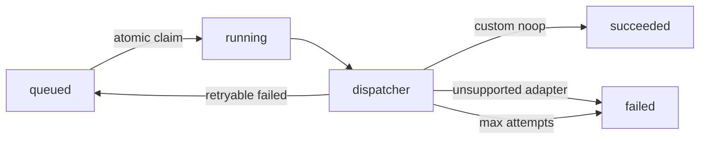

# Phase 6.0 — Publishing layer skeleton

## Scope

HTTP/API-only queue for publishing **approved** content assets to configured channels.

**In scope (6.0):**

- Publishing channels (`webhook`, `telegram`, `email`, `tilda`, `custom`)
- Publication jobs (`queued` → future dispatch)
- Ownership checks, channel status gates, approved-version pinning

**Out of scope (real adapters — Phase 6.2+):**

- External HTTP send (Telegram API, Tilda, SMTP, outbound webhooks)
- Agent tools for publish/queue
- Auto-publish on approve

## Human vs agent boundaries

| Action | Who |
|--------|-----|
| Create marketing draft | Agents (when write enabled) |
| Approve content asset | Human — `POST .../content-assets/{id}/approve` |
| Configure channel | Human — publishing-channels API |
| Queue publication | Human — `POST .../publication-jobs` |
| Cancel queued job | Human — `POST .../publication-jobs/{id}/cancel` |

Agents **cannot** create channels, queue jobs, or publish.

## Data model

### PublishingChannel

- `channel_config` (JSON, internal) — may contain secrets
- `config_preview` (JSON, API) — redacted via `redact_sensitive_payload` (`token`, `api_key`, `password`, `secret`, …)

Statuses: `active`, `paused`, `archived`.

### PublicationJob

- Created only for `ContentAssetStatus.APPROVED` with non-null `approved_version_number`
- `asset_version_number` = `approved_version_number` (not `current_version_number`)
- `payload_preview` — compact metadata (ids, titles, channel type); no full body, no secrets
- Initial status: `queued`
- `attempts` — delivery retry counter (Phase 6.1)
- Worker transitions: `queued` → `running` → `succeeded` | `failed` (or re-queued on retryable failure)

### PublicationDeliveryLog (Phase 6.1)

One row per dispatch attempt: `succeeded`, `failed`, or `skipped`. Safe `error_message` / `response_preview` only — no secrets.

## API

### Channels

| Method | Path |
|--------|------|
| POST | `/projects/{project_id}/publishing-channels` |
| GET | `/projects/{project_id}/publishing-channels` |
| GET | `/projects/{project_id}/publishing-channels/{channel_id}` |
| PATCH | `/projects/{project_id}/publishing-channels/{channel_id}` |
| DELETE | `/projects/{project_id}/publishing-channels/{channel_id}` |

DELETE sets `status=archived` (soft delete, preserves job FKs).

### Jobs

| Method | Path |
|--------|------|
| POST | `/projects/{project_id}/publication-jobs` |
| GET | `/projects/{project_id}/publication-jobs` |
| GET | `/projects/{project_id}/publication-jobs/{job_id}` |
| POST | `/projects/{project_id}/publication-jobs/{job_id}/cancel` |
| POST | `/projects/{project_id}/publication-jobs/process?limit=50` | Manual worker drain (like outbox dispatch) |

### Delivery logs

| Method | Path |
|--------|------|
| GET | `/projects/{project_id}/publication-deliveries` | Filters: `job_id`, `channel_id`, `status`, `limit`, `offset` |

Create body:

```json
{
  "asset_id": "...",
  "channel_id": "..."
}
```

## Rules

1. Draft assets → `409` on job create
2. Missing `approved_version_number` → `409`
3. Paused/archived channel → `409`
4. Cancel only when `status=queued`
5. All endpoints require auth (same as other project APIs)

## Phase 6.1 — Worker + delivery logs

### Worker flow



1. Scheduler (`app/workers/publication_worker.py`) or manual `POST .../publication-jobs/process`
2. Claim job (`queued` → `running`) — double processing prevented
3. `PublicationDispatcher` — **no HTTP**, uses `payload_preview` only (not `channel_config` secrets)
4. Write `publication_delivery_logs` row per attempt
5. Update job status

### Dispatcher

| Channel type | Behavior |
|--------------|----------|
| `custom` | Noop success (`noop_dispatch`) — for tests/smoke |
| `webhook` | **Real HTTP POST** of approved asset payload (Phase 6.2) |
| `telegram`, `email`, `tilda` | `skipped` + `unsupported_channel_adapter` → job **failed** (no retry) |

### Webhook channel config (Phase 6.2)

```json
{
  "url": "https://example.com/botfazer/publish",
  "signing_secret": "optional-shared-secret",
  "headers": {
    "X-Custom": "value"
  }
}
```

Rules:

- `url` required — `http` or `https` only
- `config_preview` redacts `signing_secret`, strips URL query, redacts secret-like header values
- Delivery logs never include query strings (safe URL preview only)

### Webhook payload

```json
{
  "publication_job_id": "...",
  "project_id": "...",
  "asset": {
    "id": "...",
    "version_number": 1,
    "type": "email",
    "title": "...",
    "body": "...",
    "metadata": {}
  },
  "channel": {
    "id": "...",
    "type": "webhook",
    "name": "..."
  }
}
```

Headers: `Content-Type`, `X-BotFazer-Publication-Job-Id`, `X-BotFazer-Asset-Id`, `X-BotFazer-Asset-Version`, `X-BotFazer-Timestamp`, optional `X-BotFazer-Signature`.

### Signature verification (receiver)

When `signing_secret` is configured:

```
signature = HMAC-SHA256(secret, timestamp + "." + raw_body)
header: X-BotFazer-Signature: sha256=<hex>
```

Same scheme as project event webhooks, but payload is **approved content**, not outbox events.

### Retry behavior (webhook)

| Outcome | Job |
|---------|-----|
| HTTP 2xx | `succeeded` |
| HTTP non-2xx | `failed` delivery log → re-queue until `PUBLICATION_JOB_MAX_ATTEMPTS` |
| Timeout / network | `failed` with safe `error_code` → retry |
| Max attempts exceeded | `failed` (terminal) |

Uses `httpx.AsyncClient(trust_env=False)` — no system proxy. `response_preview` ≤ 500 chars (no full request body in logs).

**Security:** Publication webhooks are separate from the **event outbox** webhook dispatcher — do not reuse outbox subscription URLs blindly; payload shape differs.

### Settings

| Variable | Default |
|----------|---------|
| `PUBLICATION_WORKER_ENABLED` | `false` |
| `PUBLICATION_WORKER_INTERVAL_SECONDS` | `30` |
| `PUBLICATION_JOB_MAX_ATTEMPTS` | `3` |
| `PUBLICATION_DELIVERY_TIMEOUT_SECONDS` | `10` |

`GET /health/operations` includes `publication_worker_enabled` and `pending_publication_jobs_count`.

## Phase 6.3 — Replay + operational metrics

### Replay (no auto-dispatch)

| Method | Path |
|--------|------|
| POST | `/projects/{project_id}/publication-jobs/{job_id}/replay` |
| POST | `/projects/{project_id}/publication-jobs/replay-batch` |

**Allowed statuses:** `failed`, `cancelled` only. `succeeded` / `running` / `queued` → `409`.

**Prerequisites (single + batch):**

- Asset still exists and `approved`
- `asset.approved_version_number` matches `job.asset_version_number`
- Channel exists and `active`

**Reset:** `status=queued`, `attempts=0`, `error=null`, `started_at=null`, `finished_at=null`.

Batch body:

```json
{
  "statuses": ["failed"],
  "channel_id": "optional-uuid",
  "limit": 50
}
```

Response: `matched_count`, `replayed_count`, `skipped_count` (limit 1–100).

### Manual drain workflow

1. `POST .../publication-jobs/{id}/replay` or `replay-batch` — re-queue without HTTP
2. `POST .../publication-jobs/process` — worker dispatches

### Publishing metrics (24h window + snapshots)

`GET /projects/{id}/operational-metrics` and `GET /me/operational-metrics` include:

```json
"publishing": {
  "jobs_by_status": {},
  "deliveries_by_status": {},
  "failed_jobs_count": 0,
  "oldest_queued_job_age_seconds": null,
  "avg_delivery_duration_ms": null,
  "max_delivery_duration_ms": null,
  "failed_count_by_channel_id": {}
}
```

`failed_jobs_count` and `oldest_queued_job_age_seconds` reflect **current** queue state; other fields use the 24h metrics window.

**Never replay `succeeded` jobs** — external publish is not idempotent without an explicit duplicate policy.

## Phase 6.4 — Publishing freeze + safety audit

**Status:** frozen — no new channel adapters without a new phase.

Audit: [phase_6_publishing_readiness_audit.md](phase_6_publishing_readiness_audit.md)

### Publishing freeze checklist

- [ ] Approved-only job create (`409` for draft / missing `approved_version_number`)
- [ ] Job pins `approved_version_number`, not `current_version_number`
- [ ] Paused/archived channels cannot queue jobs
- [ ] API returns `config_preview` only (no `channel_config`, no secrets)
- [ ] Delivery logs use safe URL preview (no query string)
- [ ] Webhook: HMAC on raw body, `trust_env=False`
- [ ] Replay: `failed`/`cancelled` only; no auto-dispatch after replay
- [ ] Never replay `succeeded` jobs
- [ ] Agents: no publication/publish tools; tool matrix unchanged
- [ ] `GET /health/operations`: `publication_worker_enabled`, `pending_publication_jobs_count`, `config_warnings`
- [ ] Config sanity warns on bad publication settings (see below)

### Config warnings (`GET /health/operations`)

| Code | When |
|------|------|
| `publication_worker_enabled_without_database` | Worker on, DB down |
| `publication_job_max_attempts_lt_1` | `PUBLICATION_JOB_MAX_ATTEMPTS` &lt; 1 |
| `publication_delivery_timeout_invalid` | timeout outside 1–120 |
| `publication_worker_interval_too_low` | interval &lt; 5 seconds |

### Webhook smoke script

```bash
# Safe skip without BOTFAZER_API_KEY / SMOKE_API_KEY
uv run python scripts/smoke_publication_webhook.py

# Optional real outbound webhook
export WEBHOOK_TEST_URL=https://your-receiver.example/hook
uv run python scripts/smoke_publication_webhook.py
```

Without `WEBHOOK_TEST_URL`: uses `custom` noop channel and prints `skip: real webhook`.

### Exact replay workflow

1. Job ends `failed` or `cancelled` (or cancel a `queued` job).
2. Fix channel/receiver if needed.
3. `POST /projects/{id}/publication-jobs/{job_id}/replay` — status → `queued`, `attempts=0` (**no HTTP**).
4. `POST /projects/{id}/publication-jobs/process` — worker dispatches.

Batch: `POST .../publication-jobs/replay-batch` with `{ "statuses": ["failed"], "limit": 50 }`.

### What agents cannot do

- Create/configure publishing channels
- Queue or cancel publication jobs
- Process/replay publication jobs
- Approve, publish, update, or archive content assets (no tools)
- Auto-publish on approve

Humans: approve → configure channel → queue job → process/replay as needed.

## Tests

- `tests/test_publishing_layer.py` — Phase 6.0 queue/rules
- `tests/test_publication_worker.py` — worker, logs, manual drain
- `tests/test_publication_webhook_adapter.py` — Phase 6.2 webhook adapter
- `tests/test_publication_replay_metrics.py` — Phase 6.3 replay + metrics
- `tests/test_phase_6_publishing_invariants.py` — Phase 6.4 freeze invariants

## Roadmap (post-freeze)

- Telegram, email, Tilda adapters (separate phase from domain/worker changes)
- Rate limits and idempotency keys per channel

---

## Phase 7 — Telegram publication adapter

Telegram — первый production adapter, поверх общего publishing слоя.

- Phase 7.0: `sendMessage` text-only, approved pinned version, no agent tools.
- Phase 7.1: `sendPhoto` с remote `media_url` / `image_url` в approved version metadata, caption=body.
- Phase 7.2: readiness audit + config sanity + smoke сценарии.

Документация и аудит:

- [docs/phase_7_telegram_publication_readiness_audit.md](phase_7_telegram_publication_readiness_audit.md)

Smoke (env-driven):

```bash
# text-only
export TELEGRAM_PUBLICATION_ENABLED=true
export TELEGRAM_PUBLICATION_BOT_TOKEN=...
export TELEGRAM_PUBLICATION_CHAT_ID=-100...
uv run python scripts/smoke_publication_telegram.py

# photo mode
export TELEGRAM_PUBLICATION_SMOKE_MODE=photo
export TELEGRAM_PUBLICATION_SMOKE_IMAGE_URL=https://example.com/photo.jpg
uv run python scripts/smoke_publication_telegram.py
```

Ограничения Telegram (Phase 7.2):

- Только `sendMessage` и `sendPhoto` (без albums/documents/video).
- Caption для photo ≤1024 символов — иначе `caption_too_long` и попытка помечается как `skipped`.
- Media URL только remote HTTP/HTTPS; query с `token/api_key/secret` блокируется на валидации.
