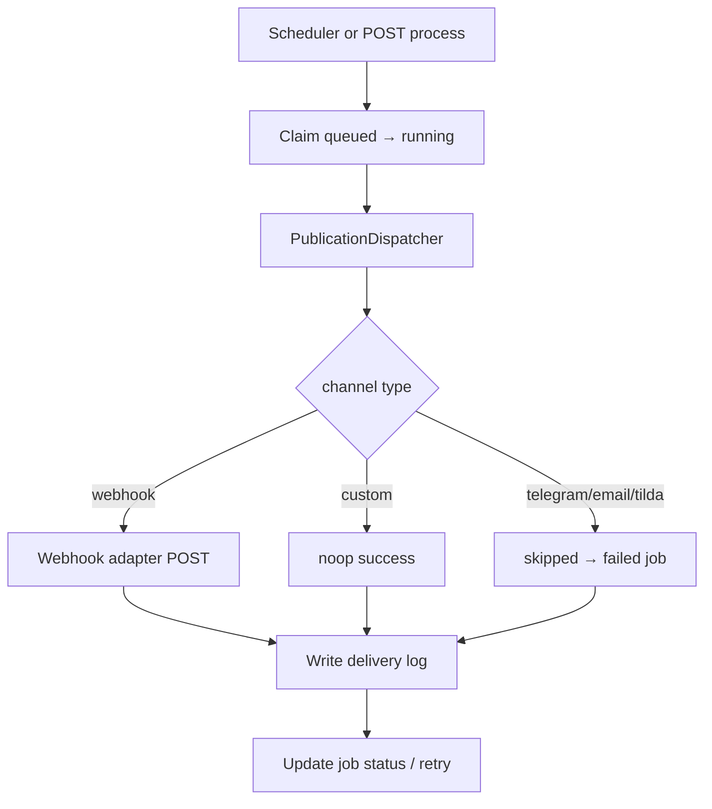

# Phase 6 — Publishing production readiness audit (freeze)

**Status:** MVP frozen at Phase 6.4  
**Scope:** HTTP/API publication queue — approved assets only, webhook adapter, worker, replay, metrics. **No** Telegram/Tilda/email adapters.

```
human approve → queue publication job → worker dispatch → delivery log
              ↑ replay (failed/cancelled only, no auto-dispatch)
```

**Out of scope (frozen):** agent publish tools, auto-publish on approve, new channel adapters without a new phase.

---

## Publishing domain model

| Entity | Role |
|--------|------|
| **PublishingChannel** | Destination config per project (`channel_config` internal, `config_preview` API-safe) |
| **PublicationJob** | One publish attempt for `(asset, approved_version, channel)` |
| **PublicationDeliveryLog** | One row per dispatch attempt (status, duration, safe previews) |

Contracts: `app/publishing/contracts.py`, API schemas: `app/schemas/publishing.py`, DB: `app/db/models/publishing.py`.

**Version pinning:** `PublicationJob.asset_version_number` is set from `ContentAsset.approved_version_number` at queue time. It does **not** follow `current_version_number` after new draft revisions.

**Asset gate:** Only `ContentAssetStatus.APPROVED` with non-null `approved_version_number` may enqueue a job (`409` otherwise).

---

## Channels

| Type | Adapter | Network |
|------|---------|---------|
| `custom` | Noop success (`noop_dispatch`) | No |
| `webhook` | Real POST JSON + optional HMAC | Yes (user URL) |
| `telegram`, `email`, `tilda` | `unsupported_channel_adapter` → job **failed** | No |
| `paused` / `archived` | Cannot create new jobs | — |

Channel statuses: `active`, `paused`, `archived` (DELETE → archived, preserves FKs).

Config validation: `app/publishing/webhook_channel_config.py` for webhook URLs; generic redaction via `redact_sensitive_payload` for previews.

---

## Jobs

Statuses: `queued` → `running` → `succeeded` | `failed` | `cancelled`.

- **Create:** `POST /projects/{id}/publication-jobs` `{ asset_id, channel_id }`
- **Cancel:** queued only → `cancelled`
- **Process:** `POST .../publication-jobs/process?limit=50` (manual or scheduler drain)
- **Replay:** `failed` / `cancelled` only → reset to `queued` (no HTTP)

Fields: `attempts`, `error`, `payload_preview` (metadata only — no full body, no secrets), timestamps.

---

## Delivery logs

`GET /projects/{id}/publication-deliveries` — filters: `job_id`, `channel_id`, `status`, pagination.

Per attempt: `succeeded`, `failed`, or `skipped`. Safe `error_message`, `response_preview`, URL preview **without query string** (`build_target_url_preview`).

---

## Worker flow



- Worker: `app/workers/publication_worker.py`
- Processor: `app/services/publication_job_processor.py`
- Default: `PUBLICATION_WORKER_ENABLED=false`

---

## Webhook adapter

Implementation: `app/publishing/adapters/webhook.py` (separate from **event outbox** webhooks).

- `httpx.AsyncClient(trust_env=False)` — ignores system proxy
- Payload: approved `ContentAssetVersion` title/body/metadata
- Optional `signing_secret` → `X-BotFazer-Signature: sha256=<hex>` over `timestamp + "." + raw_body` (`sign_webhook_body`)
- Timeout: `PUBLICATION_DELIVERY_TIMEOUT_SECONDS`
- Retries: non-2xx / network until `PUBLICATION_JOB_MAX_ATTEMPTS`

---

## Retry / replay rules

| Scenario | Behavior |
|----------|----------|
| Webhook non-2xx / timeout | Delivery `failed`, job re-queued until max attempts |
| Max attempts | Terminal `failed` |
| Unsupported adapter | `skipped`, job `failed`, **no** retry |
| Replay succeeded / queued / running | `409` |
| Replay failed / cancelled | Reset to `queued`, `attempts=0`; **does not** call `process` |
| Batch replay | Same rules, `limit` 1–100 |

Replay prerequisites: asset still `approved`, `approved_version_number` matches job, channel `active`.

Policy: `app/publishing/replay_policy.py`, service: `app/services/publication_replay_service.py`.

---

## Approved-version pinning

1. Job create reads `approved_version_number` from asset row.
2. Dispatcher loads `ContentAssetVersion` for `job.asset_version_number`, not `current_version_number`.
3. Replay blocked if asset approval version diverges from job pin.

---

## Config / secret redaction

| Surface | Rule |
|---------|------|
| Channel API | `config_preview` only; `channel_config` never returned |
| Webhook preview | `signing_secret` → `***`; URL query stripped |
| Delivery logs | Safe URL preview; no query tokens |
| Job `payload_preview` | ids, titles, channel type — no secrets |
| Operations health | Counts/flags only |

Runtime config warnings (Phase 6.4): `GET /health/operations` → `config_warnings` via `app/core/config_sanity.py`.

`config_preview` secret leakage is prevented at **write time** (`build_webhook_config_preview` / `redact_sensitive_payload`); scanning all DB rows at health check is impractical and not implemented.

---

## Agent rights boundary

| Action | Allowed |
|--------|---------|
| Create draft assets | Agents (when write flags on) |
| Approve asset | Human HTTP only |
| Configure channels / queue jobs / publish | Human HTTP only |
| Replay / process jobs | Human HTTP only |

Enforcement:

- `FORBIDDEN_AGENT_TOOL_NAMES` in `app/agents/tool_matrix.py` (includes `content_asset.publish`, no publication tools)
- No `publication*` / `publishing*` tools in `app/tools/registry.py`
- Phase 5 agent matrix **unchanged** by Phase 6

---

## Operational metrics

`GET /projects/{id}/operational-metrics` and `GET /me/operational-metrics`:

```json
"publishing": {
  "jobs_by_status": {},
  "deliveries_by_status": {},
  "failed_jobs_count": 0,
  "oldest_queued_job_age_seconds": null,
  "avg_delivery_duration_ms": null,
  "max_delivery_duration_ms": null,
  "failed_count_by_channel_id": {}
}
```

`GET /health/operations`: `publication_worker_enabled`, `pending_publication_jobs_count`, `config_warnings`.

---

## Known limitations

- Telegram, email, Tilda adapters not implemented (jobs fail fast).
- Webhook publish is **not** idempotent — do not replay `succeeded` jobs.
- No rate limiting per channel.
- No agent-side publish or channel management.
- Worker disabled by default; production must enable explicitly with healthy DB.
- Separate payload shape from event outbox webhooks.

---

## Rollback / replay runbook

**Stuck failed jobs (safe retry):**

1. Fix channel config or receiver endpoint.
2. `POST /projects/{id}/publication-jobs/{job_id}/replay` (or `replay-batch` for many).
3. `POST /projects/{id}/publication-jobs/process` to drain.

**Never:** replay `succeeded` jobs without an explicit duplicate policy on the receiver.

**Disable outbound publish:** pause channel or set `PUBLICATION_WORKER_ENABLED=false`; queued jobs remain until processed manually or cancelled.

**Investigate:** `GET .../publication-deliveries?job_id=...` — check `error_code`, safe URL preview, `response_preview`.

**Config sanity:** `GET /health/operations` — watch `publication_worker_enabled_without_database`, `publication_job_max_attempts_lt_1`, `publication_delivery_timeout_invalid`, `publication_worker_interval_too_low`.

---

## Roadmap for real adapters (post-freeze)

| Phase | Item |
|-------|------|
| 6.5+ | Telegram bot API adapter (secrets in `channel_config` only) |
| 6.5+ | SMTP / email adapter |
| 6.5+ | Tilda API adapter |
| Future | Per-channel rate limits, idempotency keys, dead-letter UI |

**Freeze rule:** Do not add adapters in the same PR as domain/worker/replay changes — keeps failure domains separable.

---

## Verification (Phase 6.4)

```bash
uv run pytest tests/test_phase_6_publishing_invariants.py
uv run python scripts/smoke_publication_webhook.py
uv run pytest
```

Invariant suite: `tests/test_phase_6_publishing_invariants.py`  
Smoke: `scripts/smoke_publication_webhook.py` (safe skip without API key; optional `WEBHOOK_TEST_URL`)
