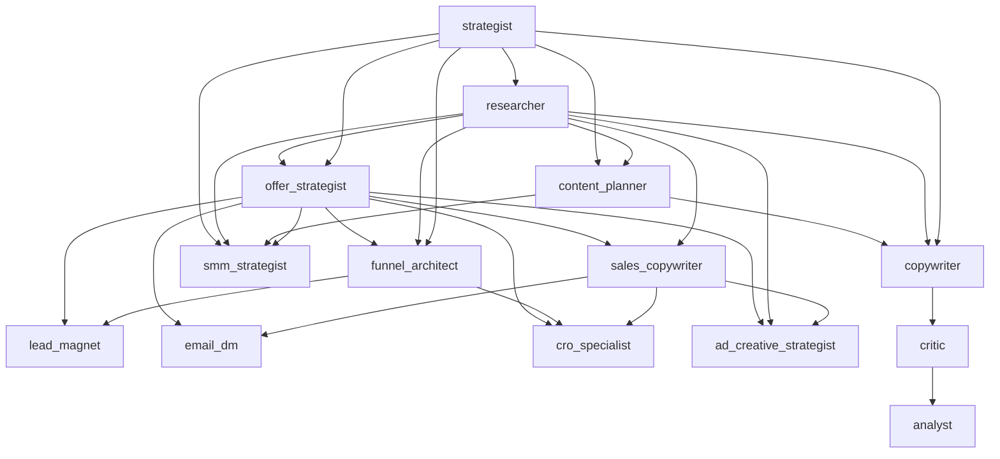

# Phase AI.125 — Marketing Department v2 Readiness Audit

**Date:** 2026-06-03  
**Scope:** 14-role marketing department baseline after AI.119 freeze.

---

## 1. Department roster (14 roles)

| Pipeline group | Roles | Executable |
|----------------|-------|------------|
| **Frozen pipeline** | Strategist, Researcher, Content Planner, Copywriter, Critic, Analyst | Yes |
| **Offer / Funnel** | Offer Strategist, Funnel Architect, Lead Magnet, Sales Copywriter, Email/DM | Yes |
| **Social / Ads / CRO** | CRO Specialist, SMM Strategist, Ad Creative Strategist | Yes |

All roles registered in `MarketingSpecialistType` and `marketing_specialist_registry.py`.

---

## 2. Dependency graph (summary)



Frozen six chain (S→R→CP→CW→CR→AN) remains independent of v2 execution order in plans.

---

## 3. Executable vs planning behavior

| Mode | Roles included | Enforcement |
|------|----------------|-------------|
| Orchestrator planning | Frozen six only | `planning.py` + registry frozen list |
| Manual execute-specialist | All 14 when in plan tasks | `SpecialistExecutionService` + v2 matrix |
| Auto-run conveyor | **Not implemented** | N/A |

---

## 4. Frozen pipeline boundaries

- `_PIPELINE_ORDER` and `_DEPENDENCY_MATRIX` — **six roles only**
- `V2_SPECIALIST_DEPENDENCIES` — **eight v2 roles** (separate dict)
- UI groups tasks into three pipeline sections (AI.120)

---

## 5. V2 demo seed flag

Default E2E seed unchanged (frozen six → copywriter → publish path).

Optional:

```bash
uv run python scripts/seed_e2e_demo.py --include-v2-marketing
```

Creates a second approved plan and executes v2 specialists in dependency order (mock LLM, no external calls).

---

## 6. Regression commands

```bash
# Full v2 smoke
uv run pytest tests/test_phase_ai_123_marketing_department_v2_regression_smoke.py -q

# Freeze invariants
uv run pytest tests/test_phase_ai_119_marketing_department_v2_freeze.py -q

# Frozen six invariants
uv run pytest tests/test_phase_ai_39_marketing_pipeline_freeze_invariants.py -q

# Per-role v2 phases
uv run pytest tests/test_phase_ai_11[1-8]_*.py -q
```

---

## 7. Readiness verdict

| Check | Status |
|-------|--------|
| 14 roles in enum + registry | Pass |
| 8 v2 roles executable | Pass |
| Frozen six unchanged | Pass |
| Planning excludes v2 | Pass |
| No tools / child runs / ContentAsset on v2 execute | Pass (tests) |
| UX output cards (AI.121) | Pass |
| Execution panel grouping (AI.120) | Pass |

**Baseline:** Marketing Department v2 is ready for product iteration on top of frozen MVP publish path.
