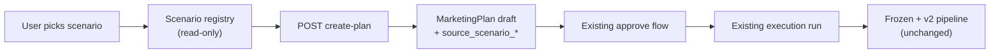

# Phase AI.126 — Product Scenario Builder Roadmap

**Date:** 2026-06-03  
**Goal:** Turn 14 marketing specialists into business-ready entry points so users pick outcomes, not roles.

---

## Problem

BotFazer exposes a full marketing department (frozen six + eight v2 executables). A business user should not need to know whether to start with `offer_strategist` or `funnel_architect`. They need:

> “I need leads for my dental clinic”

not:

> strategist → researcher → offer → funnel → lead magnet → sales copy → …

---

## Five launch scenarios (AI.126)

| ID | Name | Industry | Primary outcome |
|----|------|----------|-----------------|
| `restaurant_launch` | Restaurant Launch | Food & hospitality | Full go-to-market for a new venue |
| `dental_clinic_lead_gen` | Dental Clinic Lead Gen | Healthcare / dental | Qualified patient leads |
| `expert_blogger_content_machine` | Expert / Blogger Content Machine | Personal brand / media | Sustainable content engine |
| `telegram_bot_saas_launch` | Telegram Bot / SaaS Launch | Software / bots | Product launch funnel |
| `local_service_promo` | Local Service Promo | Local services | Area promotion & conversion |

Each scenario maps to an ordered list of specialist tasks from the registry. No new agents; composition only.

---

## Architecture (AI.127–AI.131)

**Invariants**

- Scenario registry does not execute specialists.
- `create-plan` creates a **draft** `MarketingPlan` only — no execution run.
- After approve, the **existing** marketing plan execution path is used (AI.131).
- Frozen AI.39 six-chain and v2 dependency matrix are not modified.

---

## Deliverables map

| Phase | Deliverable |
|-------|-------------|
| AI.127 | `ScenarioTemplate` contract in `contracts.py` |
| AI.128 | `app/marketing/scenarios/` registry |
| AI.129 | `POST /projects/{id}/marketing-scenarios/{scenario_id}/create-plan` |
| AI.130 | UI “Start from scenario” picker |
| AI.131 | Execution guard — reuse approve + execution run only |
| AI.132 | Optional `--scenario` seed flag |
| AI.133 | `MarketingPlan.source_scenario_*` + provenance |
| AI.134 | Regression tests |
| AI.135 | Readiness audit + doc sync |

---

## Out of scope

- LangGraph / auto-run full department
- New specialist roles
- Scenario-specific execution engines
- Changing default E2E seed (unless `--scenario` flag is passed)
