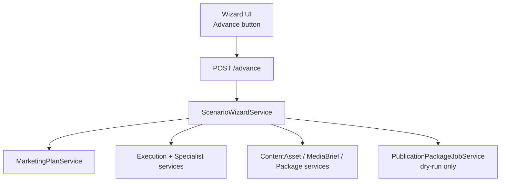

# Phase AI.136 — Scenario Auto-Run Wizard Roadmap

**Date:** 2026-06-03  
**Goal:** Guide users through the existing safe pipeline one step at a time — no new execution engine.

---

## Wizard path (AI.136)

```
scenario pick
  → draft plan (create_plan)
  → approve plan (approve_plan)
  → execution run (create_execution_run)
  → all specialists (execute_specialists)
  → approve content output (approve_copywriter_output)
  → content asset draft (create_content_asset)
  → submit asset (submit_asset)
  → approve asset (approve_asset)
  → media brief (create_media_brief)
  → submit brief (submit_media_brief)
  → approve brief (approve_media_brief)
  → publication package (create_publication_package)
  → submit package (submit_package)
  → approve package (approve_package)
  → queued dry-run job (create_dry_run_job)
```

Each transition is **one** `POST .../advance` call. No background worker. No auto-run of the full wizard via API.

---

## Safety gates (AI.141)

| Gate | Rule |
|------|------|
| Approvals | Uses existing approve/submit services — no bypass |
| Publishing | Dry-run job only — **no** `execute` real Telegram send |
| Providers | No external media/LLM provider calls beyond existing specialist dry-run |
| Frozen layers | AI.39 six-chain + v2 deps unchanged |
| Idempotency | Re-advance on completed step skips duplicate resources |

---

## Architecture



---

## Deliverables

| Phase | Item |
|-------|------|
| AI.137 | `ScenarioWizardRun` contract + DB |
| AI.138 | Step engine (15 steps) |
| AI.139 | Manual advance endpoint |
| AI.140 | Wizard state UI |
| AI.141 | Safety invariants in service + tests |
| AI.142 | `wizard_run_id` in metadata + provenance |
| AI.143 | `--wizard --scenario` seed |
| AI.144 | Dental regression to queued job |
| AI.145 | Freeze audit + docs |

---

## Content output specialist

Scenarios without `copywriter` (e.g. dental lead gen) use **`sales_copywriter`** output for the content-asset leg of the wizard. Conversion is wizard-scoped only — AI.40 copywriter conversion unchanged.
