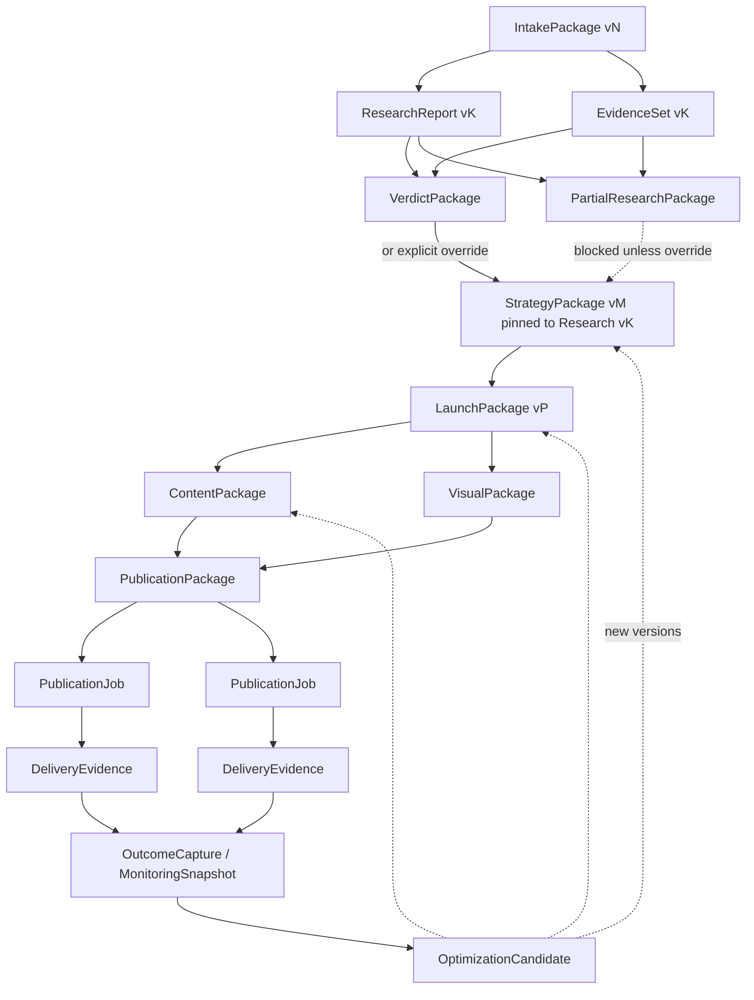

# ARTIFACT-FLOW

> **Program:** PRODUCT-02  
> **Owns:** Versioned lineage graph + ApprovalRecord semantics  
> **Patch:** PRODUCT-02-BLUEPRINT-PATCH-01 · OD-07 · OD-08  
> **Status:** OWNER-APPROVED · `owner_freeze` NOT SET  
> Semantic contracts only — **not** a physical DB schema.

---

## 1. Principle

Artifacts form a **lineage graph**, not a one-way conveyor chain.

Each version records who produced it, what it consumed, what it supersedes, and which ApprovalRecord (if any) binds it.

Approved versions are **immutable snapshots**. Edits create new versions. Strategy/Launch changes may **invalidate** dependents or remove them from the current head pointer — they do not delete approved history.

---

## 2. Common version fields (semantic)

Every artifact version conceptually carries:

| Field | Meaning |
|-------|---------|
| `tenant_id` | Tenant isolation boundary |
| `project_id` | Commercial unit |
| `capability_run_id` | Producing run |
| `artifact_type` | Typed package name |
| `version` | Monotonic per type within project (or equivalent) |
| `status` | ArtifactVersionState (`draft` … `archived`) — **no** separate `stale` value |
| `created_from` | Parent artifact version refs (**same** `tenant_id` / `project_id`) |
| `supersedes` | Prior version of same type (if any; same tenant/project) |
| `approval_reference` | ApprovalRecord id(s) when bound (same tenant/project) |
| `evidence_source_lineage` | Claims/sources/run provenance |
| `immutable_snapshot_boundary` | When status=`approved`, content frozen |
| `invalidation_rules` | Parent change → `invalidated` and/or lose head pointer |
| `retention_audit` | Keep for audit; soft-archive policy |

### Current head pointer (assertable)

Per `(tenant_id, project_id, artifact_type)` there is a **current head** (conceptual `current_artifact_version_id`).

| Event | Required observables |
|-------|----------------------|
| New version becomes current | Head points to new version id; prior current (if any) has `status=superseded` **or** remains `approved` but is no longer head |
| Parent Strategy revision invalidates Launch candidate | Dependent Launch/Content draft or unapproved → `status=invalidated`; approved dependents lose head (and may also be `superseded`) — **not deleted** |
| UI “stale” | Derived only: `status ∈ {superseded, invalidated}` **or** version id ≠ current head |

Lineage and approval references **MUST** share `tenant_id` and (normally) `project_id`.

---

## 3. ApprovalRecord contract (minimal · OD-10 alignment)

Not a boolean. Minimal common contract; types are extensible.

| Field | Meaning |
|-------|---------|
| `approval_id` | Stable id |
| `tenant_id` | Tenant boundary |
| `project_id` | Project boundary |
| `artifact_id` / version | Target |
| `approval_type` | See list below |
| `status` | `pending` \| `approved` \| `rejected` \| `expired` \| `invalidated` |
| `requested_by` | Actor |
| `decided_by` | Actor |
| `requested_at` | Timestamp |
| `decided_at` | Timestamp |
| `expires_at` | Optional |
| `reason` / `comment` | Human rationale |
| `invalidated_at` | Optional |
| `invalidation_reason` | Optional |

### Approval types (semantic)

| Type | Typical target |
|------|----------------|
| Research acceptance / continue | Research terminal / partial override |
| Strategy | `StrategyPackage` |
| Budget | Launch budget frame |
| Content | `ContentPackage` |
| Visual | `VisualPackage` |
| Publication package | Package binding assets + channel |
| External execution | Real publish job |
| Optimization candidate | `OptimizationPlan` / candidate |

---

## 4. Artifact catalog

| Artifact | Producer | Consumer(s) | Notes |
|----------|----------|-------------|-------|
| `IntakePackage` | Intake | Research | Versioned; change after Research does not rewrite Research |
| `ResearchReport` | Research | Strategy, UI | New run → new version |
| `EvidenceSet` | Research | Strategy, Verdict UI | Tied to Research version |
| `VerdictPackage` | Research | Strategy | Sufficient path |
| `PartialResearchPackage` | Research | Owner gate | **Does not** unlock Strategy alone |
| `StrategyPackage` | Strategy | Launch, Content | Pinned to specific Research version(s) |
| `LaunchPackage` | Launch | Content, Visuals, Publication | May be invalidated by Strategy revision |
| `ContentPackage` | Content | Approval, Publication | Parallel to Visuals |
| `VisualPackage` | Visuals | Approval, Publication | Optional; parallel to Content |
| `PublicationPackage` | Publication prep | Jobs | Multi-instance |
| `PublicationJob` | Publication | Evidence | Many per Launch |
| `DeliveryEvidence` | Publication job | Outcome / Analytics | External execution truth |
| `OutcomeCapture` | Outcome (MVP) | Optimization (later) | Basic metrics / notes |
| `MonitoringSnapshot` | Project Analytics | Optimization | Post-MVP fuller analytics |
| `OptimizationPlan` / Candidate | Optimization | Strategy/Launch/Content | New versions only |

---

## 5. Lineage graph (not a chain)



Content and Visuals are **siblings** under Launch, not a forced serial edge.

---

## 6. Mandatory scenarios

### 6.1 Intake changed after Research

- New `IntakePackage` version.  
- Prior Research versions remain (audit).  
- Does **not** silently rewrite Research; may trigger owner-suggested Research rerun.

### 6.2 Research rerun

- New `capability_run_id` → new `ResearchReport` / Evidence / Verdict or Partial.  
- **Assertable:** new version becomes current head for `ResearchReport` (and related types); prior head retained; prior version `status=superseded` **or** still `approved` but head ≠ prior id.

### 6.3 Strategy pinned to Research version

- `StrategyPackage.created_from` includes specific Research version ids.  
- Assumption-constrained Strategies **must** carry inherited semantic fields: `gaps`, `limitations`, `confidence`, `unresolved_assumptions` (OD-08).

### 6.4 Strategy revision invalidates Launch candidates

- New Strategy version approved and becomes Strategy head.  
- **Assertable:** dependent draft/unapproved Launch versions → `status=invalidated` (re-derive = new Launch version, not silent rewrite).  
- Previously approved Launch versions: content immutable; lose Launch head pointer and/or `status=superseded`; **not deleted**.  
- In-flight Content/Visuals runs: `cancelled` or `interrupted` (CapabilityRunState); their draft outputs `invalidated` if not yet approved.

### 6.5 Approved Content after Strategy change

- Approved Content remains immutable (`status` stays `approved` or becomes `superseded`).  
- **Assertable:** Content version id ≠ current Content head for the new Launch pin; UI may label “stale” only as derived from head/status.  
- New Content versions created for the new Launch/Strategy pin.

### 6.6 Publication creates external execution evidence

- Each `PublicationJob` yields `DeliveryEvidence` (success or honest failure).  
- Dry-run alone cannot mint real DeliveryEvidence.

### 6.7 Analytics / Outcome linked to jobs

- `OutcomeCapture` / `MonitoringSnapshot` reference specific `PublicationJob` / campaign / output ids.  
- Not a floating project-level boolean.

### 6.8 Optimization creates new candidate version

- Does not rewrite historical Strategy/Content.  
- Produces new Optimization candidate → after approval, new Strategy/Launch/Content versions (OD-06).

---

## 7. Partial Research wall (OD-08)

```
PartialResearchPackage
  → owner reviews limitations
  → ApprovalRecord (continue / override)
  → StrategyPackage (assumption-constrained + inherited gaps)
```

Without that ApprovalRecord, Strategy entryConditions fail.

---

## 8. Publication multi-instance (OD-07)

One Launch may produce many packages, jobs, channels, schedules, retries, and evidence records.  
**Forbidden:** modeling publication solely as `published=true` on the Project or Launch.

---

## 9. UI binding (derived)

| User sees | Backed by |
|-----------|-----------|
| Intake review | `IntakePackage` |
| Partial panel | `PartialResearchPackage` + limitations |
| Verdict | `VerdictPackage` + `EvidenceSet` |
| Strategy approve | `StrategyPackage` + ApprovalRecord |
| Launch checklist | `LaunchPackage` |
| Content / Visuals review | sibling packages + approvals |
| Publish confirm | PublicationPackage + External execution approval |
| After publish | `DeliveryEvidence` per job |
| Outcome / monitoring | `OutcomeCapture` / `MonitoringSnapshot` |

---

## 10. Implementation note

Future persistence may use documents or tables. This file does **not** define migrations, indexes, or ORM models.
