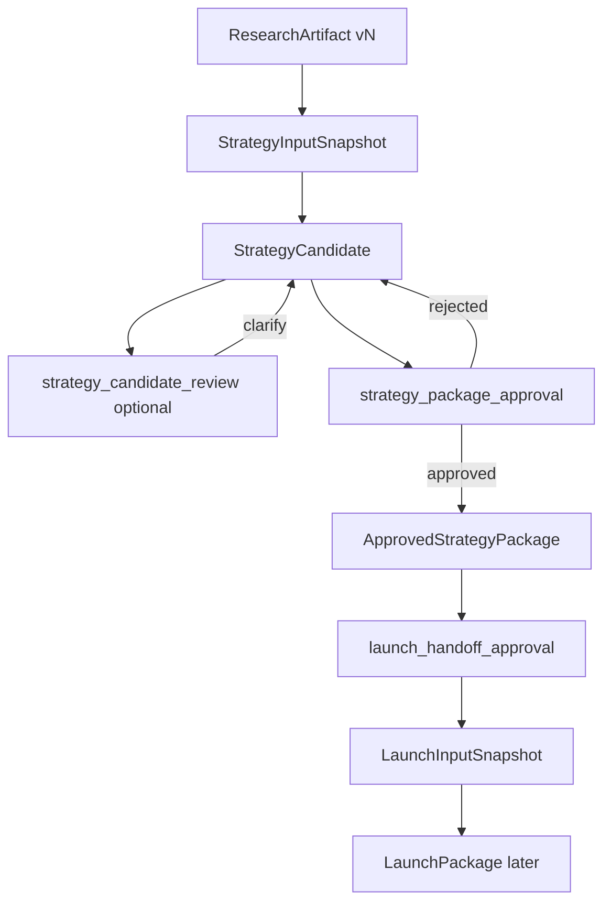

# PRODUCT-03 — Strategy Artifact Flow

> **Program ID:** PRODUCT-03 = Strategy Architecture  
> **Task:** PRODUCT-03-STRATEGY-BLUEPRINT-01 · **Patch:** PRODUCT-03-STRATEGY-BLUEPRINT-PATCH-01  
> **Owns:** Versioned Strategy lineage (logical — not DB schema)  
> **Inherits:** PRODUCT-02 four-layer lifecycle; does **not** edit OWNER-FROZEN P02 catalog in this patch  
> **OD-P03:** OWNER-APPROVED · **`owner_freeze`:** **OWNER-FROZEN** (2026-08-02)  
> **Status:** **OWNER-FROZEN** — freeze does not start Strategy Runtime

---

## 1. Purpose

Research versions → Strategy versions → Launch consumes a **specific** approved Strategy version — including eligibility labels, revoke, mid-Launch, export, rollback.

---

## 2. Canonical graph

```text
ResearchArtifact(version N)
        │
        ▼
StrategyInputSnapshot (pinned)     # semantic pin — P02 catalog follow-up
        │
        ▼
StrategyCandidate                  # StrategyPackage draft | ready_for_review
        │
        ├── strategy_candidate_review (optional loop)
        │
        ▼
strategy_package_approval
        │
        ▼
ApprovedStrategyPackage
        │
        ▼
launch_handoff_approval
        │
        ▼
LaunchInputSnapshot                # semantic pin into Launch
```



---

## 3. Pointers

| Pointer | Meaning |
|---------|---------|
| `strategy_approved_head` | Current approved package version |
| `strategy_candidate_head` | Current draft / review candidate |
| `research_pin` | On SIS / package |
| `research_head` | Latest Research terminal |

**Eligibility labels** (derived; not ArtifactVersionState): `stale_viewable` · `stale_launch_blocking` · `revalidated` · plus P02 `superseded` / `invalidated`.  
See Architecture §10.

Tenant + project required on every node. Cross-project lineage **denied**.

---

## 4. Semantic artifacts

| Artifact | Producer | Notes |
|----------|----------|-------|
| ResearchReport / EvidenceSet / Verdict / Partial | Research | Partial alone ≠ Strategy entry |
| StrategyInputSnapshot | Strategy start | Pin + decision/override |
| StrategyPackage (Candidate / Approved) | Strategy | Sections SC-01…07 + package fields |
| ApprovalRecord | Owner decisions | Typed; never boolean |
| LaunchInputSnapshot | Handoff | Pins approved Strategy version |

---

## 5. Normative scenarios (testable)

### 5.1 Owner edit creates new version
Manual section edit → new StrategyPackage version; prior immutable; attribution + timestamp; re-approval required for Launch.

### 5.2 Regenerate one section preserves others
Section regen copies unchanged sections into **new** package version; must-refresh cascade still applies when dependency rules fire.

### 5.3 Partial override revoked
`partial_strategy_override` → invalidated/expired → **StrategyInputSnapshot unusable**; candidate `invalidated`; approved bytes kept but Launch eligibility blocked; handoff blocked; if Launch already handed off → mid-Launch owner decision (§5.6); history kept; need new Research or new override (+ new SIS).

### 5.4 Research superseded before approval
Draft/candidate pinned to N; Research N+1 → require **new** StrategyInputSnapshot; no silent continue.

### 5.5 Research superseded after approval
Approved immutable; may remain `strategy_approved_head`; `stale_launch_blocking` **unless** active `research_revalidation` for `(approved_head, research_head)`; default = revise.

### 5.6 Launch active when Strategy becomes stale
Launch on V unchanged; new Strategy candidate created; owner: continue Launch · rebuild · cancel · partial update dependents. No auto-rewrite.

### 5.7 Rollback to previous approved version
Set `strategy_approved_head` to prior approved Pk; `strategy_rollback`; Pk bytes unchanged; if pin ≠ research_head, still `stale_launch_blocking` until revise/revalidation.

### 5.8 Cross-project artifact access denied
SIS / package / ApprovalRecord / LaunchInputSnapshot must share tenant_id **and** project_id.

### 5.9 Export only approved version
Export ACL + only `status=approved`; includes eligibility label at export time.

### 5.10 Rejected Strategy not usable by Launch
Rejected package cannot receive `launch_handoff_approval` or appear as approved head.

### 5.11 Candidate rejected / Strategy revision / SC cascades
Unchanged from prior pack: reject → revise; SC-01 change must-refresh SC-02…07; SC-03 → SC-04,06,07; SC-02 → SC-03,04.

### 5.12 Pricing / spend_band provenance
Optional fields `spend_band_min`, `spend_band_max`, `spend_band_currency` each require `provenance` ∈ {`owner_provided`, `research_estimate`, `unknown`}, `source` (string), `confidence` ∈ {`low`,`medium`,`high`,`unknown`}. If any band field set → `budget_assumptions_acknowledgement` required (LR-08). Never presented as confirmed economic fact.

---

## 6. Invalidation matrix (summary)

| Cause | Candidate | Approved Strategy | Active Launch |
|-------|-----------|-------------------|---------------|
| New package version becomes head | prior superseded/invalidated | prior may lose approved head | unchanged until owner decision |
| Research supersede | need new SIS | stale_launch_blocking unless research_revalidation | mid-Launch rule §5.6 |
| Override revoke | SIS unusable; candidate invalidated | eligibility blocked | handoff blocked; if already handed off → mid-Launch owner decision |
| Reject | rejected | — | blocked |

---

## 7. Partial override lineage

```text
PartialResearchPackage
  → partial_strategy_override
  → StrategyInputSnapshot(assumption_constrained=true, accepted_risks[])
  → StrategyCandidate / Package(assumption_constrained=true)
  → strategy_package_approval
  → launch_handoff_approval(accepted_gap_ids[], residual_gap_ids[])
  → LaunchInputSnapshot
```

Revoke cuts the chain at override → invalidates dependents per §5.3.

---

## 8. Recovery

| Failure | Recovery |
|---------|----------|
| Run failed | New CapabilityRun; prior versions kept |
| Mid-review abandon | Candidate retained; ProjectLifecycle unchanged |
| Hydrate | From latest package + ApprovalRecords; no duplicate silent start |
| Accidental head | Rollback §5.7 |
| Override revoke | §5.3 |

---

## 9. Testable assertions

| # | Assertion |
|---|-----------|
| T1 | No Research pin → reject Strategy start |
| T2 | Partial without override → no SIS |
| T3 | Approved bytes immutable |
| T4 | Launch without strategy_package_version_id rejected |
| T5 | Research supersede does not delete Strategy |
| T6 | Rollback restores prior approved head; records strategy_rollback |
| T7 | Cross-tenant or cross-project refs denied |
| T8 | Partial never auto-opens Strategy |
| T9 | assumption_constrained persists through approval/handoff; not cleared by revalidation alone |
| T10 | research_pin ≠ research_head without active research_revalidation ⇒ stale_launch_blocking / not launch_eligible; with active revalidation ⇒ revalidated, may be launch_eligible |
| T11 | Rejected package not Launch-usable |
| T12 | SC-01 change ⇒ must-refresh {SC-02…SC-07} |
| T13 | strategy_candidate_review ≠ Launch unlock |
| T14 | Constrained handoff without critical accepted_gap_ids rejected |
| T15 | research_revalidation leaves assumption_constrained + gaps unchanged |
| T16 | Client-supplied `decided_by` or `edited_by` rejected |
| T17 | Export only approved; JSON minimum fields present |
| T18 | Override revoke → SIS unusable; candidate invalidated; handoff blocked; history kept |
| T19 | Any edit/regen → new version id |
| T20 | Mid-Launch Strategy change does not mutate existing Launch package |
| T21 | spend_band_min/max/currency without provenance rejected |
| T22 | Export without tenant/project ownership denied |
| T23 | Band fields present without budget_assumptions_acknowledgement ⇒ LR-08 false |
| T24 | Unapproved candidate SC edit does not set stale_launch_blocking on approved head |
---

## 10. Out of scope

Physical DB schema · API shapes · exact UI · LaunchPackage internals beyond pin.
