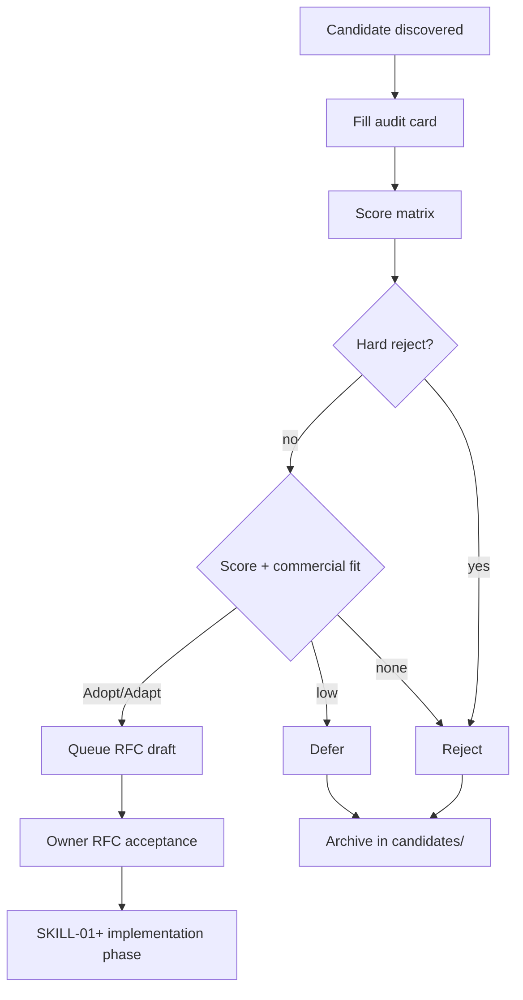

# Adopt — Adapt — Reject Matrix

**Phase:** SKILL-R0.1 (updated from SKILL-R0)  
**Applies to:** Skill candidates (`docs/research/skills/`) and MCP/connector candidates (`docs/research/mcp/`)

---

## Purpose

Force an explicit owner decision **before** any registry, runtime, or production wiring.

This matrix is the single decision rubric for research cards. Scores inform the decision; they do not auto-implement anything.

---

## Definitions

| Decision | Meaning | Production allowed? |
|----------|---------|---------------------|
| **Adopt** | Use with minimal Marketsynth wrapper; fits golden path and trust model | Only after RFC + implementation phase + owner acceptance |
| **Adapt** | Valuable but must be reshaped (internal subskill, native adapter, contracts, gates) | Only after RFC + explicit slice |
| **Reject** | Does not meet commercial, security, or architecture bar | Never |
| **Defer** | Potentially useful later; not on critical path now | Revisit when unblock condition met |

---

## Scoring dimensions (0–2 each)

| Dimension | 0 | 1 | 2 |
|-----------|---|---|---|
| **Commercial value** | No paying user outcome | Indirect / nice-to-have | Directly strengthens sellable CWF step |
| **Golden path fit** | Parallel workflow / new Home | Partial overlap | Extends Idea→…→Telegram without fork |
| **Evidence integrity** | Fake / unverifiable output | Partial citations | Full Answer+Evidence+Source+Confidence |
| **Security / trust** | Unbounded write or egress | Gaps mitigatable | Read-only or gated writes + audit |
| **Implementation cost** | Large platform project | Medium slice | Narrow vertical addition |
| **Maintenance burden** | Vendor lock / fragile | Moderate ops | Stable API + clear SLA |

**Maximum score:** 12

---

## Decision thresholds (guidance)

| Total score | Typical decision |
|-------------|------------------|
| 10–12 | **Adopt** or **Adapt** (prefer Adapt if any write surface) |
| 7–9 | **Adapt** or **Defer** |
| 4–6 | **Defer** |
| 0–3 | **Reject** |

### Hard rejects (override score)

Reject regardless of score if any of:

- Creates a **second active product path** (parallel Home, recovery, marketplace UI)
- **Bypasses** human approval for publish, spend, or launch
- **Uncontrolled write** without RFC-SKILL-003 / RFC-CONN-001 exception
- **Positive verdict / launch** without evidence gate
- **Duplicates** existing internal capability with no commercial uplift
- **Violates** CWF.1 freeze scope without owner-approved slice

### Hard defer rules

Defer if:

- Needed only after **CWF.1 acceptance** (e.g. Maps MCP for local business — until local slice in workflow)
- Requires **SKILL-01+** infrastructure not yet specified
- Classified as **D/E priority** under Commercial Product Directive

---

## SKILL-R0.1 Candidate registry (all audited)

| ID | Candidate | Type | Source | Commercial fit | Architecture fit | Security risk | License status | Evidence quality | Proposed decision | Priority | Blocking unknowns | RFC required | Notes |
|----|-----------|------|--------|----------------|------------------|---------------|----------------|------------------|-------------------|----------|-------------------|--------------|-------|
| MS-SKILL-001 | Product Marketing Context | Skill | marketingskills/product-marketing | High | High w/ Adapt | Medium | MIT verified | Partial — needs Evidence on facts | **Adapt** | P0 | Persisted context contract | Yes | Card: `skills/candidates/01-product-marketing-context.md` |
| MS-SKILL-002 | Market Research | Skill | marketingskills/customer-research | High | High w/ Adapt | Medium–High | MIT verified | Partial — confidence labels in source | **Adapt** | P0 | Connector routing for Mode 2 | Yes | Card: `02-market-research.md` |
| MS-SKILL-003 | Competitor Analysis | Skill | marketingskills/competitors | High | High w/ Adapt | Medium | MIT verified | Partial | **Adapt** | P0 | Fetch audit trail | Yes | Card: `03-competitor-analysis.md` |
| MS-SKILL-004 | ICP & Segmentation | Skill | marketingskills + internal | High | High w/ Adapt | Medium | MIT verified | Partial — min sample rules | **Adapt** | P0 | Evidence threshold enforcement | Yes | Card: `04-icp-segmentation.md` |
| MS-SKILL-005 | Market Validation | Skill | Internal BIV + refs | High | High | Low–Med | Internal + MIT refs | High for verdict path | **Adapt** | P0 | Extend BIV gaps only | Yes | Card: `05-market-validation.md` |
| MS-SKILL-006 | Positioning | Skill | marketingskills/product-marketing | High | High w/ Adapt | Medium | MIT verified | Partial | **Adapt** | P0 | PositioningSnapshot contract | Yes | Card: `06-positioning.md` |
| MS-SKILL-007 | Offer Builder | Skill | marketingskills/offers | High | High w/ Adapt | Low–Med | MIT verified | Partial | **Adapt** | P0 | Launch Pack mapping | Yes | Card: `07-offer-builder.md` |
| MS-SKILL-010 | CRO Audit | Skill | marketingskills/cro | Medium | Medium | Medium | MIT verified | Partial | **Adapt** | P1 | After CWF.1a acceptance | Yes | Card: `08-cro-audit.md` |
| MS-SKILL-011 | Landing Copywriting | Skill | marketingskills/copywriting | High | High w/ Adapt | Low | MIT verified | Partial | **Adapt** | P1 | Content asset contracts | Yes | Card: `09-copywriting.md` |
| MS-SKILL-012 | SEO Audit | Skill | marketingskills/seo-audit | Medium | Medium | Medium | MIT verified | Partial | **Adapt** | P1 | Benchmark crawl tools | Yes | Card: `10-seo-audit.md` |
| MS-SKILL-013 | AI SEO | Skill | marketingskills/ai-seo | Low–Med | Medium | Low | MIT verified | Unknown | **Defer** | P1 | KPI + demand proof | No | Card: `11-ai-seo.md` |
| MS-SKILL-014 | Content Strategy | Skill | marketingskills/content-strategy | High | High w/ Adapt | Low | MIT verified | Partial | **Adapt** | P1 | Launch Pack scope | Yes | Card: `12-content-strategy.md` |
| MS-SKILL-015 | Social Content | Skill | marketingskills/social | High | High w/ Adapt | Low | MIT verified | Partial | **Adapt** | P1 | Native Telegram publish path | Yes | Card: `13-social-content.md` |
| MS-SKILL-016 | Ad Creative | Skill | marketingskills/ad-creative | Medium | Medium | Medium | MIT verified | Partial | **Defer** | P1 | Ad MCP RFC | No | Card: `14-ad-creative.md` |
| MS-SKILL-019 | Visual Content Brief | Skill | marketingskills/image | High | Medium | High w/ gen | MIT verified | Brief OK / gen N/A | **Adapt** | P1 | Higgsfield gateway | Yes | Card: `15-visual-content-brief.md` |
| MS-SKILL-020 | Video Content Brief | Skill | marketingskills/video | Medium | Medium | High w/ gen | MIT verified | Partial | **Adapt** | P1 | Video Studio gates | Yes | Card: `16-video-content-brief.md` |
| MCP-001 | XmlRiver Search | MCP | XmlRiver API + internal | High | High | Low–Med | Commercial API | High (candidates) | **Adapt** | P0 | Per-tenant credentials | Yes | Baseline — card `mcp/candidates/01-xmlriver-baseline.md` |
| MCP-002 | Firecrawl Fetch | MCP | Firecrawl API + internal | High | High | Medium | Commercial API | High (excerpt) | **Adapt** | P0 | SSRF/pricing validation | Yes | Baseline — card `02-firecrawl-baseline.md` |
| MCP-003 | Higgsfield MCP | MCP | higgsfield.ai/mcp | High | Medium | **High** | Proprietary | Unknown tool schemas | **Adapt** | P0 | tools/list, content rights, OAuth vault | Yes | Pilot only — card `03-higgsfield.md` |
| MCP-004 | Playwright MCP | MCP | microsoft/playwright-mcp | Medium | Medium | **High** | Apache-2.0 (verify) | Requires benchmark | **Defer** | P0 | Read-only subset + sandbox | No | Card `04-playwright-browser.md` |
| MCP-005 | Telegram MCP | MCP | Community userbot servers | Low (dup) | **Fails** — bypass | **Critical** | MIT (example) | N/A | **Reject** | P0 | N/A — use native publish | No | Hard reject — card `05-telegram.md` |
| MCP-006 | Google Drive/Sheets | MCP | Various | Medium | Medium | Medium | Verify per server | Unknown | **Defer** | P1 | Pick canonical server | No | Card `06-google-drive-sheets.md` |
| MCP-007 | GitHub MCP | MCP | GitHub/community | Low | Low | Medium | Verify | N/A | **Defer** | P1 | Dev-only scope | No | Card `07-github.md` |
| MCP-008 | Ahrefs SEO | MCP | Ahrefs | Medium | Medium | Low–Med | Commercial | Unknown | **Defer** | P1 | Official MCP existence | No | Card `08-ahrefs-seo.md` |
| MCP-009 | Google Ads | MCP | Google/3rd party | Medium | Low | **High** | Commercial | N/A | **Reject** | P1 | Native gated adapter later | No | Spend surface — card `09-google-ads.md` |
| MCP-010 | Meta Ads | MCP | Meta/3rd party | Medium | Low | **High** | Commercial | N/A | **Reject** | P1 | Same | No | Card `10-meta-ads.md` |
| MCP-011 | Yandex Direct | MCP | Yandex/3rd party | Medium | Low | **High** | Commercial | N/A | **Reject** | P1 | Native adapter later | No | Card `11-yandex-direct.md` |
| MCP-012 | amoCRM | MCP | amoCRM | Medium | Medium | High PII | Commercial | Unknown | **Defer** | P1 | DPA + adapter | No | Card `12-amocrm.md` |
| MCP-013 | Bitrix24 | MCP | Bitrix24 | Medium | Medium | High PII | Commercial | Unknown | **Defer** | P1 | CRM RFC | No | Card `13-bitrix24.md` |
| MCP-014 | HubSpot | MCP | HubSpot | Medium | Medium | High PII | Commercial | Unknown | **Defer** | P1 | CRM RFC | No | Card `14-hubspot.md` |
| MCP-015 | Notion | MCP | Notion | Low–Med | Low | Medium | Service ToS | Unknown | **Defer** | P1 | Avoid second SoT | No | Card `15-notion.md` |
| MCP-016 | Slack | MCP | Slack | Low | Low | Medium | Service ToS | N/A | **Defer** | P1 | Not on CWF path | No | Card `16-slack.md` |
| META | Agent Skills spec | Spec | agentskills.io / Anthropic | N/A | High | Low | Open spec | N/A | **Adopt** (format) | P0 | MS packaging RFC | Yes | See source-ecosystem-comparison.md |
| META | Smithery hosted MCP | Marketplace | Smithery | Low | Low | **High** | N/A | N/A | **Reject** (prod) | — | Jun 2025 incident | No | Research only per owner audit |
| META | Official MCP Registry | Discovery | modelcontextprotocol.io | N/A | Medium | Medium | N/A | N/A | **Adapt** (discovery) | P0 | Private connector registry | Yes | Not trust root |

---

## Adopt vs Adapt (Skills)

| Signal | Prefer |
|--------|--------|
| User-facing marketplace Skill | **Reject** or **Defer** (not CWF model) |
| Internal step inside existing skill (e.g. audience segmentation in BIV) | **Adapt** — subskill pattern |
| Drop-in replaces golden path step with same gates | **Adapt** — rarely **Adopt** |
| New sellable step with evidence + approval | **Adapt** first; **Adopt** only after RFC-SKILL-002 package proof |

---

## Adopt vs Adapt (MCP / Connectors)

| Signal | Prefer |
|--------|--------|
| Read-only search/fetch with audit | **Adapt** (wrap existing `app/mcp/` pattern) |
| Write / publish / billing / CRM | **Reject** or **Defer** — use native gated adapters |
| Maps / local business data | **Defer** until CWF slice needs it |
| Marketplace MCP bundle | **Reject** — evaluate tools individually |

---

## Required fields on every card

1. Decision (Adopt / Adapt / Reject / Defer)
2. Rationale (plain language, commercial not technical)
3. CWF step affected (or `none`)
4. Owner sign-off
5. Implementation gate reference (RFC + phase)

---

## Workflow diagram

---

## Related documents

- [README.md](README.md) — SKILL-R0 overview
- [SKILL-R0.1-candidate-audit-summary.md](SKILL-R0.1-candidate-audit-summary.md)
- [skills/source-ecosystem-comparison.md](skills/source-ecosystem-comparison.md)
- [mcp/browser-research-comparison.md](mcp/browser-research-comparison.md)
- [skills/skill-audit-card-template.md](skills/skill-audit-card-template.md)
- [mcp/mcp-audit-card-template.md](mcp/mcp-audit-card-template.md)
