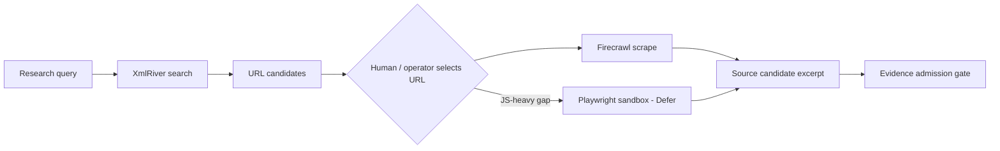

# Browser / Research Connector Comparison

**Phase:** SKILL-R0.1  
**Date:** 2026-07-23  
**Candidates:** XmlRiver, Firecrawl, Playwright MCP  
**Purpose:** Baseline comparison for CWF.1 research/evidence connectors — **no single winner required**.

---

## Summary recommendation (architecture inference)

| Role | Recommended connector | Confidence |
|------|---------------------|------------|
| SERP URL discovery (candidates) | **XmlRiver** (existing native adapter) | source-verified in repo |
| Managed single-page extraction | **Firecrawl** (existing native adapter) | source-verified in repo |
| JS-heavy / interactive pages | **Playwright MCP** — Defer until read-only profile benchmarked | requires benchmark |
| Default production routing | **Hybrid: XmlRiver → Firecrawl** | architecture inference |
| Autonomous browsing agent | **Reject** for CWF.1 | architecture inference |

---

## Comparison matrix

| Criterion | XmlRiver | Firecrawl | Playwright MCP |
|-----------|----------|-----------|----------------|
| **Primary function** | Web search (SERP URLs) | Single-URL scrape → markdown | Full browser automation (a11y tree) |
| **Crawling** | No — search results only | No — explicit single URL in Marketsynth adapter | Can navigate multi-page — **unbounded risk** |
| **Rendering** | N/A (search metadata) | Managed headless render via vendor API | Local Chromium render |
| **Extraction** | URL list (+ limited XML fields) | Markdown excerpt (2000 char cap in adapter) | DOM snapshot + interaction |
| **Structured output** | SourceCandidate URLs | SourceCandidate + markdown excerpt | Accessibility tree JSON — **verbose** |
| **Authentication** | API key + user ID (env) | Bearer API key (env) | Local process — OS privileges |
| **Read/write surface** | Read-only | Read-only in Marketsynth adapter | **Mixed** — navigate/click/type (write-like) |
| **Browser control** | None | Vendor-managed | Full control |
| **Prompt injection exposure** | Medium (SERP snippets) | **High** (arbitrary page content) | **High** (live DOM + forms) |
| **Robots / policy controls** | Vendor-dependent — **Unknown** | Vendor claims compliance — **Requires validation** | Operator must enforce URL allowlist |
| **Self-hosting** | No (vendor API) | API vendor-hosted; Firecrawl OSS **Not verified** for self-host parity | Yes (`npx @playwright/mcp`) |
| **Cost** | Per-query commercial — **Requires pricing validation** | Credit-based scrape — **Requires pricing validation** | Infra + ops (CPU/RAM); no per-page vendor fee |
| **Observability** | HTTP status + adapter warnings | HTTP + warnings in adapter | Local logs — must add audit wrapper |
| **Retry behavior** | Adapter raises BusinessToolError | Same | **Unknown** — not integrated |
| **Evidence capture** | Candidate URLs only (`is_evidence=False`) | Candidate + excerpt | Possible via snapshot — not Evidence by default |
| **Tenant isolation** | Deployment-level keys today — **Requires RFC** for per-tenant | Same | Isolated runner per tenant/job required |
| **CWF.1 research fit** | **High** — discovery | **High** — fetch admitted URLs | **Medium** — only for gaps |
| **Production suitability now** | **Adapt** — baseline | **Adapt** — baseline | **Defer** |
| **Recommended role** | Discovery / source candidates | Managed extraction | Controlled automation sandbox only |

---

## Detailed notes

### XmlRiver (baseline)

- **Source-verified:** `app/business_tools/providers/xmlriver_search.py`, `app/mcp/registry.py` (`search`, read-only).
- Returns **candidates only** with warning `candidates_only_not_evidence`.
- Does not replace Evidence admission or verdict logic.
- **Blocking unknown:** per-tenant credential model, vendor rate limits, robots policy.

### Firecrawl (baseline)

- **Source-verified:** `app/business_tools/providers/firecrawl_fetch.py` — POST `https://api.firecrawl.dev/v1/scrape`, single URL, markdown format, no recursive crawl.
- Best for turning an **already selected URL** into normalized text for operator review.
- **Blocking unknown:** SSRF protections, pricing at scale, JS-render fidelity vs Playwright on specific sites — **requires benchmark**.

### Playwright MCP

- **Source-verified:** [microsoft/playwright-mcp](https://github.com/microsoft/playwright-mcp) README — tools include `browser_navigate`, `browser_click`, `browser_snapshot`, etc.
- Microsoft documentation notes MCP vs CLI tradeoffs (token cost vs persistent browser context).
- **Security posture:** write-capable browser automation conflicts with Marketsynth deny-by-default MCP policy unless heavily sandboxed.
- **Conclusion type:** **Defer pending technical validation** — benchmark JS-heavy pages where Firecrawl fails; define read-only tool subset if any.

---

## Hybrid routing (architecture inference)

---

## Benchmark plan (not executed in SKILL-R0.1)

1. Select 5 CWF-relevant URLs (static, SPA, paywalled, RU/EN mix).
2. Compare Firecrawl markdown fidelity vs Playwright snapshot text extraction.
3. Measure cost, latency, failure modes, injection-safe sanitization needs.
4. Record audit IDs and store results in `docs/research/mcp/benchmarks/` (future phase).

---

## Sources

- `app/mcp/registry.py`
- `app/business_tools/providers/xmlriver_search.py`
- `app/business_tools/providers/firecrawl_fetch.py`
- https://docs.firecrawl.dev/
- http://xmlriver.com/
- https://github.com/microsoft/playwright-mcp
