# UI demo readiness audit (Phase UI.12)

**Status:** Internal MVP demo — ready for a controlled walkthrough with a technical tester.  
**Not ready for:** public multi-tenant SaaS, billing, or unauthenticated access.

This document freezes what BotFazer can **reliably demonstrate today** via the Internal Operations UI (`web/`) without Swagger.

Related:

- Setup & click-path: [web/README.md](../web/README.md)
- Manual smoke steps: [ui_demo_smoke_checklist.md](./ui_demo_smoke_checklist.md)
- UI guardrails: [ui_invariants.md](./ui_invariants.md)
- **Tester round (before UI.13):** [ui_demo_script.md](./ui_demo_script.md), [ui_tester_feedback_template.md](./ui_tester_feedback_template.md), [ui_troubleshooting.md](./ui_troubleshooting.md)

---

## Executive summary

| Area | Verdict |
|------|---------|
| Demo seed | Yes — `scripts/seed_demo_marketing_flow.py` |
| Ops UI (human) | Yes — campaigns → plan → review → asset → schedule → calendar |
| Agent-driven approve/publish | No — by design (HTTP/UI only for human gates) |
| Login / multi-user UI | No |
| Real Telegram delivery in demo | Optional — requires API env token + worker; UI schedules only |

---

## Demo seed

**Script:** `uv run python scripts/seed_demo_marketing_flow.py`

| Flag | Purpose |
|------|---------|
| `--reset-db` | Delete local sqlite file and `create_all` schema (dev only) |
| `--refresh-api-key` | Revoke prior demo-named key and print a new `bfz_...` plain key |

**Creates (idempotent by stable names):**

| Entity | Demo name / note |
|--------|------------------|
| User | `demo@botfazer.local` (telegram id `9000100`) |
| API key | `Demo marketing flow key` |
| Project | **Demo Marketing Project** |
| Campaign | **Q2 Launch Demo** (active) |
| Publishing channel | **Demo Telegram** (`chat_id` placeholder) |
| Plan draft | **Demo launch plan** (3 content items) |
| Content assets | 3 drafts from plan generate |
| Approved asset | First generated asset approved |
| Pending review | At least one remaining draft |
| Publication job | One **scheduled** job on approved asset |

**Stdout (copy to `web/.env.local`):**

- `NEXT_PUBLIC_BOTFAZER_PROJECT_ID`
- `NEXT_PUBLIC_BOTFAZER_API_KEY`
- `NEXT_PUBLIC_BOTFAZER_API_BASE_URL` (hint line)

**Notes:**

- SQLite dev: script uses SQLModel `create_all` (not Alembic). For PostgreSQL, run `uv run alembic upgrade head` before seeding.
- Seed does **not** start the API or web app.
- Seed does **not** auto-approve all assets or publish to Telegram.

---

## Required environment

### API server (repo root `.env`)

| Variable | Demo need |
|----------|-----------|
| `DATABASE_URL` | Required (sqlite file or Postgres) |
| `APP_ENV` | `development` for `/docs` and permissive CORS |
| `TELEGRAM_PUBLICATION_BOT_TOKEN` | **Not** required to demo UI scheduling; required only for real Telegram dispatch |
| `TELEGRAM_PUBLICATION_ENABLED` | Off by default; worker/smoke only |

See `.env.example` for full list.

### Web app (`web/.env.local`)

| Variable | Required for demo UI |
|----------|----------------------|
| `NEXT_PUBLIC_BOTFAZER_API_BASE_URL` | Yes (default `http://127.0.0.1:8000`) |
| `NEXT_PUBLIC_BOTFAZER_API_KEY` | Yes — Bearer from seed |
| `NEXT_PUBLIC_BOTFAZER_PROJECT_ID` | Yes — scopes campaigns, review, assets, channels |

**Never commit** `.env`, `.env.local`, or seed-printed API keys.

---

## API and UI startup

### 1. API

```powershell
cd <repo-root>
uv sync --extra dev
copy .env.example .env
# optional: $env:DATABASE_URL="sqlite+aiosqlite:///./botfazer.db"
uv run uvicorn app.main:app --reload
```

Check: http://127.0.0.1:8000/health → `status: ok`

CORS in development allows `http://localhost:3000`.

### 2. Demo data

```powershell
uv run python scripts/seed_demo_marketing_flow.py --reset-db --refresh-api-key
```

### 3. Web UI

```powershell
cd web
copy .env.example .env.local
# paste NEXT_PUBLIC_* from seed
npm install
npm run dev
```

Open: http://localhost:3000

### 4. Pre-flight verification (CI-style)

```powershell
uv run python scripts/seed_demo_marketing_flow.py --reset-db --refresh-api-key
cd web
npm run lint
npm run build
```

---

## Demo click-path (MVP story)

Human narrator flow — matches [ui_demo_smoke_checklist.md](./ui_demo_smoke_checklist.md):

```mermaid
flowchart LR
  seed[Seed demo] --> dash[Dashboard]
  dash --> camp[Campaigns]
  camp --> detail[Campaign detail]
  detail --> plan[Plan draft / Generate]
  plan --> review[Review Queue]
  review --> asset[Asset editor]
  asset --> sched[Schedule publication]
  sched --> cal[Publication calendar]
  cal --> chan[Channels settings]
```



| Step | Route | What to show |
|------|-------|----------------|
| 1 | — | Seed + `.env.local` |
| 2 | `/` | Project-scoped metrics |
| 3 | `/campaigns` | Campaign list + workflow hints |
| 4 | `/campaigns/{id}` | Overview, workflow, plan drafts, calendar, assets |
| 5 | (same) | Create plan draft _(optional; seed has one)_ |
| 6 | (same) | Generate draft assets |
| 7 | `/review` | Pending drafts, Approve |
| 8 | `/assets/{id}` | Draft edit / approved schedule |
| 9 | (same) | Schedule publication (future time) |
| 10 | `/campaigns/{id}` | Calendar: scheduled job |
| 11 | (same) | Reschedule / Cancel scheduled job |
| 12 | `/settings/channels` | Telegram channel CRUD (no bot token in form) |

---

## What the MVP covers (in scope)

### Human operations UI

- **Dashboard** — operational metrics for scoped project
- **Campaigns** — list, create, filter, edit, archive
- **Campaign detail** — overview, workflow state, plan drafts, asset list, publication calendar
- **Plan drafts** — create, view, generate draft assets, archive plan
- **Review queue** — list pending drafts; approve / archive (human only)
- **Asset editor** — manual draft revision; revision from approved; version preview; approve / archive
- **Schedule publication** — approved assets only; future `scheduled_at`; channel picker
- **Publication jobs** — list by status; reschedule / cancel **scheduled** jobs
- **Publishing channels** — Telegram channel metadata (`chat_id`, parse mode); activate / pause / archive

### Backend capabilities used (no new domain in UI.12)

- Marketing campaigns, plan drafts, content assets, versions
- Review queue read model
- Publication scheduling API (queued/scheduled states)
- Publishing channels

### Safety properties demonstrated

See [ui_invariants.md](./ui_invariants.md) and **Safety boundaries** below.

---

## What the MVP does not cover (out of scope)

| Gap | Notes |
|-----|--------|
| **Auth / login UI** | API key in `.env.local` only; no sessions, SSO, or RBAC in web |
| **Billing / plans** | Not implemented |
| **Public signup** | Internal demo only |
| **Rich text / WYSIWYG** | Plain textarea for asset body |
| **Drag-and-drop calendar** | Table/list calendar only |
| **Publish now** | No immediate queue-without-schedule in UI |
| **Agent approve / publish** | Agents must not call human-only gates (see invariants) |
| **In-UI API key management** | Keys created via seed or API, not web settings |
| **Telegram test-send from UI** | No “send test message” button |
| **Multi-project switcher** | Single `PROJECT_ID` from env |
| **Mobile polish** | Desktop-first; responsive but not audited for phones |
| **i18n** | English UI strings |
| **Production hardening** | Rate limits, audit UI, on-call runbooks — backend phases separate |

---

## Known limitations

1. **Single project scope** — Wrong `NEXT_PUBLIC_BOTFAZER_PROJECT_ID` shows empty or wrong data with no in-app picker.
2. **SQLite vs Postgres** — Demo seed on sqlite uses `create_all`; production-like DBs need Alembic migrations.
3. **API key rotation** — Re-seed with `--refresh-api-key`; old browser tabs keep old key until `.env.local` updated and dev server restarted.
4. **TanStack Query cache** — Rare stale counts after actions; refresh page if metrics look wrong.
5. **Scheduled job execution** — UI creates **scheduled** rows; actual Telegram send requires worker + `TELEGRAM_PUBLICATION_*` env (not part of UI demo).
6. **Partial plan generation** — API can return `plan_draft_generation_partial_state`; UI shows explicit error text.
7. **Asset sidebar entry** — `/assets` nav disabled; open assets via review, campaign list, or direct URL.
8. **Owner vs project metrics** — Dashboard requires `PROJECT_ID`; without it, shows config hint (no owner-wide fallback in UI).

---

## Safety boundaries

These are **product rules** for internal demo and must stay true in future UI work unless explicitly redesigned.

| Boundary | Enforcement |
|----------|-------------|
| **Agents do not approve** | No `content_asset.approve` (or equivalent) in agent tool allowlists; approve is `POST .../approve` used by UI only |
| **Agents do not publish** | No agent tool to queue/publish; scheduling is human via UI/API |
| **Schedule only via UI/API** | `POST /projects/{id}/publication-jobs` with optional future `scheduled_at`; UI has no “publish now” |
| **Telegram bot token only in API env** | `TELEGRAM_PUBLICATION_BOT_TOKEN` in server `.env`; channel form collects `chat_id` / parse mode only |
| **Archive is destructive** | UI confirm dialogs for asset, campaign, plan draft, channel, publication cancel |
| **Review queue metadata-only** | API `ReviewQueueItem` has no `body`; UI does not render full asset body on list |
| **Inbound content sanitization** | Backend `sanitize_payload` on writes (foundation rule); UI shows API errors on failure |

---

## Tester handoff

**Audience:** Engineer or PM with repo checkout — **internal demo**, not customers.

**Recommended order (product learning):**

1. Demo script — [ui_demo_script.md](./ui_demo_script.md)  
2. Feedback — [ui_tester_feedback_template.md](./ui_tester_feedback_template.md)  
3. Troubleshooting — [ui_troubleshooting.md](./ui_troubleshooting.md)  
4. **10–15 live demos** with different roles  
5. Aggregate feedback → decide next UI/backend work  
6. **Then** UI.13 analytics — see [ui_13_product_analytics_deferred.md](./ui_13_product_analytics_deferred.md)

**Before each session (5 min):**

1. Run verification block (seed + lint + build).
2. Copy seed output into `web/.env.local`.
3. Start API + `npm run dev`.

**During session (12–18 min):**

Present using [ui_demo_script.md](./ui_demo_script.md); optional QA pass with [ui_demo_smoke_checklist.md](./ui_demo_smoke_checklist.md).

**After session:**

Tester completes feedback template within 48h.

**If something breaks:**

- [ui_troubleshooting.md](./ui_troubleshooting.md)
- Compare behavior to [ui_invariants.md](./ui_invariants.md)

---

## Phase UI.12 freeze statement

As of **UI.12**, BotFazer is **demo-ready** as an **internal marketing-ops MVP**: a seeded project can be walked end-to-end in the web UI without Swagger, with clear human gates for approval and scheduling, and documented limits for auth, billing, and agent autonomy.

Further UI work should treat this audit as the baseline unless explicitly moving to a public beta.
