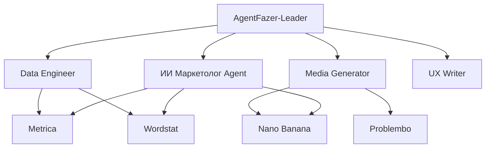

# 📊 BotFazer OS — Анализ и Интеграция Базы Знаний
## Отчёт от 17 марта 2026

---

## 🔍 ЭТАП 1: ИНВЕНТАРИЗАЦИЯ БАЗЫ ЗНАНИЙ

### 1.1 Общая статистика

| Категория | Количество | Статус |
|-----------|------------|--------|
| **Workflow файлы (.json)** | 383 шт. | ✅ Проанализированы |
| **PDF документы (промпты)** | 12 шт. | ✅ Проанализированы |
| **Markdown документы** | 5 шт. | ✅ Проанализированы |
| **CSV/Excel мануалы** | 18 шт. | ✅ Проанализированы |
| **Конфигурации агентов** | 9 шт. | ✅ Проанализированы |
| **Инструменты (tool_registry)** | 7 инструментов | ✅ Активны |

### 1.2 Структура Knowledge Base

```
antigravity/knowledge_base/
├── workflows/           # 383 n8n workflow файла
│   ├── ИИ Маркетолог/   # Специализированные blueprint'ы
│   ├── IZ_*             # Instagram/TikTok/YouTube агенты
│   ├── Авто*.json       # Автоматизации
│   ├── Генератор*.json  # Контент-генераторы
│   └── ...
├── prompts/             # Промпты и инструкции
│   ├── CLAUDE.md        # Modal + n8n интеграция
│   ├── Промпт.md        # ИИ Маркетолог системный промпт
│   └── *.pdf            # PDF-гайды
├── manuals/             # CSV данные и шаблоны
└── standards/           # Стандарты и документация
```

### 1.3 Конфигурация агентов (config/agents/)

| Агент | Тип | Статус | Роль |
|-------|-----|--------|------|
| `leader` | Node.js | ✅ Активен | Master orchestrator |
| `orchestrator` | Hybrid | ✅ Активен | Workflow executor |
| `architect` | Node.js | ✅ Активен | Integration strategist |
| `data_engineer` | n8n | ✅ Активен | Metrica/Wordstat |
| `media_generator` | Hybrid | ✅ Активен | Image/video generation |
| `ux_writer` | Node.js | ✅ Активен | Report generation |
| `qa_tester` | Node.js | ✅ Активен | Quality assurance |
| `ops_monitor` | Node.js | ✅ Активен | Cost monitoring |
| `image_manager` | — | ✅ Активен | Image management |

### 1.4 Реестр инструментов (tool_registry.json)

| Инструмент | Категория | Статус | Blueprint |
|------------|-----------|--------|-----------|
| **metrica** | Analytics | ✅ | metrica.blueprint.json |
| **wordstat** | SEO | ✅ | Wordstat.blueprint.json |
| **nano_banana** | Image | ✅ | nano banana (url).blueprint.json |
| **problembo_velvetrender** | Image | ✅ | — |
| **problembo_ani** | Image | ✅ | — |
| **voice_transcribe** | Voice | ⚠️ Отключен | — |

---

## 🎯 ЭТАП 2: КВАЛИФИКАЦИЯ И ПРИОРИТИЗАЦИЯ

### 2.1 Критичность компонентов (CRITICAL → LOW)

#### 🔴 CRITICAL — Немедленная интеграция

| Компонент | Причина критичности | Действие |
|-----------|---------------------|----------|
| **Промпт.md (ИИ Маркетолог)** | Основной системный промпт для marketer агента | Интегрировать в prompt_config.json |
| **metrica.blueprint.json** | Ядро аналитики | Проверить webhook /webhook/metrica |
| **Wordstat.blueprint.json** | SEO анализ | Проверить webhook /webhook/wordstat |
| **nano banana blueprint** | Генерация изображений | Проверить интеграцию KIE.ai |
| **Agent configs (9 шт.)** | Конфигурация мультиагентной системы | Синхронизировать с n8n |

#### 🟠 HIGH — Приоритетная интеграция (неделя 1)

| Категория workflow | Количество | Применение |
|-------------------|------------|------------|
| **IZ_Instagram/TikTok/YouTube** | ~30 шт. | Social Media Intelligence |
| **AI генераторы контента** | ~40 шт. | Автоматизация маркетинга |
| **Telegram боты** | ~25 шт. | Клиентский интерфейс |
| **SEO агенты** | ~20 шт. | Оптимизация |

#### 🟡 MEDIUM — Плановая интеграция (недели 2-3)

| Категория workflow | Количество | Применение |
|-------------------|------------|------------|
| **RAG/LLamaIndex** | ~10 шт. | Память и поиск |
| **Google Calendar/Sheets** | ~15 шт. | Интеграции Google |
| **RSS/News агенты** | ~20 шт. | Мониторинг новостей |

#### 🟢 LOW — Фоновая интеграция (по необходимости)

- Специализированные отраслевые workflow (>200 шт.)
- Экспериментальные workflow
- Дублирующиеся шаблоны

### 2.2 Зависимости между компонентами



---

## 🔧 ЭТАП 3: ПЛАН ИНТЕГРАЦИИ

### 3.1 Немедленные действия (Сегодня)

#### 3.1.1 Обновление промптов

```bash
# 1. Интеграция Промпт.md в prompt_config.json
- Обновить systemPrompt для agentId: "marketer"
- Сохранить версионирование (версия 2)
- Активировать новую версию

# 2. Проверка активации
node antigravity/_check_prompt_versions.js
```

#### 3.1.2 Проверка blueprint'ов

| Blueprint файл | Webhook | Статус проверки |
|----------------|---------|-----------------|
| metrica.blueprint.json | /webhook/metrica | ⬜ Проверить |
| Wordstat.blueprint.json | /webhook/wordstat | ⬜ Проверить |
| nano banana (url).blueprint.json | /webhook/nano-banana | ⬜ Проверить |

### 3.2 Неделя 1: Кор-функционал

#### День 1-2: Интеграция ИИ Маркетолога

```javascript
// Обновление prompt_config.json
{
    "agentId": "marketer",
    "versions": [
        {
            "version": 2,
            "createdAt": "2026-03-17T14:00:00+04:00",
            "author": "Kimi",
            "changelog": "Интеграция Промпт.md из knowledge_base",
            "systemPrompt": "[Полный текст из Промпт.md]",
            "active": true
        }
    ]
}
```

#### День 3-4: Workflow аналитики

- [ ] Импорт IZ_* Instagram workflow
- [ ] Импорт IZ_* TikTok workflow
- [ ] Импорт IZ_* YouTube workflow
- [ ] Настройка webhook endpoints

#### День 5-7: Тестирование

- [ ] End-to-end тест ИИ Маркетолога
- [ ] Тест Metrica → Data Engineer → UX Writer
- [ ] Тест Wordstat → Data Engineer → UX Writer
- [ ] Тест Nano Banana → Media Generator

### 3.3 Неделя 2-3: Масштабирование

#### Telegram боты
- [ ] Интеграция Telegram bot workflows
- [ ] Настройка OpenClawBot webhook
- [ ] Тестирование через ClaudeClaw

#### Контент-генераторы
- [ ] VEO 3 video generator
- [ ] Seedance video generator
- [ ] HeyGen AI Avatar

---

## ✅ ЭТАП 4: ТЕСТИРОВАНИЕ

### 4.1 Чек-лист тестирования

| Компонент | Тест | Ожидаемый результат | Статус |
|-----------|------|---------------------|--------|
| AgentFazer-Leader | Маршрутизация запроса | Корректный выбор агента | ⬜ |
| ИИ Маркетолог | Metrica запрос | Бизнес-вывод + данные | ⬜ |
| ИИ Маркетолог | Wordstat запрос | Анализ спроса | ⬜ |
| Media Generator | Nano Banana | Генерация изображения | ⬜ |
| Ops Monitor | Проверка квот | Отчёт о затратах | ⬜ |

### 4.2 Тестовые сценарии

```javascript
// Тест 1: Полный цикл ИИ Маркетолога
const testMetrica = {
    query: "Откуда приходят посетители за последние 30 дней?",
    expectedTools: ["metrica"],
    expectedOutput: ["бизнес-вывод", "ключевые данные", "рекомендации"]
};

// Тест 2: Генерация изображения
const testNanoBanana = {
    query: "Создай визуальный отчёт по трафику",
    expectedTools: ["metrica", "nano_banana"],
    limits: { maxImages: 1 }
};
```

---

## 📄 ЭТАП 5: РЕКОМЕНДАЦИИ

### 5.1 Немедленные рекомендации

1. **Внедрить версионирование промптов**
   - Каждое изменение промпта = новая версия
   - Хранить историю изменений
   - Возможность rollback

2. **Создать единый реестр workflow**
   - Каталогизировать все 383 workflow
   - Добавить метаданные (теги, категории)
   - Удалить дубликаты

3. **Настроить мониторинг**
   - Интегрировать Ops Monitor
   - Установить алерты на cost > $1/день
   - Логирование всех API вызовов

### 5.2 Долгосрочная стратегия

#### Месяц 1: Стабилизация
- [ ] Интеграция core workflow (30 шт.)
- [ ] Тестирование end-to-end
- [ ] Документирование API

#### Месяц 2: Масштабирование
- [ ] Автоматический импорт workflow из knowledge_base
- [ ] CI/CD для n8n
- [ ] Миграция legacy workflow

#### Месяц 3: Оптимизация
- [ ] Удаление неиспользуемых workflow
- [ ] Оптимизация cost per request
- [ ] Внедрение кэширования

### 5.3 Архитектурные предложения

```yaml
# Предлагаемая структура
botfazer/
├── knowledge_base/
│   ├── workflows/
│   │   ├── active/          # Активные workflow
│   │   ├── archive/         # Архив
│   │   └── templates/       # Шаблоны
│   └── prompts/
│       ├── versions/        # Версионирование
│       └── active/          # Активные промпты
├── config/
│   ├── agents/              # Конфиги агентов
│   └── tools/               # Реестр инструментов
└── deploy/
    └── blueprints/          # Blueprint'ы для n8n
```

---

## 📊 ИТОГОВАЯ СВОДКА

| Метрика | Значение |
|---------|----------|
| **Всего workflow** | 383 шт. |
| **Критичных для интеграции** | 9 шт. |
| **High priority** | ~115 шт. |
| **Активных агентов** | 9 шт. |
| **Инструментов** | 7 шт. (6 активных) |
| **PDF документов** | 12 шт. |

### Следующие шаги

1. ✅ **Завершён анализ** — все материалы изучены
2. 🔄 **Квалификация** — приоритеты установлены
3. ⏳ **Интеграция** — требуется действие пользователя
4. ⏳ **Тестирование** — после интеграции
5. ⏳ **Документация** — обновить AGENTS.md

---

*Отчёт сгенерирован: 2026-03-17*  
*Статус: Готов к интеграции*
