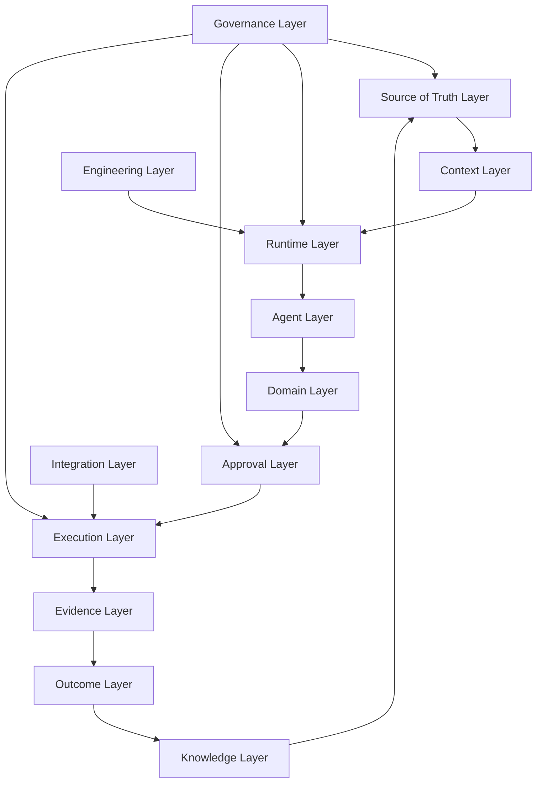
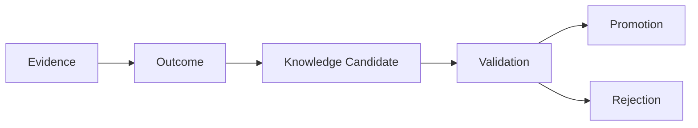
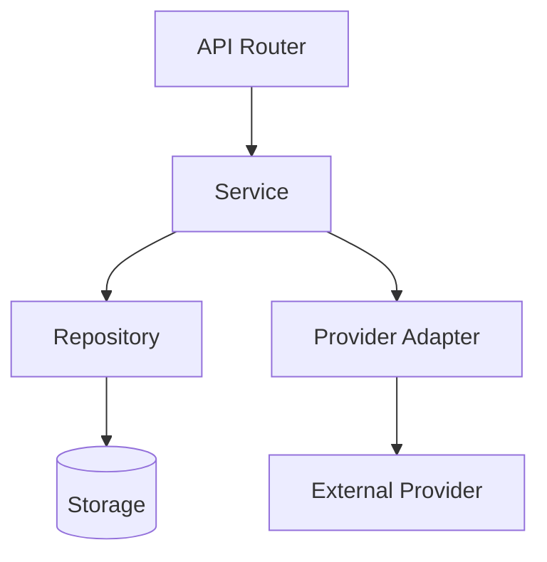

# ARCHITECTURE_CORE.md

**Project:** Marketsynth  
**Document Type:** Core Architecture Specification  
**Authority:** Derived from `PROJECT_CONSTITUTION.md`  
**Status:** FROZEN  
**Version:** 1.0.0  

---

# 1. Purpose

`ARCHITECTURE_CORE.md` defines the structural architecture of Marketsynth.

The Constitution defines project law.

This document defines the system shape.

All implementation, runtime behavior, contracts, AI coding tasks, and future domain extensions MUST conform to this architecture unless an accepted ADR explicitly changes it.

---

# 2. Architectural Thesis

Marketsynth is a governed AI runtime for operational work.

It is composed of:

1. Source of Truth Layer
2. Context Layer
3. Runtime Layer
4. Agent Layer
5. Domain Layer
6. Approval Layer
7. Execution Layer
8. Evidence Layer
9. Outcome Layer
10. Knowledge Layer
11. Governance Layer
12. Integration Layer
13. Engineering Layer

Marketsynth MUST NOT be implemented as a loose prompt chain.

Marketsynth MUST NOT let implementation define architecture.

---

# 3. System Map



---

# 4. Source of Truth Layer

The Source of Truth Layer defines canonical project meaning.

It includes:

- `PROJECT_CONSTITUTION.md`
- `RUNTIME_INVARIANTS.md`
- `ARCHITECTURE_CORE.md`
- accepted ADRs
- accepted RFCs
- contracts
- decision registry
- document index

The Source of Truth Layer is technology-independent.

Implementation MUST NOT override it.

---

# 5. Context Layer

The Context Layer assembles deterministic, tenant-scoped context for reasoning and runtime work.

It MAY include:

- user request;
- project state;
- runtime memory;
- active contracts;
- approved knowledge;
- relevant architecture;
- policy constraints.

It MUST NOT include:

- secrets;
- unrelated tenant data;
- superseded architecture;
- raw provider dumps;
- unapproved knowledge as authority.

---

# 6. Runtime Layer

The Runtime Layer governs lifecycle transitions.

Canonical lifecycle:

```text
Context → Decision → Approval → Execution → Evidence → Outcome → Knowledge Candidate
```

Runtime MUST maintain enough lineage to reconstruct material actions.

Runtime MUST reject invalid state transitions.

Runtime MUST NOT silently repair illegal transitions in ways that hide defects.

---

# 7. Agent Layer

Agents are bounded AI-assisted runtime participants.

Every agent SHOULD declare:

- role;
- domain;
- capabilities;
- permissions;
- inputs;
- outputs;
- tool access;
- memory scope;
- escalation behavior.

Agents MUST NOT bypass approval.

Agents MUST NOT cross tenant boundaries.

Agents MUST NOT silently mutate frozen architecture or contracts.

---

# 8. Domain Layer

Domains are bounded areas of capability and responsibility.

Initial domains:

1. Marketing
2. Programmer
3. Automation
4. Knowledge
5. Execution
6. Orchestration
7. Supervisor

Future domains:

- HR
- Legal
- Sales
- Finance
- Research
- Analytics
- Operations

Domains MUST integrate via contracts, events, and orchestrated workflows.

Domains MUST NOT directly mutate another domain's internal state.

---

# 9. Approval Layer

The Approval Layer separates readiness from permission.

Readiness means technically eligible.

Approval means explicit human authorization.

No real execution MAY occur without valid Human Approval unless the action is explicitly classified as safe internal simulation.

---

# 10. Execution Layer

The Execution Layer performs real-world actions only after required gates.

Execution preconditions:

1. valid tenant ownership;
2. valid artifact;
3. readiness;
4. approval;
5. active target;
6. idempotency control where applicable;
7. evidence capture.

Execution MUST be auditable.

Execution MUST produce evidence, including failure evidence where possible.

---

# 11. Evidence Layer

Evidence records what happened.

Evidence SHOULD be immutable or append-only where feasible.

Evidence MUST be safe.

Evidence MUST NOT contain credentials, secrets, raw provider dumps, or unrelated tenant data.

---

# 12. Outcome Layer

Outcome interprets evidence.

Outcome MUST NOT replace evidence.

Outcome MAY contain measurement, interpretation, confidence, and limitations.

Outcome SHOULD link to execution and evidence.

---

# 13. Knowledge Layer

Knowledge is not automatic memory.

Knowledge flow:



Knowledge Candidate MUST never cross tenant boundary.

Global knowledge MUST be anonymized, validated, scoped, and promoted.

---

# 14. Governance Layer

Governance controls architecture, decisions, amendments, versioning, audits, and document lifecycle.

Governance includes:

- Constitution;
- ADR;
- RFC;
- audit reports;
- migration logs;
- decision registry;
- document status policy.

Governance MUST remain explicit.

---

# 15. Integration Layer

External providers and tools are accessed only through adapters.

Provider-specific behavior MUST NOT leak into domain services.

Integrations SHOULD support:

- timeout;
- retry policy;
- error normalization;
- safe logging;
- idempotency;
- audit events.

---

# 16. Engineering Layer

Preferred dependency direction:



Routers handle transport.

Services handle business rules.

Repositories handle persistence.

Adapters isolate providers.

---

# 17. Dependency Rules

Allowed:

- API → Service
- Service → Repository
- Service → Adapter Interface
- Repository → Storage
- Adapter → External Provider
- Service → Contract
- Tests → All public layers

Forbidden:

- Repository → Service
- Adapter → Domain policy
- Router → Repository directly for business flows
- Domain service → Provider-specific implementation
- Cross-domain mutation without contract
- Runtime → unrelated tenant data

---

# 18. State and Lifecycle

Core runtime objects MUST use explicit lifecycle states.

Free-form lifecycle strings are prohibited for core runtime entities.

Invalid transitions MUST be rejected.

State transition code SHOULD live in services or dedicated state-machine components, not routers.

---

# 19. Architecture and Legacy Code

Legacy BotFazer v3 implementation MAY be useful.

It is not Source of Truth.

Migration direction is:

```text
Marketsynth Architecture → Audit → Legacy Code → Migration → Marketsynth Runtime
```

Never weaken Marketsynth architecture merely to fit legacy code.

---

# 20. Architecture Compliance Checklist

Before implementation, verify:

- Constitution read;
- Runtime Invariants checked;
- Architecture Core applicable;
- affected domain identified;
- contracts reviewed;
- tenant boundary preserved;
- approval boundary preserved;
- tests planned.

---

# 21. Audit Report

Status: PASSED.

Checked:

- derived from Constitution;
- technology-independent;
- approval separated from readiness;
- tenant isolation preserved;
- future domains supported;
- legacy code classified correctly;
- Cursor-readable structure provided.

This document is FROZEN v1.0.0.
