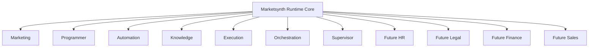

# DOMAIN_MODEL.md

**Project:** Marketsynth  
**Document Type:** Domain Architecture Specification  
**Authority:** Derived from `PROJECT_CONSTITUTION.md` and `ARCHITECTURE_CORE.md`  
**Status:** FROZEN  
**Version:** 1.0.0  

---

# 1. Purpose

This document defines Marketsynth domains, responsibilities, boundaries, and expansion rules.

A domain is a bounded area of capability, language, ownership, contracts, runtime behavior, and responsibility.

---

# 2. Domain Principles

Domains MUST be:

- bounded;
- contract-driven;
- independently extensible;
- tenant-aware;
- approval-aware where execution is possible;
- auditable;
- aligned with Runtime Invariants.

Domains MUST NOT directly mutate another domain's internal state.

---

# 3. Initial Domains

Initial domains:

1. Marketing
2. Programmer
3. Automation
4. Knowledge
5. Execution
6. Orchestration
7. Supervisor

---

# 4. Marketing Domain

## Purpose

Marketing Domain produces marketing artifacts and prepares them for governed execution.

## Responsibilities

- campaign briefs;
- content plans;
- publication packages;
- channel-specific copy;
- visual prompts;
- offer structures;
- audience hypotheses;
- performance interpretations;
- approval requests.

## Boundaries

Marketing may propose publication.

Marketing may not publish without Human Approval.

Marketing may not bypass Execution Runtime.

---

# 5. Programmer Domain

## Purpose

Programmer Domain supports technical analysis and implementation planning.

## Responsibilities

- technical task drafts;
- architecture/code gap analysis;
- implementation plans;
- code review suggestions;
- migration plans;
- developer notes;
- testing suggestions.

## Boundaries

Programmer Agent has no autonomous codebase write authority by default.

Programmer output is advisory unless explicit implementation authority exists.

---

# 6. Automation Domain

## Purpose

Automation Domain defines repeatable operational flows.

## Responsibilities

- workflow design;
- trigger/action mapping;
- scheduling logic;
- integration flow proposals;
- operational automation blueprints.

## Boundaries

Automation may prepare flows.

Automation may not execute real external effects without approval and Execution Runtime.

---

# 7. Knowledge Domain

## Purpose

Knowledge Domain manages evidence-derived learning.

## Responsibilities

- Knowledge Candidate creation;
- validation;
- rejection;
- promotion;
- lineage;
- tenant policy checks;
- knowledge graph references.

## Boundaries

Knowledge Candidate never crosses tenant boundary.

Global knowledge requires validation and anonymization.

---

# 8. Execution Domain

## Purpose

Execution Domain performs controlled real-world actions.

## Responsibilities

- execution jobs;
- execution attempts;
- provider calls;
- idempotency;
- failure handling;
- evidence capture.

## Boundaries

Execution requires readiness and Human Approval.

Execution does not decide business truth.

---

# 9. Orchestration Domain

## Purpose

Orchestration Domain coordinates work across domains.

## Responsibilities

- route;
- schedule;
- assign;
- coordinate;
- escalate;
- track runtime status.

## Boundaries

Orchestrator does not define business truth.

Orchestrator does not approve execution.

---

# 10. Supervisor Domain

## Purpose

Supervisor Domain monitors system safety, quality, and invariant compliance.

## Responsibilities

- findings;
- audits;
- violation detection;
- escalation;
- risk classification;
- execution blocking when critical.

## Boundaries

Supervisor does not execute business actions directly.

---

# 11. Future Domains

Future domains MAY include:

- HR;
- Legal;
- Sales;
- Finance;
- Research;
- Analytics;
- Operations.

Each future domain MUST define:

- purpose;
- capabilities;
- contracts;
- boundaries;
- approval requirements;
- tenant model;
- evidence model;
- risks;
- tests.

---

# 12. Domain Expansion Diagram

---

# 13. Cross-Domain Interaction

Allowed interaction methods:

- contracts;
- events;
- orchestrated workflows;
- service interfaces;
- approved runtime transitions.

Forbidden:

- direct database mutation across domain boundaries;
- hidden prompt-based coupling;
- shared global state;
- unscoped memory sharing;
- bypassing Orchestrator for multi-domain workflows.

---

# 14. Domain Audit Report

Status: PASSED.

This document preserves tenant isolation, approval boundaries, Orchestrator limits, Programmer restrictions, and future extensibility.

This document is FROZEN v1.0.0.
