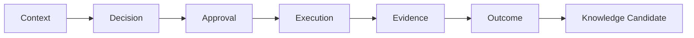
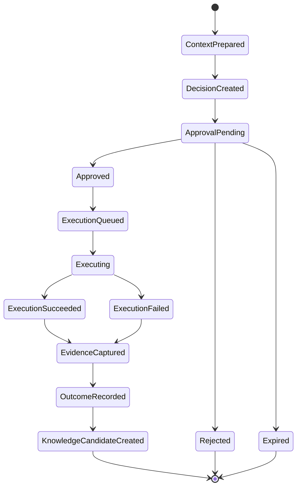

# RUNTIME_MODEL.md

**Project:** Marketsynth  
**Document Type:** Runtime Architecture Specification  
**Authority:** Derived from `PROJECT_CONSTITUTION.md` and `RUNTIME_INVARIANTS.md`  
**Status:** FROZEN  
**Version:** 1.0.0  

---

# 1. Purpose

This document defines the Marketsynth Runtime Model.

Runtime is the governed lifecycle in which AI-assisted work moves from context to decision, approval, execution, evidence, outcome, and knowledge candidate.

---

# 2. Runtime Thesis

Marketsynth Runtime exists to prevent AI work from becoming uncontrolled prompt output.

It ensures:

- tenant isolation;
- explicit state;
- approval before execution;
- evidence capture;
- outcome derivation;
- knowledge discipline;
- auditability.

---

# 3. Canonical Runtime Flow

---

# 4. Runtime Objects

Core runtime objects:

1. Context Snapshot
2. Decision Record
3. Approval Request
4. Approval Decision
5. Execution Job
6. Execution Attempt
7. Evidence Record
8. Outcome Record
9. Knowledge Candidate
10. Supervisor Finding
11. Audit Event

---

# 5. Context Snapshot

Context Snapshot records scoped reasoning input.

It SHOULD include:

- tenant;
- project;
- user request;
- relevant memory references;
- governing architecture references;
- constraints;
- timestamp;
- builder metadata.

It MUST NOT include secrets or unrelated tenant data.

---

# 6. Decision Record

Decision Record represents a route, assignment, plan, recommendation, or selected next action.

It SHOULD include:

- decision type;
- actor;
- input context reference;
- rationale;
- target domain;
- confidence where applicable;
- constraints;
- timestamp.

Decision Record is not approval.

---

# 7. Approval Request

Approval Request asks a human owner to authorize scoped execution.

It MUST include:

- tenant;
- project where applicable;
- artifact;
- action;
- target;
- risk summary;
- expiration where applicable;
- requester;
- status.

---

# 8. Approval Decision

Approval Decision is explicit human response.

States:

- pending;
- approved;
- rejected;
- expired.

Approved means execution MAY proceed if all other preconditions still hold.

Rejected means execution MUST NOT proceed.

Expired means execution MUST NOT proceed unless new approval is obtained.

---

# 9. Execution Job

Execution Job represents approved intent to perform real action.

It MUST validate:

- tenant ownership;
- artifact state;
- approval state;
- target availability;
- idempotency key where applicable.

---

# 10. Execution Attempt

Execution Attempt records each actual attempt.

It SHOULD include:

- job id;
- attempt number;
- provider;
- safe request metadata;
- status;
- started_at;
- finished_at;
- safe error if failed.

---

# 11. Evidence Record

Evidence Record captures what happened.

It SHOULD include:

- execution attempt;
- provider response summary;
- external id where safe;
- status;
- timestamp;
- actor;
- tenant;
- project.

It MUST NOT contain secrets.

---

# 12. Outcome Record

Outcome Record interprets evidence.

It MAY include:

- measured result;
- business interpretation;
- operational conclusion;
- confidence;
- limitations;
- recommended next step.

Outcome MUST reference evidence.

---

# 13. Knowledge Candidate

Knowledge Candidate proposes reusable knowledge.

It MUST remain scoped.

It MUST NOT cross tenant boundary.

It requires validation before promotion.

---

# 14. Runtime State Machine

---

# 15. Runtime Guards

Runtime guards:

- tenant guard;
- approval guard;
- readiness guard;
- contract guard;
- state transition guard;
- secret boundary guard;
- provider availability guard;
- idempotency guard;
- evidence guard.

---

# 16. Runtime Failure Handling

Failures MUST be safe.

Runtime failures SHOULD:

- preserve state;
- capture evidence where possible;
- produce safe errors;
- avoid duplicate external effects;
- emit audit event;
- trigger supervisor finding if critical.

---

# 17. Runtime and Supervisor

Supervisor observes runtime.

Supervisor may:

- inspect transitions;
- detect invariant violations;
- create findings;
- escalate.

Supervisor may not:

- execute external actions;
- invent approval;
- silently correct tenant violations.

---

# 18. Runtime and Orchestrator

Orchestrator coordinates runtime.

Orchestrator may:

- route;
- schedule;
- assign;
- escalate;
- coordinate.

Orchestrator may not:

- define business truth;
- bypass approval;
- mutate external systems directly.

---

# 19. Runtime Audit Report

Status: PASSED.

This document preserves:

- Human Approval before Execution;
- Readiness/Approval separation;
- Knowledge Candidate tenant boundary;
- Runtime lineage;
- Orchestrator authority limits;
- Supervisor authority limits.

This document is FROZEN v1.0.0.
