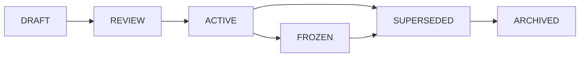

# DOCUMENT_GOVERNANCE.md

**Project:** Marketsynth  
**Document Type:** Governance Specification  
**Status:** FROZEN  
**Version:** 1.0.0  
**Authority:** Derived from `PROJECT_CONSTITUTION.md`

---

# 1. Purpose

This document defines how Marketsynth documentation is created, reviewed, promoted, frozen, superseded, deprecated, and archived.

Documentation is not decoration.

Documentation is Source of Truth when it has authority and status.

---

# 2. Required Metadata

Every governance document SHOULD include:

- Project
- Document Type
- Status
- Version
- Authority
- Scope
- Dependencies
- Last Review
- Audit Status

---

# 3. Document Statuses

Allowed statuses:

- DRAFT
- REVIEW
- ACTIVE
- FROZEN
- SUPERSEDED
- DEPRECATED
- ARCHIVED

## 3.1 DRAFT

DRAFT documents are not implementation authority unless explicitly scoped for experimental use.

## 3.2 REVIEW

REVIEW documents are being checked and MUST NOT override ACTIVE/FROZEN documents.

## 3.3 ACTIVE

ACTIVE documents are current authority within their scope.

## 3.4 FROZEN

FROZEN documents are foundational. Semantic edits require ADR/RFC and audit.

## 3.5 SUPERSEDED

SUPERSEDED documents are replaced by newer authority.

## 3.6 DEPRECATED

DEPRECATED documents remain available for migration or historical context only.

## 3.7 ARCHIVED

ARCHIVED documents are retained for traceability.

---

# 4. Promotion Process

A document MAY become FROZEN only after:

1. constitutional compatibility check;
2. dependency check;
3. contradiction check;
4. AI-readability check;
5. audit section added.

---

# 5. Document Authority

Document authority is not based on file age.

Authority is based on:

- status;
- declared dependency;
- alignment with Constitution;
- acceptance through governance process.

---

# 6. AI Rules

AI agents MUST NOT:

- treat DRAFT as implementation authority unless instructed;
- silently edit FROZEN documents;
- ignore document status;
- use SUPERSEDED documents as current architecture;
- merge contradictory documents without raising audit risk.

---

# 7. Weekly Audit

During active architecture development, weekly audit SHOULD check:

- stale DRAFT documents;
- duplicated concepts;
- contradictions;
- missing status headers;
- broken reading order;
- obsolete BotFazer naming;
- architecture drift.

---

# 8. Audit Status

PASSED.

This document is FROZEN v1.0.0.
