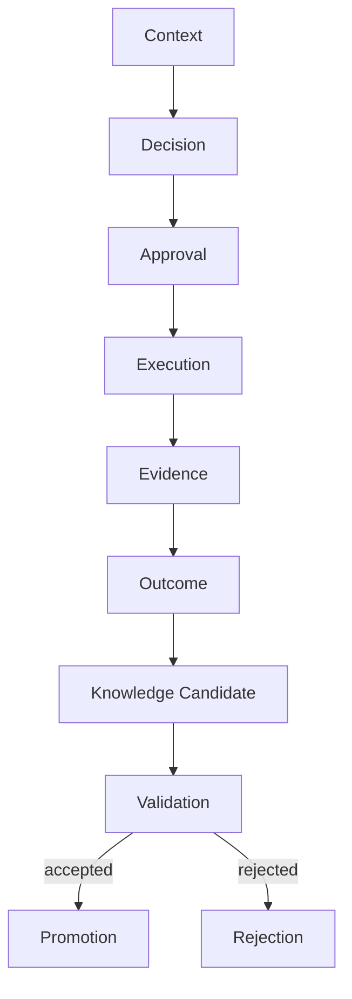

# KNOWLEDGE_MODEL.md

**Project:** Marketsynth  
**Document Type:** Knowledge Architecture Specification  
**Status:** FROZEN  
**Version:** 1.0.0  
**Authority:** Derived from `PROJECT_CONSTITUTION.md`

---

# 1. Purpose

This document defines how Marketsynth converts evidence and outcomes into validated knowledge.

Knowledge is not raw memory.

Knowledge is not every AI conclusion.

Knowledge is governed.

---

# 2. Core Law

Knowledge Candidate never crosses Tenant boundary.

Global knowledge MUST NOT contain tenant-private information.

---

# 3. Knowledge Flow

---

# 4. Knowledge Candidate

Knowledge Candidate is a proposed reusable statement derived from:

- evidence;
- outcome;
- validated runtime event;
- human-confirmed insight;
- approved analysis.

It is not authoritative by default.

---

# 5. Candidate Scope

Candidate scope MAY be:

- session;
- project;
- tenant;
- product-global.

Product-global scope requires explicit promotion.

---

# 6. Promotion Preconditions

Promotion requires:

1. evidence reference;
2. outcome reference;
3. tenant policy check;
4. validation;
5. scope decision;
6. audit record;
7. anonymization if global.

---

# 7. Rejection

Candidate SHOULD be rejected if:

- evidence is missing;
- tenant boundary is unclear;
- claim is speculative;
- outcome does not support it;
- source is obsolete;
- privacy risk exists.

---

# 8. Global Knowledge

Global knowledge MAY include:

- architecture lessons;
- product rules;
- generalized operational patterns;
- anonymized best practices.

Global knowledge MUST NOT include:

- tenant secrets;
- tenant content;
- tenant strategy;
- private performance data;
- identifiable customer details.

---

# 9. Knowledge Versioning

Promoted knowledge SHOULD be versioned.

Corrections SHOULD preserve lineage.

Silent replacement is prohibited for high-value knowledge.

---

# 10. Audit Status

PASSED.

This document is FROZEN v1.0.0.
