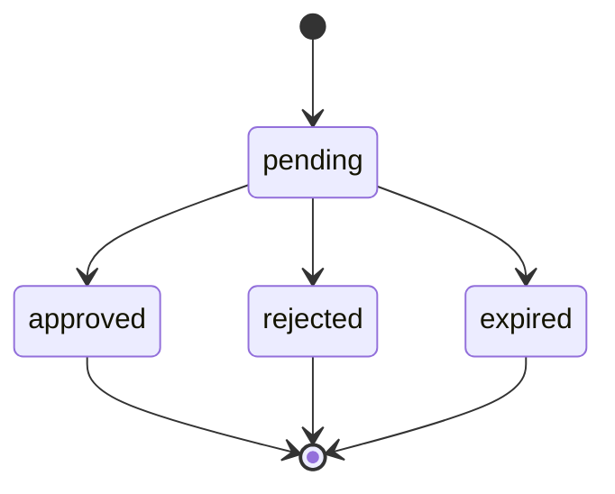

# APPROVAL_MODEL.md

**Project:** Marketsynth  
**Document Type:** Runtime Approval Specification  
**Status:** FROZEN  
**Version:** 1.0.0  
**Authority:** Derived from `PROJECT_CONSTITUTION.md`

---

# 1. Purpose

This document defines Human Approval in Marketsynth.

Approval is the boundary between AI-prepared work and real-world execution.

---

# 2. Core Law

Real Execution MUST NOT occur without valid Human Approval unless the action is explicitly classified as safe internal simulation.

Readiness is not approval.

AI confidence is not approval.

Generated recommendation is not approval.

---

# 3. Approval Objects

Approval flow uses:

- Approval Request;
- Approval Decision;
- Approval Evidence;
- Approval Expiration;
- Approval Audit Event.

---

# 4. Approval Request

Approval Request MUST include:

- tenant;
- project where applicable;
- artifact;
- proposed action;
- target;
- risk summary;
- requester;
- expiration where applicable;
- status.

---

# 5. Approval States

Canonical states:

```text
pending
approved
rejected
expired
```

No other state may be used unless approved through contract change.

---

# 6. Approval State Machine



---

# 7. Approval Validity

An approval is valid only if:

- status is approved;
- tenant matches;
- artifact matches;
- action matches;
- target matches;
- expiration has not passed;
- owner authority is valid;
- no critical supervisor finding blocks execution.

---

# 8. Owner Unavailable Policy

If required owner is unavailable, runtime MUST:

1. wait;
2. escalate;
3. expire;
4. follow explicit delegation policy.

Runtime MUST NOT invent approval.

---

# 9. Approval Reuse

Approval reuse is prohibited unless:

- reuse scope is explicit;
- artifact equivalence is proven;
- action matches;
- target matches;
- time window is valid;
- audit record is preserved.

---

# 10. Approval Evidence

Each decision SHOULD generate evidence or audit event including:

- actor;
- timestamp;
- decision;
- scope;
- reason if rejected;
- expiration if applicable.

---

# 11. Approval Violations

Approval violation is CRITICAL if:

- execution occurred without approval;
- approval scope mismatch was ignored;
- owner was invented;
- expired approval was reused;
- rejected approval was bypassed.

---

# 12. Audit Status

PASSED.

This document is FROZEN v1.0.0.
