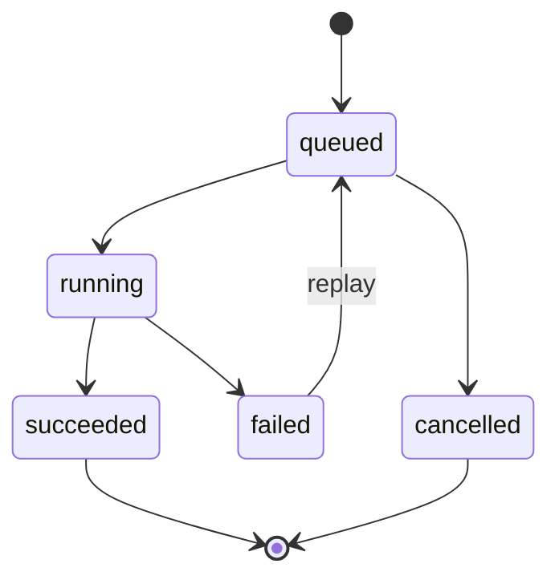

# EXECUTION_MODEL.md

**Project:** Marketsynth  
**Document Type:** Runtime Execution Specification  
**Status:** FROZEN  
**Version:** 1.0.0  
**Authority:** Derived from `PROJECT_CONSTITUTION.md`

---

# 1. Purpose

This document defines Real Execution in Marketsynth.

Execution is controlled external effect.

Execution is not reasoning.

Execution is not approval.

Execution is not readiness.

---

# 2. Real Execution Definition

Real Execution is any action that mutates:

- external provider state;
- publication channel;
- user-visible system state;
- production data;
- account settings;
- budget;
- credentials;
- irreversible workflow.

---

# 3. Execution Preconditions

Execution requires:

1. valid tenant;
2. valid project where applicable;
3. valid artifact;
4. readiness;
5. valid approval;
6. active target;
7. provider access;
8. idempotency where applicable;
9. evidence capture plan.

---

# 4. Execution Job

Execution Job represents authorized intent to execute.

Fields SHOULD include:

- id;
- tenant;
- project;
- artifact;
- approval id;
- target;
- status;
- idempotency key;
- attempts;
- error;
- created_at;
- started_at;
- finished_at.

---

# 5. Execution Attempt

Each attempt SHOULD record:

- job id;
- attempt number;
- provider;
- safe request metadata;
- status;
- safe response metadata;
- error;
- timestamp.

---

# 6. Execution State Machine

Replay from `failed` to `queued` requires explicit validation.

---

# 7. Idempotency

Execution SHOULD use idempotency when duplicate external effects are possible.

Idempotency key SHOULD include:

- tenant;
- action;
- artifact version;
- target;
- approval id.

---

# 8. Replay Rules

Replay MUST validate:

- original artifact exists;
- artifact version matches;
- approval remains valid or new approval exists;
- target remains active;
- tenant matches;
- duplicate external effect risk is controlled.

---

# 9. Provider Calls

Provider calls MUST be isolated through adapters.

Provider-specific errors MUST be normalized.

Secrets MUST NOT enter logs, prompts, errors, or evidence.

---

# 10. Failure Handling

Failure SHOULD:

- preserve state;
- capture safe evidence;
- emit audit event;
- avoid duplicate external effects;
- expose safe error;
- allow explicit replay where valid.

---

# 11. Audit Status

PASSED.

This document is FROZEN v1.0.0.
