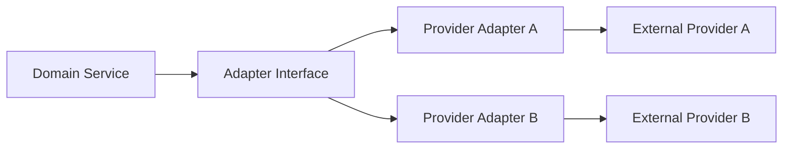

# INTEGRATION_ARCHITECTURE.md

**Project:** Marketsynth  
**Document Type:** Integration Architecture Specification  
**Status:** FROZEN  
**Version:** 1.0.0  
**Authority:** Derived from ARCHITECTURE_CORE.md, SECURITY_MODEL.md, EXECUTION_MODEL.md

---

# 1. Purpose

This document defines how Marketsynth integrates with external providers, APIs, automation platforms, channels, and infrastructure services.

# 2. Core Law

External providers MUST be isolated behind adapters. Provider-specific behavior MUST NOT leak into domain services.

# 3. Integration Types

Supported integration classes include LLM providers, publication channels, messaging channels, storage providers, analytics providers, automation platforms, identity providers, billing providers, notification providers, and future domain-specific providers.

# 4. Adapter Pattern

# 5. Integration Requirements

Every mutating integration SHOULD define operation type, auth method, permission scope, timeout, retry policy, idempotency behavior, safe error mapping, evidence output, audit events, and rate limits.

# 6. Secret Handling

Integration credentials MUST live in secure secret storage or runtime configuration and MUST NOT enter prompts, logs, public errors, evidence payloads, memory, knowledge candidates, or documentation examples.

# 7. Provider Replacement

Replacing a provider MUST NOT require constitutional change. It MAY require new adapter, contract tests, migration plan, and capability mapping.

# 8. Integration Testing

Integration tests SHOULD verify success, timeout, rate limit, auth failure, permission failure, safe error shape, idempotency, and evidence capture.

---

# Audit Status

PASSED.

This document is FROZEN v1.0.0.
