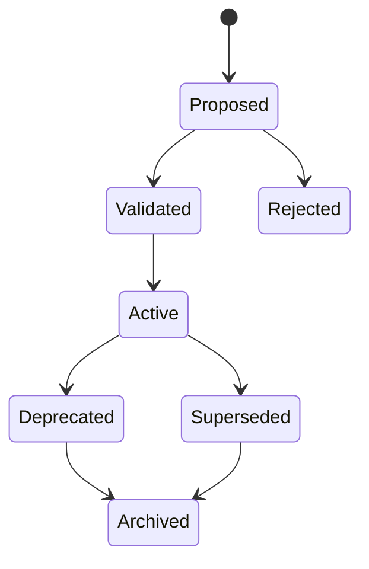

# MEMORY_MODEL.md

**Project:** Marketsynth  
**Document Type:** Memory Architecture Specification  
**Status:** FROZEN  
**Version:** 1.0.0  
**Authority:** Derived from PROJECT_CONSTITUTION.md, KNOWLEDGE_MODEL.md, SECURITY_MODEL.md

---

# 1. Purpose

This document defines Marketsynth memory.

Memory preserves operational continuity. Memory is not automatically knowledge. Memory MUST remain scoped, safe, auditable, and tenant-isolated.

# 2. Core Law

Memory MUST NOT cross tenant boundary. Memory MUST NOT silently become global knowledge. Memory MUST NOT store secrets.

# 3. Memory Types

1. Session Memory
2. Project Memory
3. Tenant Memory
4. Agent Working Memory
5. Runtime Memory
6. Knowledge Memory
7. Global Product Knowledge

# 4. Session Memory

Session Memory supports a current interaction. It SHOULD be ephemeral and MUST NOT automatically become persistent memory.

# 5. Project Memory

Project Memory stores project-relevant facts, preferences, campaign context, reusable constraints, and decisions. It MUST be tenant-scoped.

# 6. Tenant Memory

Tenant Memory is reusable within one tenant only and MUST NOT be visible to another tenant.

# 7. Agent Working Memory

Agent Working Memory supports agent reasoning. It MUST be bounded by agent permission and MUST NOT become durable unless explicitly persisted through policy.

# 8. Runtime Memory

Runtime Memory MAY include last decisions, pending approvals, execution status, failure patterns, and supervisor findings.

# 9. Knowledge Memory

Knowledge Memory stores promoted knowledge and SHOULD preserve lineage to evidence/outcome.

# 10. Global Product Knowledge

Global Product Knowledge requires explicit promotion, anonymization, and tenant safety.

# 11. Memory Lifecycle

# 12. Persistent Memory Fields

Persistent memory SHOULD include id, tenant_id, project_id, scope, type, content, source, evidence reference where applicable, created_at, updated_at, version, status, retention policy, and redaction status.

# 13. Retention and Deletion

Memory SHOULD support expiration, correction, invalidation, archival, and deletion where policy requires.

# 14. Memory vs Knowledge

AI agents MUST NOT treat memory as verified knowledge unless promoted.

---

# Audit Status

PASSED.

This document is FROZEN v1.0.0.
